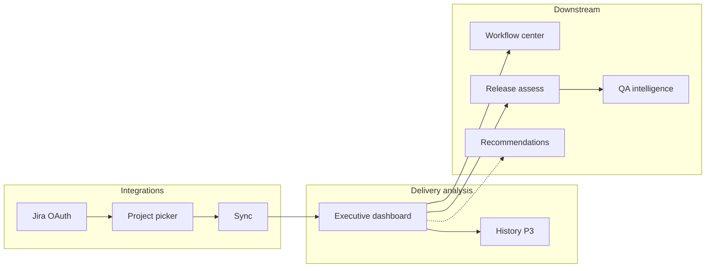

# Delivery analysis — Jira operational intelligence

**Last updated:** 2026-06-04  
**Status:** P1 UI shell complete — P2 live rollup next  
**Owner agents:** `/frontend` (page & components), `/backend` (snapshot rollup, history, APIs), `/architect` (review before merge)

**Related docs:** [`docs/jira-integration.md`](docs/jira-integration.md) · [`code-analysis.md`](code-analysis.md) · [`docs/AIDOS-USP.md`](docs/AIDOS-USP.md) · [`feature-flag.md`](feature-flag.md)

> **This document is the spec for the Delivery Analysis page.** It defines executive UX, metrics, data contracts, and phased delivery. Jira OAuth, sync, and `JiraDeliverySnapshot` remain specified in [`docs/jira-integration.md`](docs/jira-integration.md) — link there for connection and sync; extend here for dashboard-only scope.

---

## 1. Purpose

Give **engineering and delivery leadership** a single place to see **whether Jira-backed work is on track** — blockers, schedule slip, quality risk, and sprint progress — without opening Jira or the Integrations admin panel.

AIDOS sits **above** Jira Cloud and answers governance questions such as:

- Are we blocked or overdue at portfolio scale, and where?
- Which fix versions are at risk of missing their target date?
- Is the active sprint on pace to complete committed work?
- How does delivery health today compare to last week (trend)?
- What should leadership escalate before the next release gate?

This complements **Code analysis** (GitHub / AI-assisted code) and **QA intelligence** (release readiness). Together they form the “observe delivery” story in [`docs/AIDOS-USP.md`](docs/AIDOS-USP.md): **govern and observe AI-native delivery**, not replace Jira.

### Audience

| Persona | Primary need on this page |
|---------|---------------------------|
| VP Engineering / CTO | Portfolio health score, red/yellow signals, trend vs last period |
| Delivery manager | Per-project breakdown, sprint burndown proxy, version timeline |
| Release manager | Fix versions, overdue releases, link to AIDOS release assess |
| Program lead | Multi-project filters, compare projects, export for steering meetings |

### What already exists (do not rebuild)

| Capability | Location | Use on this page |
|------------|----------|------------------|
| Jira OAuth + project picker | `docs/jira-integration.md` §6–8 | Empty state → `/integrations` |
| Read sync → `deliverySnapshot` | `src/lib/jira-sync.ts`, `POST /api/integrations/jira/sync` | **Sync now** reuses this |
| Snapshot type | `JiraDeliverySnapshot` in `src/lib/jira-meta.ts` | P1–P2 KPI source |
| Delivery health engine | `src/lib/jira-delivery-health.ts` | P2 rollup + governance cards (extend for org-wide) |
| Release assess wiring | `src/app/api/releases/[id]/assess/route.ts` | Cross-link “View release” from version rows |

### Explicit non-goals (MVP)

- Writing to Jira (issues, transitions, comments)
- Replacing Jira dashboards or Advanced Roadmaps
- ML forecasting or story-point burndown (unless trivial JQL counts ship in P2b)
- Per-customer Atlassian env vars (SaaS: org `Integration.metadataJson` only)

---

## 2. Product constraints (non-negotiable)

| Rule | Detail |
|------|--------|
| Read-only | Same Atlassian scopes as [`docs/jira-integration.md`](docs/jira-integration.md) §6.1 — no write scopes |
| Human-governed | Insights inform recommendations and release assess — no auto-transitions in Jira |
| Multi-tenant | All data scoped by `session.organizationId`; snapshot from org `Integration` (`provider = JIRA`) |
| Honest scope | Show “last synced”, selected `projectKeys`, and “partial data” when boards/sprints unavailable |
| Not a PM tool | Copy frames **governance & operational visibility**, not backlog editing |
| Verify build | Run `npm run build` before marking any PR complete |

---

## 3. Route & navigation

| Item | Value |
|------|--------|
| **Path** | `/delivery-analysis` |
| **Workspace** | Enterprise only (same guard as `/code-analysis`, `/qa`) |
| **Nav label** | Delivery analysis |
| **Icon** | `Kanban` or `Truck` (Lucide) — prefer **`Kanban`** |
| **Placement** | After **Workflow center**, before **QA intelligence** (delivery → quality → code → ops) |
| **Feature flag** | `nav.delivery_analysis` in `NAV_FEATURE_FLAGS` (default `false` until UI ships) |

### Empty / blocked states

| Condition | UI |
|-----------|-----|
| Jira not connected | CTA card → `/integrations` (“Connect Jira to analyze delivery”) |
| Connected, no projects selected | CTA to select projects on Integrations (same copy as sync `400`) |
| Connected, never synced | “Sync Jira data” CTA + explain first sync pulls versions, counts, sprints |
| Connected + synced | Full dashboard; banner if sync &gt; 24h old (warning, not blocking) |
| MVP workspace | Redirect to `/accelerator` |
| No Delivery DNA | Redirect to `/governance/setup` (match `/code-analysis`) |

---

## 4. Page information architecture

Single scrollable page with **sticky filter bar**, **executive story above the fold**, and **tabbed drill-downs**. Density similar to Code analysis — scannable KPIs, charts for trends, tables for accountability.

```
┌─────────────────────────────────────────────────────────────────────────────┐
│  Delivery analysis                              [Sync now] [Export]         │
│  Jira delivery visibility · N projects · last synced 12m ago                │
├─────────────────────────────────────────────────────────────────────────────┤
│  [Project ▾] [All ▾] [Range: 30d ▾] [Compare: vs prior sync ▾]            │
├─────────────────────────────────────────────────────────────────────────────┤
│  ┌──────────────┐ ┌──────────────┐ ┌──────────────┐ ┌──────────────┐        │
│  │ Delivery     │ │ Open work    │ │ Blocked      │ │ Overdue      │        │
│  │ health 78    │ │ 142 issues   │ │ 6 issues     │ │ 11 issues    │        │
│  │  ▼ 4 pts     │ │  ▲ 8         │ │  ─ 0         │ │  ▲ 3         │        │
│  └──────────────┘ └──────────────┐ └──────────────┘ └──────────────┘        │
├─────────────────────────────────────────────────────────────────────────────┤
│  Risk mix (stacked bar)          │  Health trend (line, P3)                 │
│  Blocked · Overdue · Bugs · OK   │  Score + open work over sync history      │
├─────────────────────────────────────────────────────────────────────────────┤
│  By project (bars)               │  Active sprints (cards)                 │
├─────────────────────────────────────────────────────────────────────────────┤
│  Tabs: [Overview] [Versions] [Sprints] [Signals] [Projects detail]        │
│  … tables, expand rows, external Jira links …                               │
└─────────────────────────────────────────────────────────────────────────────┘
```

### Design tokens

Follow platform patterns (`PageHeader`, `Card`, `Badge`, `Button`):

| Semantic | Token |
|----------|--------|
| Healthy / on track | `text-secondary`, accent `#4F8CFF` |
| Warning | `text-warning` |
| Critical / blocked | destructive or strong warning |
| Released version | muted success |
| Overdue version / sprint behind | warning border |

---

## 5. Metrics catalog

### 5.1 Headline KPIs (always visible)

Computed from `JiraDeliverySnapshot` for filtered project scope (see §6). Deltas require P3 history; until then show “—” or hide delta with tooltip “Trends after two syncs”.

| Metric | Definition (product) | Source (current sync) | Why it matters |
|--------|----------------------|------------------------|----------------|
| **Delivery health score** | 0–100 composite from `analyzeJiraDeliveryHealth` (org-wide mode) | Derived in `compute-delivery-snapshot.ts` (new) | Single number for leadership standups |
| **Open work** | Sum of `openIssues` in scope | Snapshot per project | Volume of incomplete work |
| **Blocked** | Sum of `blockedCount` | JQL in sync | Execution risk |
| **Overdue** | Sum of `overdueCount` | JQL in sync | Schedule risk |

Optional fifth KPI (P2 UI or P2b data):

| Metric | Definition | Source |
|--------|------------|--------|
| **Open bugs** | Sum of `bugsOpen` | Snapshot |
| **Sprint completion %** | Weighted avg of `done/committed` for active scrum sprints | Snapshot `activeSprint` |
| **Unassigned** | Sum of `unassignedCount` | Snapshot |

Each KPI card: value, delta vs prior period (P3), short subtitle (e.g. “Across 3 projects”).

### 5.2 Risk mix chart

Stacked horizontal bar or donut for scoped portfolio:

| Segment | Formula |
|---------|---------|
| Blocked | `blockedCount` |
| Overdue | `overdueCount` |
| Bugs (open) | `bugsOpen` |
| Other open | `openIssues - blocked - overdue` (clamp ≥ 0; dedupe is approximate — document in tooltip) |

Tooltip: counts are JQL-based at sync time, not live Jira.

### 5.3 Trend charts (P3)

- **X-axis:** `syncedAt` from `DeliveryAnalysisSnapshot` history (one point per successful sync)
- **Series 1:** Delivery health score
- **Series 2 (toggle):** Open work · Blocked · Overdue · Bugs
- **Annotation:** manual sync events (user + timestamp from `AuditLog`)

Until P3: show placeholder card “Sync at least twice to see trends” with mini sparkline from last two metadata snapshots if available (optional P2 shortcut).

### 5.4 Dimensional breakdowns

| Dimension | Visualization | Interaction |
|-----------|---------------|-------------|
| Project | Horizontal bars: health score or open work | Click → filter page to project |
| Active sprint | Card per project with scrum sprint: name, dates, done/committed %, severity | Link to Jira board (external) |
| Fix version | Table in Versions tab | Row → filter; link to release assess if name matches AIDOS release |

### 5.5 Drill-down tables (tabs)

#### Overview tab

Summary cards re-stating signals; quick links to Integrations, Workflow center, Recommendations.

#### Versions tab

| Column | Notes |
|--------|-------|
| Project | key + name |
| Version | fix version name |
| Status | Released / Open / **Overdue** badge |
| Target date | `releaseDate` |
| Open issues in version | P2b: JQL count `fixVersion = X AND statusCategory != Done` |

Current snapshot includes version metadata but **not** per-version issue counts — add in P2b sync extension.

#### Sprints tab

| Column | Notes |
|--------|-------|
| Project | |
| Sprint | name |
| State | active / future / closed |
| Window | start–end |
| Progress | `done / committed` + bar |
| Severity | from health rules (&lt;40% critical, etc.) |

Empty state when no scrum board or missing `read:sprint:jira-software` scope.

#### Signals tab (governance)

Reuse and extend `JiraDeliverySignal` / `JiraDeliveryGap` at **org portfolio** level (not release-scoped):

| Signal | Example rule |
|--------|----------------|
| Portfolio blocked | `blockedCount >= 5` (org) or ≥3 in one project |
| Overdue cluster | `overdueCount >= 10` |
| Bug backlog | `bugsOpen >= 15` |
| Version slip | any `versions[].overdue && !released` |
| Sprint behind | active sprint completion &lt; 50% with &lt; 3 days to `endDate` (P2b) |
| Stale sync | `syncedAt` older than 48h |

Each signal: severity badge, affected project(s), “Open in Jira” external link (project URL from `siteUrl`), stub “Create recommendation” (future P4).

#### Projects detail tab

Per-project row: all snapshot fields + health score + expand for version list and sprint card.

### 5.6 Cross-links (executive workflow)

| From | To | When |
|------|-----|------|
| Version row | `/releases` + assess | Fuzzy match via `matchReleaseToFixVersion` |
| Signal card | `/recommendations` | When recommendation exists for same gap (P4) |
| Health score | `/qa` | Subtitle “Also reflected in QA readiness when releases assessed” |
| Footer | `/integrations` | Manage connection, projects, sync |

---

## 6. Filters & controls

| Control | Options | Default |
|---------|---------|---------|
| **Project scope** | All selected · single project key | All selected (`metadata.projectKeys`) |
| **Risk focus** | All · Blockers · Schedule · Quality · Sprint | All (filters signals + highlights KPIs) |
| **Time range** | Labels only for P1 mock; P3 uses sync history window (7d · 30d · 90d of sync points) | 30d |
| **Compare** | vs previous sync · vs org baseline (P4) | Previous sync |

**Actions:**

- **Sync now** — `POST /api/integrations/jira/sync` (existing); then refresh via `GET /api/delivery-analysis/snapshot` or `router.refresh()`
- **Export** — CSV via `/api/delivery-analysis/export` (P2): projects, KPIs, versions, signals

Sticky filter bar on scroll (client component). Session required; sync requires `manage_integrations` (button disabled with tooltip for view-only users).

---

## 7. Data architecture

### 7.1 Current snapshot (reuse)

`JiraDeliverySnapshot` (see [`docs/jira-integration.md`](docs/jira-integration.md) §7.3) is the **source of truth** after each sync. Stored at `Integration.metadataJson.deliverySnapshot`.

**Strengths for v1 dashboard:** portfolio counts, fix versions, active sprint progress, multi-project.

**Gaps for executive richness:**

| Gap | Impact | Phase to address |
|-----|--------|------------------|
| No historical points | No trend / delta | P3 `DeliveryAnalysisSnapshot` table |
| No per-version issue counts | Versions tab shallow | P2b extend `jira-sync.ts` |
| No status breakdown (To Do / In Progress / Done) | No flow metrics | P2b JQL buckets |
| No issue list / assignee dimension | No accountability table | P3 or P4 (paginated JQL search) |
| No throughput (resolved last 7d) | No velocity story | P2b JQL `resolved >= -7d` |
| Org health tied to release name today | `analyzeJiraDeliveryHealth` needs release | P2: `analyzePortfolioDeliveryHealth` |

### 7.2 Computed rollup (new)

Add `src/lib/delivery-analysis/compute-snapshot.ts`:

```ts
// Input: JiraDeliverySnapshot + optional projectKey filter
// Output: DeliveryAnalysisSnapshot (dashboard DTO)

export type DeliveryAnalysisSnapshot = {
  generatedAt: string;        // ISO — same as snapshot.syncedAt
  projectKeys: string[];
  siteUrl?: string;
  kpis: {
    healthScore: number;
    healthScoreDelta?: number;
    openWork: number;
    openWorkDelta?: number;
    blocked: number;
    blockedDelta?: number;
    overdue: number;
    overdueDelta?: number;
    bugsOpen?: number;
    sprintCompletionPct?: number | null;
  };
  riskMix: { blocked: number; overdue: number; bugs: number; otherOpen: number };
  byProject: Array<{
    key: string;
    name: string;
    healthScore: number;
    openIssues: number;
    blockedCount: number;
    overdueCount: number;
    bugsOpen: number;
    activeSprint?: { name: string; done: number; committed: number; pct: number };
  }>;
  versions: Array<{
    projectKey: string;
    projectName: string;
    id: string;
    name: string;
    released: boolean;
    releaseDate?: string;
    overdue?: boolean;
    openIssuesInVersion?: number; // P2b
  }>;
  sprints: Array<{ /* normalized from activeSprint per project */ }>;
  signals: JiraDeliverySignal[];
  gaps: JiraDeliveryGap[];
};
```

Implement `analyzePortfolioDeliveryHealth({ snapshot, projectKey? })` in `src/lib/jira-delivery-health.ts` (or sibling module):

- Reuse penalty/score logic from `analyzeJiraDeliveryHealth` with **synthetic release context** `"Portfolio"` and no version match, OR extract shared `buildSignalsAndGaps(metrics, sprint, versions)` to avoid duplication.
- When `projectKey` set, scope metrics to one project (same as `pickProjectScope`).

### 7.3 Persistence (P3 — mirror code analysis)

| Model | Purpose |
|-------|---------|
| `DeliveryAnalysisRun` | Audit trail per sync used for dashboard (optional: link to Jira sync audit) |
| `DeliveryAnalysisSnapshot` | JSON rollup per org per sync (`snapshotJson`, `healthScore`, `syncedAt`) |

**Resolution order** (match code analysis):

1. Latest row in `DeliveryAnalysisSnapshot` for org
2. Else compute live from `metadataJson.deliverySnapshot`
3. Else mock (P1 UI only) with banner

**Migration:** `prisma/migrations/YYYYMMDD_delivery_analysis_history/migration.sql`

Do **not** duplicate raw Jira API payloads in Prisma until needed — store computed `DeliveryAnalysisSnapshot` JSON for trend queries.

### 7.4 Sync hook

After successful `syncJiraIntegration` in `src/lib/jira-sync.ts`:

```
persist deliverySnapshot (existing)
  → computeDeliveryAnalysisSnapshot(snapshot)
  → upsert DeliveryAnalysisSnapshot + metadata.deliveryAnalysisSnapshot (compat)
  → ActivityEvent: delivery_analysis.synced
```

Keep **Integrations** sync button as primary; Delivery Analysis **Sync now** calls the same API.

---

## 8. API routes

| Route | Method | Auth | Purpose |
|-------|--------|------|---------|
| `/api/integrations/jira/sync` | POST | session + `manage_integrations` | **Existing** — refresh Jira data |
| `/api/delivery-analysis/snapshot` | GET | session | Latest `DeliveryAnalysisSnapshot`; query `?projectKey=` |
| `/api/delivery-analysis/export` | GET | session | CSV export for scoped snapshot |
| `/api/delivery-analysis/history` | GET | session | P3: time series for charts (`?days=30`) |

All routes: `organizationId` from session, Zod query validation, never return OAuth tokens.

---

## 9. UI implementation plan

### 9.1 Files to add

| Area | Path |
|------|------|
| Page (server) | `src/app/(platform)/delivery-analysis/page.tsx` |
| Types | `src/lib/delivery-analysis/types.ts` |
| Compute rollup | `src/lib/delivery-analysis/compute-snapshot.ts` |
| Mock data | `src/lib/delivery-analysis/mock-data.ts` |
| Persist (P3) | `src/lib/delivery-analysis/persist.ts` |
| Dashboard shell | `src/components/delivery-analysis/delivery-analysis-dashboard.tsx` (client) |
| KPI strip | `src/components/delivery-analysis/kpi-strip.tsx` |
| Risk mix chart | `src/components/delivery-analysis/risk-mix-chart.tsx` |
| Trend chart | `src/components/delivery-analysis/trend-chart.tsx` |
| Project breakdown | `src/components/delivery-analysis/project-breakdown.tsx` |
| Sprint cards | `src/components/delivery-analysis/sprint-cards.tsx` |
| Filter bar | `src/components/delivery-analysis/analysis-filters.tsx` (client) |
| Tabs | `src/components/delivery-analysis/analysis-tabs.tsx` (client) |
| Empty state | `src/components/delivery-analysis/connect-jira-empty.tsx` |
| Signals panel | `src/components/delivery-analysis/delivery-signals.tsx` |
| API routes | `src/app/api/delivery-analysis/snapshot/route.ts`, `export/route.ts`, `history/route.ts` (P3) |

### 9.2 Page behavior

1. Server: session + org; MVP redirect; require DNA.
2. Load Jira integration; `isJiraOAuthConnected`.
3. If not connected → `ConnectJiraEmpty`.
4. If no `projectKeys` → empty state with link to Integrations project picker.
5. If no `deliverySnapshot` → CTA sync (show project names if selected).
6. If snapshot exists → `resolveStoredDeliveryAnalysis(orgId)` (P3) or compute from metadata.
7. Client: filters narrow `byProject` / signals locally; **Sync now** POST sync then refetch snapshot.

### 9.3 Nav & flags

| File | Change |
|------|--------|
| `src/lib/feature-flags.ts` | Add `nav.delivery_analysis`, map `/delivery-analysis` |
| `src/lib/workspace-mode.ts` | Nav item after Workflow; add to `isEnterpriseOnlyPath` |
| `feature-flag.md` | Document flag |

### 9.4 Acceptance criteria — P1 (UI shell)

- [x] Page loads at `/delivery-analysis` for Enterprise org with DNA
- [x] Four KPI cards + risk mix + project breakdown + sprint cards with mock data
- [x] Tabs switch without full page reload
- [x] Filters narrow mock dataset by project
- [x] Jira not connected / no projects / no sync states render correct CTAs
- [x] Mobile: KPIs 2×2; tabs scroll horizontally; `pb-24`
- [x] `npm run build` passes

### 9.5 Acceptance criteria — P2 (live data)

- [ ] `compute-snapshot.ts` + `analyzePortfolioDeliveryHealth` covered by unit tests or manual checklist
- [ ] Dashboard reads live snapshot after Integrations sync
- [ ] `GET /api/delivery-analysis/snapshot` returns org-scoped rollup only
- [ ] Export CSV matches filtered view
- [ ] View-only user can see dashboard but not sync (disabled button)
- [ ] Org A cannot read org B data
- [ ] `npm run build` passes

### 9.6 Acceptance criteria — P3 (history & trends)

- [ ] Prisma models migrated
- [ ] Each Jira sync appends history row; trend chart shows ≥2 points
- [ ] KPI deltas vs previous sync
- [ ] `npm run build` passes

---

## 10. Backend extensions (sync enrichment)

### P2b — Optional JQL additions in `jira-sync.ts`

| Metric | JQL pattern |
|--------|-------------|
| Open in fix version | `project = KEY AND fixVersion = "X" AND statusCategory != Done` |
| Resolved last 7d | `project = KEY AND resolved >= -7d` |
| In progress | `project = KEY AND statusCategory = "In Progress"` |

Cap API calls: max 10 projects × (5 base + 2 per version capped at 5 versions) — document rate-limit strategy in implementer notes.

### P4 — Governance loop

- Map `JiraDeliveryGap` to `Recommendation` drafts (recommend-only)
- Policy thresholds in Delivery DNA (“max blocked before release gate”)
- Feed `/reports` summary card linking to `/delivery-analysis`

---

## 11. Phased delivery

| Phase | Scope | Status |
|-------|--------|--------|
| **P0 — Spec** | This document | ✅ Done |
| **P1 — UI shell** | Page, components, mock data, nav flag, empty states | ✅ Done |
| **P2 — Live rollup** | `compute-snapshot`, portfolio health, snapshot + export APIs, wire dashboard | Not started |
| **P2b — Sync enrichment** | Per-version counts, throughput, status buckets (if needed for tabs) | Not started |
| **P3 — History & trends** | Prisma snapshots, deltas, trend chart | Not started |
| **P3b — Scheduled sync** | External cron → `POST .../jira/sync` (platform worker) | Not started |
| **P4 — Governance** | Signals → recommendations, DNA policies | Not started |

**Recommended build order:**

1. `/frontend` P1 — stakeholders validate executive UX with mock data.
2. `/backend` P2 — compute + GET snapshot (no schema change).
3. `/backend` P3 — history table + trend API.
4. `/backend` P2b — only if Versions tab feels too thin in review.

**Parallel contract freeze:** P1 mock `DeliveryAnalysisSnapshot` shape in §7.2 is the API contract for P2.

---

## 12. Copy & governance framing

Align with [`docs/AIDOS-USP.md`](docs/AIDOS-USP.md):

| Avoid | Prefer |
|-------|--------|
| “Jira replacement” | “Delivery analysis · governance view” |
| “Auto-prioritize backlog” | “Visibility into delivery risk and progress” |
| “AI project manager” | “Evidence for human release decisions” |

**Page subtitle (draft):**

> *See blockers, overdue work, version targets, and sprint progress from Jira — so leaders can govern delivery with evidence, not dashboard hopping.*

**Tooltip on health score:**

> *Composite score from blocked, overdue, bug, version, and sprint signals at last sync. Not a substitute for team judgment.*

---

## 13. Relationship to other pages



| Page | Relationship |
|------|----------------|
| **Integrations** | Connection, project selection, technical sync status — keep admin-focused |
| **Workflow center** | Process templates; link as “operating model” context |
| **Code analysis** | Parallel “observe” pillar for GitHub / AI code — cross-link in Reports |
| **QA intelligence** | Consumes same Jira health on release assess — mention in subtitle |
| **Reports** | Executive PDF/summary later; embed delivery health widget |

---

## 14. Security & tenancy

Inherit [`docs/jira-integration.md`](docs/jira-integration.md) §11:

- Snapshot APIs filter by `session.organizationId` only.
- No `metadataJson` tokens in client props or API JSON.
- Sync remains `manage_integrations`; snapshot GET any authenticated org member (confirm role matrix with architect — default: same as viewing `/qa`).

---

## 15. Verification

### P1 UI

1. `npm run build`
2. Enable `nav.delivery_analysis` → visit `/delivery-analysis`
3. Mock KPIs, charts, tabs, filters
4. Simulate empty states (disconnect Jira test org)
5. Mobile layout

### P2 Live

1. Connect Jira, select projects, sync on Integrations
2. Open `/delivery-analysis` — live KPIs match Integrations snapshot counts
3. Change Jira data → sync → dashboard updates
4. Export CSV
5. Tenancy: two orgs, two sites

### P3 History

1. Sync twice (or migrate seed rows)
2. Trend chart and deltas appear
3. `npx prisma migrate deploy` in each environment

---

## 16. Open questions

| # | Question | Default assumption |
|---|----------|-------------------|
| 1 | Nav label “Delivery analysis” vs “Delivery intelligence”? | **Delivery analysis** (pairs with Code analysis) |
| 2 | Who can click Sync now? | **`manage_integrations` only**; others read-only |
| 3 | Show mock data when connected but empty snapshot? | **No** — CTA only (unlike code-analysis mock-with-banner) |
| 4 | Per-version open issue counts in MVP? | **P2b** if Versions tab is in P1 scope |
| 5 | Issue-level table in MVP? | **No** — counts only until P4 |
| 6 | Reuse `jira-delivery-health` score for portfolio? | **Yes**, refactor shared signal builder |
| 7 | Store history in metadata array vs Prisma? | **Prisma** for P3 (same as code analysis) |
| 8 | Scheduled sync owner? | Platform cron doc in `docs/jira-integration.md` §10 — not in-repo Actions |

---

## 17. Agent handoff prompts

**P1 — Frontend:**

> Per `delivery-analysis.md` §9: add `/delivery-analysis` page, components, mock `DeliveryAnalysisSnapshot`, nav flag `nav.delivery_analysis`, empty states. Match code-analysis layout patterns.

**P2 — Backend:**

> Implement `compute-snapshot.ts`, extend `jira-delivery-health.ts` for portfolio scope, `GET /api/delivery-analysis/snapshot` and `export`. Wire dashboard to live `deliverySnapshot` after sync. No Prisma yet.

**P3 — Backend:**

> Add `DeliveryAnalysisSnapshot` model, persist on Jira sync, `GET .../history`, wire trend chart + deltas.

**Architect:**

> Review tenancy, read-only scopes, role matrix for sync vs view, and overlap with release assess to avoid duplicate/conflicting scores.

---

## 18. Mock data shape (P1)

```ts
// src/lib/delivery-analysis/types.ts (illustrative)

export type DeliveryAnalysisSnapshot = {
  generatedAt: string;
  projectKeys: string[];
  siteUrl: string;
  kpis: {
    healthScore: number;
    healthScoreDelta: number;
    openWork: number;
    openWorkDelta: number;
    blocked: number;
    blockedDelta: number;
    overdue: number;
    overdueDelta: number;
    bugsOpen: number;
    sprintCompletionPct: number;
  };
  riskMix: { blocked: number; overdue: number; bugs: number; otherOpen: number };
  trend: { syncedAt: string; healthScore: number; openWork: number }[];
  byProject: { key: string; name: string; healthScore: number; openIssues: number; blockedCount: number; overdueCount: number; bugsOpen: number }[];
  versions: { projectKey: string; name: string; released: boolean; overdue?: boolean; releaseDate?: string }[];
  sprints: { projectKey: string; name: string; done: number; committed: number; pct: number; endDate?: string }[];
  signals: Array<{ id: string; label: string; value: string; severity: "info" | "warning" | "critical" }>;
  gaps: Array<{ area: string; gap: string; priority: "low" | "medium" | "high" }>;
};
```

---

*Next step: `/orchestrator` or `/frontend` starts **P1 UI shell**; freeze §7.2 DTO before `/backend` P2.*
