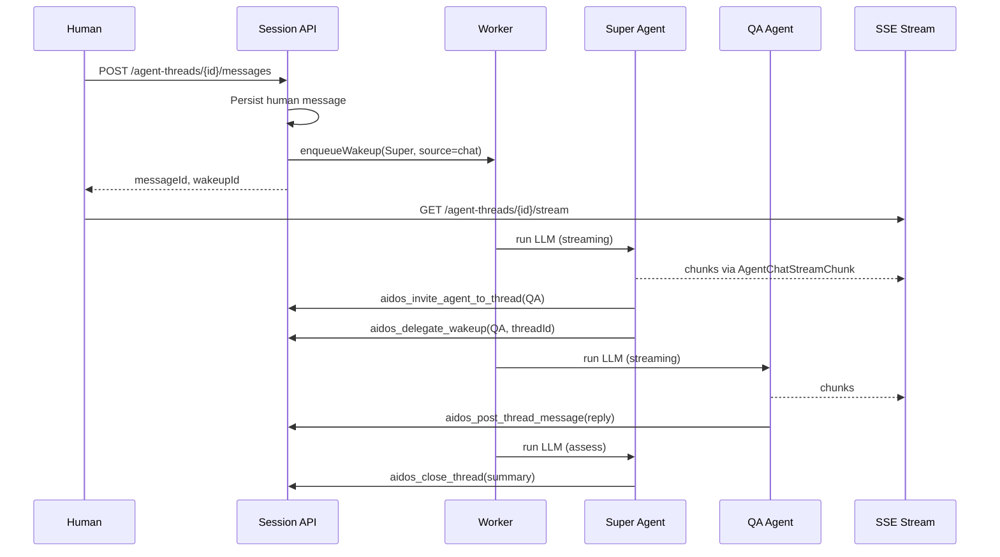
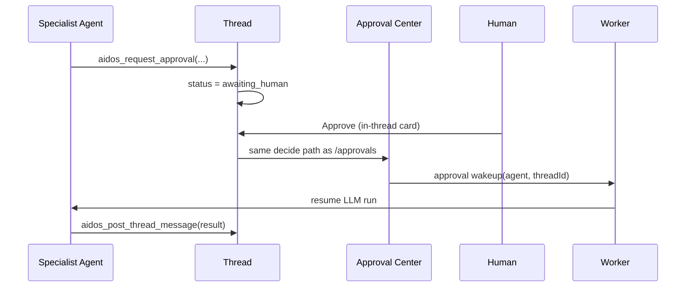

# AIDOS Agent Chat System — Implementation Plan

**Status:** Draft · **Last updated:** 2026-06-11  
**Audience:** Engineering (backend, frontend, architect)  
**Parent doc:** [ai-agents-workflow.md](./ai-agents-workflow.md) (Phase 5 control plane)  
**Phase slot:** **5.6 — Operational Agent Threads**

---

## 1. Executive summary

AIDOS needs a **governed group-chat surface** where humans open **discrete operational threads**, the **Super Agent** coordinates specialist agents, and replies appear in a **shared timeline** — not a ChatGPT-style 1:1 assistant.

This plan implements **Phase 5.6** on top of the existing wakeup queue, LLM adapter, delegation, and Approval Center.

### Locked product decisions

| # | Decision | Choice |
|---|----------|--------|
| 1 | Thread model | **Many threads** — isolated context per topic; future Slack/Discord bot creates threads via external source id |
| 2 | Routing | **Hybrid (Option C)** — Super Agent invites specialists; user may address invited agents directly; **only Super Agent** may close/resolve |
| 3 | Agent actions | **Full operational tools** — critical actions use Approval Center (in-thread UI backed by same `Approval` rows); post-approval wakeup resumes work |
| 4 | Real-time UX | **Async worker + live SSE (Option C)** — stream while user is on page; connection drop is non-fatal; history on return |
| 5 | Transparency | **Results-first (Option B)** — final replies visible; reasoning/tool traces behind per-message **Show reasoning** |

### What this is not

- Not a replacement for Approval Center (approvals remain the governance gate).
- Not a single org-wide channel (avoids unbounded context and token cost).
- Not synchronous blocking chat (worker stays async; SSE is an observation layer).

---

## 2. Progress tracker

Update checkboxes as subtasks complete. **Done when** column is the acceptance test for that subtask.

### Phase 5.6a — Data model & thread CRUD

| ID | Subtask | Owner | Done when | Status |
|----|---------|-------|-----------|--------|
| 5.6a.1 | Prisma models: `AgentChatThread`, `AgentChatParticipant`, `AgentChatMessage`, `AgentChatStreamChunk` | `/backend` | `npx prisma migrate dev` succeeds; org-scoped indexes | ✅ |
| 5.6a.2 | Enums: `AgentChatThreadStatus`, `AgentChatMessageKind`, `AgentChatParticipantRole` | `/backend` | Generated client exports enums | ✅ |
| 5.6a.3 | `AgentWakeupSource.chat` + migration | `/backend` | New wakeup source usable in worker | ✅ |
| 5.6a.4 | `src/lib/agent-chat/` domain module (create, list, get, add message) | `/backend` | Unit-testable functions; org isolation on every query | ✅ |
| 5.6a.5 | `POST /api/agent-threads` — human creates thread | `/backend` | Session auth; returns thread id; Super Agent participant auto-added | ✅ |
| 5.6a.6 | `GET /api/agent-threads` — list with status filter | `/backend` | Paginated; scoped by `organizationId` | ✅ |
| 5.6a.7 | `GET /api/agent-threads/[id]` — thread + participants + messages | `/backend` | 404 cross-org; messages ordered asc | ✅ |
| 5.6a.8 | `POST /api/agent-threads/[id]/messages` — human posts message | `/backend` | Persists message; enqueues Super Agent `chat` wakeup; returns `messageId` + `wakeupId` | ✅ |
| 5.6a.9 | Audit + activity on thread create / human message | `/backend` | `AuditLog` + `ActivityEvent` rows written | ✅ |
| 5.6a.10 | `/agent-threads` list page (Server Component) | `/frontend` | Empty state; open/done tabs; link to thread | ✅ |
| 5.6a.11 | `/agent-threads/new` — create thread form | `/frontend` | Creates thread; redirects to detail | ✅ |
| 5.6a.12 | `/agent-threads/[id]` — static timeline (no SSE yet) | `/frontend` | Renders messages; human compose box | ✅ |
| 5.6a.13 | Nav entry in `AppShell` | `/frontend` | "Agent threads" visible on desktop + mobile nav | ✅ |
| 5.6a.14 | Architect review: tenancy + API contracts | `/architect` | Review note in `docs/reviews/` | ✅ |

**Phase 5.6a exit criteria**

- [x] Human can create a thread, post a message, see it in timeline.
- [x] Super Agent wakeup is enqueued with `threadId` + `messageId` in payload.
- [x] `npm run build` passes.

---

### Phase 5.6b — Super Agent routing & specialist invite

| ID | Subtask | Owner | Done when | Status |
|----|---------|-------|-----------|--------|
| 5.6b.1 | Extend wakeup payload contract for `chat` source | `/backend` | Documented in §6; worker passes payload to adapter | ⬜ |
| 5.6b.2 | Chat context builder: last N messages + participant list + thread metadata | `/backend` | Function returns compact markdown for LLM user message | ⬜ |
| 5.6b.3 | Update Super `AGENTS.md` + `HEARTBEAT.md` for chat routing | `/backend` | Instructions describe invite vs delegate vs close | ⬜ |
| 5.6b.4 | New tool: `aidos_invite_agent_to_thread` | `/backend` | Super-only; adds `AgentChatParticipant`; posts system message | ⬜ |
| 5.6b.5 | New tool: `aidos_post_thread_message` | `/backend` | Agent posts reply; sets `authorAgentId`; kind `agent_reply` | ⬜ |
| 5.6b.6 | Extend `aidos_delegate_wakeup` payload with `threadId`, `triggerMessageId` | `/backend` | Specialist wakeup includes chat context keys | ⬜ |
| 5.6b.7 | Specialist `AGENTS.md` addendum: chat participation rules | `/backend` | Hired specialists know they may reply in invited threads | ⬜ |
| 5.6b.8 | `POST /api/agents/me/chat/...` agent-auth routes backing new tools | `/backend` | Agent API key + `X-Run-Id`; org scoped | ⬜ |
| 5.6b.9 | Thread status transitions: `open` → `routing` → `active` | `/backend` | Updated on Super invite / first specialist reply | ⬜ |
| 5.6b.10 | UI: routing cards ("Super Agent invited QA Intelligence") | `/frontend` | `messageKind=system` renders distinct card | ⬜ |
| 5.6b.11 | UI: participant strip (avatars + roles) | `/frontend` | Shows Super + invited specialists | ⬜ |
| 5.6b.12 | UI: @mention autocomplete for invited agents only | `/frontend` | User can target invited agent; message stored with `targetAgentId` | ⬜ |
| 5.6b.13 | Targeted human message enqueues wakeup for mentioned agent (not Super) | `/backend` | Payload includes `threadId`, `replyToMessageId`, `targetAgentId` | ⬜ |
| 5.6b.14 | E2E manual test script in §12.1 | `/backend` | Documented happy path passes on dev | ⬜ |

**Phase 5.6b exit criteria**

- [ ] User asks "how many bugs are open?" → Super invites QA → QA replies in same thread.
- [ ] User `@QA` follow-up wakes QA directly (Super not required for reply).
- [ ] `npm run build` passes.

---

### Phase 5.6c — Streaming (SSE) & reasoning collapse

| ID | Subtask | Owner | Done when | Status |
|----|---------|-------|-----------|--------|
| 5.6c.1 | `runAnthropicWithToolsStreaming` in `llm/anthropic.ts` | `/backend` | `stream: true`; yields text deltas + tool_use events | ⬜ |
| 5.6c.2 | Stream event bus: persist chunks to `AgentChatStreamChunk` | `/backend` | Chunks linked to `runId` + provisional `messageId` | ⬜ |
| 5.6c.3 | LLM adapter branch: emit chunks when `wakeup.source === "chat"` | `/backend` | Chunks written during run; finalized on run complete | ⬜ |
| 5.6c.4 | Chunk kinds: `text_delta`, `thinking_delta`, `tool_start`, `tool_end`, `run_complete`, `run_error` | `/backend` | Enum + consistent JSON shape (§7) | ⬜ |
| 5.6c.5 | `GET /api/agent-threads/[id]/stream` — SSE endpoint | `/backend` | Session auth; `Last-Event-ID` replay; heartbeat every 15s | ⬜ |
| 5.6c.6 | Finalize stream → `AgentChatMessage` with `contentMarkdown` + `reasoningJson` | `/backend` | Partial chunks discarded after finalize; message id stable | ⬜ |
| 5.6c.7 | `useAgentThreadStream` client hook | `/frontend` | Connects SSE; merges deltas into message placeholders | ⬜ |
| 5.6c.8 | Streaming message bubble (token-by-token) | `/frontend` | Cursor-style live text; agent avatar + name | ⬜ |
| 5.6c.9 | **Show reasoning** expander per agent message | `/frontend` | Collapsed by default; shows thinking + tool trace from `reasoningJson` | ⬜ |
| 5.6c.10 | Disconnect handling: UI shows "Agent still working…" + poll fallback | `/frontend` | On reconnect, SSE resumes from `Last-Event-ID` or GET messages | ⬜ |
| 5.6c.11 | Reuse `MarkdownContent` for finalized messages | `/frontend` | Consistent with run detail page | ⬜ |

**Phase 5.6c exit criteria**

- [ ] User on thread page sees Super + specialist replies stream live.
- [ ] User navigates away mid-stream → returns → sees completed message (no broken state).
- [ ] Reasoning hidden by default; expand shows tool calls.
- [ ] `npm run build` passes.

---

### Phase 5.6d — Thread lifecycle & Super-only close

| ID | Subtask | Owner | Done when | Status |
|----|---------|-------|-----------|--------|
| 5.6d.1 | New tool: `aidos_close_thread` (Super only) | `/backend` | Sets status `done`; writes summary message; `closedAt` | ⬜ |
| 5.6d.2 | New tool: `aidos_reopen_thread` (Super only) | `/backend` | `done` → `active`; system message | ⬜ |
| 5.6d.3 | Status `awaiting_human` when agent needs input | `/backend` | Super or specialist can set via tool | ⬜ |
| 5.6d.4 | Human message on `done` thread auto-reopens (status → `active`) + Super wakeup | `/backend` | User does not need explicit reopen | ⬜ |
| 5.6d.5 | Thread list: status badges, last activity, participant count | `/frontend` | Sort by `updatedAt` desc | ⬜ |
| 5.6d.6 | Thread header: status chip + closure summary when done | `/frontend` | Super closure card pinned or in timeline | ⬜ |
| 5.6d.7 | Disable compose when `done` (show "Send message to reopen") | `/frontend` | UX hint; compose still works | ⬜ |
| 5.6d.8 | Link `AgentHeartbeatRun` → `threadId` in `contextSnapshotJson` | `/backend` | Run detail page links back to thread | ⬜ |

**Phase 5.6d exit criteria**

- [ ] Super assesses QA reply and closes thread with summary.
- [ ] User cannot close thread via API (403).
- [ ] Follow-up on done thread reopens and wakes Super.
- [ ] `npm run build` passes.

---

### Phase 5.6e — Approvals in-thread

| ID | Subtask | Owner | Done when | Status |
|----|---------|-------|-----------|--------|
| 5.6e.1 | `Approval.payloadJson` includes `threadId`, `messageId` (optional) | `/backend` | Existing approval create paths accept chat context | ⬜ |
| 5.6e.2 | New tool: `aidos_request_approval` | `/backend` | Creates `Approval` row; posts `approval_request` message kind | ⬜ |
| 5.6e.3 | Thread status → `awaiting_human` on approval request | `/backend` | Automatic on tool success | ⬜ |
| 5.6e.4 | `POST /api/agent-threads/[id]/approvals/[approvalId]/decide` — thin wrapper | `/backend` | Delegates to existing approval logic + audit | ⬜ |
| 5.6e.5 | Approval decided → enqueue `approval` wakeup to `requestedByAgentId` with `threadId` | `/backend` | Reuses existing approval handler pattern | ⬜ |
| 5.6e.6 | Agent posts `approval_resolved` system message after decision | `/backend` | Visible in thread timeline | ⬜ |
| 5.6e.7 | In-thread approval card component (Approve / Reject) | `/frontend` | Calls decide API; role-gated like Approval Center | ⬜ |
| 5.6e.8 | Deep link to `/approvals` from card | `/frontend` | Same approval id | ⬜ |
| 5.6e.9 | Update `skills/aidos/SKILL.md` — chat + approval flow | `/backend` | LLM knows to use `aidos_request_approval` for critical actions | ⬜ |

**Phase 5.6e exit criteria**

- [ ] Agent proposes critical action → approval card in thread → human approves → agent wakes and completes → reply in thread.
- [ ] Audit log entries match Approval Center decisions.
- [ ] `npm run build` passes.

---

### Phase 5.6f — Context management & multi-agent coordination

| ID | Subtask | Owner | Done when | Status |
|----|---------|-------|-----------|--------|
| 5.6f.1 | Thread context window policy (last 20 messages + summary) | `/backend` | Configurable constant; older messages summarized | ⬜ |
| 5.6f.2 | Super writes `contextSummary` on close (tool field) | `/backend` | Stored on thread; injected on reopen | ⬜ |
| 5.6f.3 | Parallel delegate: Super invites QA + DevOps in one heartbeat | `/backend` | Two delegation wakeups; both post to same thread | ⬜ |
| 5.6f.4 | Sequential chain: second agent sees first agent's reply in context | `/backend` | Integration test with ordered wakeups | ⬜ |
| 5.6f.5 | Super synthesis message optional after specialists reply | `/backend` | Documented in Super AGENTS.md | ⬜ |
| 5.6f.6 | Token usage rollup per thread (sum of runs) | `/backend` | Exposed on thread detail API | ⬜ |

**Phase 5.6f exit criteria**

- [ ] Long thread does not exceed token budget (summary + window).
- [ ] Multi-agent thread completes with two specialist replies visible.
- [ ] `npm run build` passes.

---

### Phase 5.6g — External integration readiness (Slack / Discord)

| ID | Subtask | Owner | Done when | Status |
|----|---------|-------|-----------|--------|
| 5.6g.1 | `externalSource` + `externalChannelId` + `externalThreadId` on thread | `/backend` | Nullable; unique per org when set | ⬜ |
| 5.6g.2 | `POST /api/agent-threads/ingress` — internal/service auth | `/backend` | Creates or appends thread by external ids; same wakeup flow | ⬜ |
| 5.6g.3 | Outbound webhook stub: `thread.message.posted` event | `/backend` | Logged only; no Slack SDK in 5.6g | ⬜ |
| 5.6g.4 | Doc: Slack bot mapping (§11) | `/architect` | Future `@aidos` → `ingress` contract frozen | ⬜ |

**Phase 5.6g exit criteria**

- [ ] Thread created via `ingress` API behaves identically to web-created thread.
- [ ] `npm run build` passes.

---

## 3. Architecture

```
┌──────────────────────────────────────────────────────────────────────────┐
│  Human UI — /agent-threads                                               │
│  Thread list · Timeline · SSE client · In-thread approval cards          │
├──────────────────────────────────────────────────────────────────────────┤
│  Session API                                                             │
│  POST thread · POST message · GET stream (SSE) · GET history           │
├──────────────────────────────────────────────────────────────────────────┤
│  Agent API (Bearer + X-Run-Id)                                           │
│  invite · post_message · close_thread · request_approval · delegate      │
├──────────────────────────────────────────────────────────────────────────┤
│  Worker (unchanged drain loop)                                           │
│  chat wakeup → LLM adapter (streaming) → tools → chunk persist           │
├──────────────────────────────────────────────────────────────────────────┤
│  Prisma — AgentChatThread · Message · Participant · StreamChunk          │
│  Existing — AgentWakeupRequest · AgentHeartbeatRun · Approval            │
└──────────────────────────────────────────────────────────────────────────┘
```

### 3.1 Message flow (happy path)



### 3.2 Design principles

1. **Threads are context boundaries** — each thread loads only its own message window + summary.
2. **Super Agent is coordinator** — invites, assesses, closes; specialists execute domain work.
3. **Worker stays async** — SSE is observability; no long-held HTTP request to Anthropic from browser.
4. **Governance unchanged** — approvals are still `Approval` rows; chat is a presentation layer.
5. **External-ready** — `externalSource` + ingress API mirror web flow for future bots.

---

## 4. Data model

### 4.1 New enums

```prisma
enum AgentChatThreadStatus {
  open
  routing
  active
  awaiting_human
  done
  stalled
}

enum AgentChatMessageKind {
  human
  agent_reply
  system
  approval_request
  approval_resolved
}

enum AgentChatParticipantRole {
  coordinator   // Super Agent — always present
  specialist    // Invited hired agent
  human         // Org user (via userId, not AgentRegistry)
}

enum AgentChatStreamChunkKind {
  text_delta
  thinking_delta
  tool_start
  tool_end
  run_complete
  run_error
}

enum AgentChatExternalSource {
  web
  slack
  discord
  api
}
```

### 4.2 New models

```prisma
model AgentChatThread {
  id                 String                   @id @default(cuid())
  organizationId     String
  title              String
  status             AgentChatThreadStatus    @default(open)
  contextSummary     String?                  // Super-written on close; injected on reopen
  createdByUserId    String?
  externalSource     AgentChatExternalSource  @default(web)
  externalChannelId  String?
  externalThreadId   String?
  closedAt           DateTime?
  createdAt          DateTime                 @default(now())
  updatedAt          DateTime                 @updatedAt

  organization  Organization             @relation(...)
  createdBy     User?                    @relation(...)
  participants  AgentChatParticipant[]
  messages      AgentChatMessage[]

  @@unique([organizationId, externalSource, externalThreadId])
  @@index([organizationId, status, updatedAt])
}

model AgentChatParticipant {
  id             String                   @id @default(cuid())
  organizationId String
  threadId       String
  role           AgentChatParticipantRole
  agentId        String?                  // AgentRegistry when specialist/coordinator
  userId         String?                  // User when human
  invitedAt      DateTime                 @default(now())
  invitedByAgentId String?

  thread AgentChatThread @relation(...)
  agent  AgentRegistry?  @relation(...)
  user   User?           @relation(...)

  @@unique([threadId, agentId])
  @@unique([threadId, userId])
  @@index([organizationId, threadId])
}

model AgentChatMessage {
  id              String               @id @default(cuid())
  organizationId  String
  threadId        String
  kind            AgentChatMessageKind
  contentMarkdown String               @default("")
  reasoningJson   String               @default("{}")  // collapsed: thinking + tools
  authorUserId    String?
  authorAgentId   String?
  targetAgentId   String?              // human @mention
  approvalId      String?
  runId           String?              // AgentHeartbeatRun id
  createdAt       DateTime             @default(now())

  thread  AgentChatThread @relation(...)
  authorUser  User?           @relation(...)
  authorAgent AgentRegistry?  @relation(...)
  approval    Approval?       @relation(...)

  @@index([threadId, createdAt])
  @@index([organizationId, threadId])
}

model AgentChatStreamChunk {
  id             String                   @id @default(cuid())
  organizationId String
  threadId       String
  runId          String
  messageId      String?                  // provisional until finalize
  sequence       Int
  kind           AgentChatStreamChunkKind
  payloadJson    String                   @default("{}")
  createdAt      DateTime                 @default(now())

  @@index([threadId, runId, sequence])
  @@index([threadId, createdAt])
}
```

### 4.3 Existing model changes

```prisma
enum AgentWakeupSource {
  timer
  event
  approval
  on_demand
  delegation
  chat          // NEW
}
```

`Approval.payloadJson` convention (no schema change required):

```json
{
  "threadId": "clx...",
  "messageId": "clx...",
  "action": "assess_release",
  "releaseId": "..."
}
```

---

## 5. API surface

### 5.1 Human / session auth

| Method | Path | Purpose |
|--------|------|---------|
| `POST` | `/api/agent-threads` | Create thread `{ title?, initialMessage? }` |
| `GET` | `/api/agent-threads` | List threads `?status=open\|done\|all&cursor=` |
| `GET` | `/api/agent-threads/[id]` | Thread + participants + messages |
| `POST` | `/api/agent-threads/[id]/messages` | Human message `{ content, targetAgentId? }` |
| `GET` | `/api/agent-threads/[id]/stream` | SSE stream (§7) |
| `POST` | `/api/agent-threads/[id]/approvals/[approvalId]/decide` | Approve/reject from thread UI |

### 5.2 Service / ingress (Phase 5.6g)

| Method | Path | Purpose |
|--------|------|---------|
| `POST` | `/api/agent-threads/ingress` | Bot creates/continues thread by `externalSource` + `externalThreadId` |

Auth: `PLATFORM_WORKER_SECRET` or future integration OAuth — not session cookie.

### 5.3 Agent auth (new routes)

| Method | Path | Tool |
|--------|------|------|
| `POST` | `/api/agents/me/chat/threads/[id]/invite` | `aidos_invite_agent_to_thread` |
| `POST` | `/api/agents/me/chat/threads/[id]/messages` | `aidos_post_thread_message` |
| `POST` | `/api/agents/me/chat/threads/[id]/close` | `aidos_close_thread` |
| `POST` | `/api/agents/me/chat/threads/[id]/reopen` | `aidos_reopen_thread` |
| `POST` | `/api/agents/me/chat/threads/[id]/approvals` | `aidos_request_approval` |

Existing `POST /api/agents/me/delegate` gains optional `threadId` in payload.

### 5.4 Wakeup payload contract (`source: chat`)

```typescript
type ChatWakeupPayload = {
  threadId: string;
  triggerMessageId: string;
  targetAgentId?: string;   // set when human @mentions specialist
  approvalId?: string;      // set on approval follow-up wakeup
  decision?: "APPROVED" | "REJECTED" | "MODIFIED";
};
```

---

## 6. LLM adapter changes

### 6.1 Chat-specific user message

Replace generic heartbeat prompt when `source === "chat"`:

```text
## Agent chat thread
- threadId: ...
- status: active
- participants: Super Agent (coordinator), QA Intelligence (specialist), @user

## Recent messages (newest last)
...

## Your task
- If you are Super Agent: triage, invite specialists, assess replies, close when resolved.
- If you are a specialist: answer the human's question using tools; post reply via aidos_post_thread_message.
- Critical mutations: aidos_request_approval first; do not bypass governance.
```

### 6.2 New LLM tools (add to `llm-tools.ts`)

| Tool | Agent | Description |
|------|-------|-------------|
| `aidos_invite_agent_to_thread` | Super | Add specialist participant + system message |
| `aidos_post_thread_message` | All invited | Post `agent_reply` to thread |
| `aidos_close_thread` | Super | `done` + summary message |
| `aidos_reopen_thread` | Super | Reopen closed thread |
| `aidos_request_approval` | All | Create approval + `approval_request` message |

### 6.3 Streaming adapter path

```text
runLlmAdapter(ctx)
  if ctx.wakeup.source === "chat":
    runAnthropicWithToolsStreaming(...)
      on text_delta    → insert AgentChatStreamChunk
      on tool_start/end → insert chunk (for reasoningJson)
      on complete      → finalize AgentChatMessage
  else:
    existing non-streaming path
```

### 6.4 Reasoning storage (Option B)

`reasoningJson` shape:

```json
{
  "thinking": "…concatenated thinking deltas…",
  "tools": [
    { "name": "aidos_get_inbox", "input": {}, "outputPreview": "…", "startedAt": "…", "endedAt": "…" }
  ]
}
```

UI shows **only** `contentMarkdown` by default; expander reads `reasoningJson`.

---

## 7. SSE protocol

**Endpoint:** `GET /api/agent-threads/[id]/stream`

**Headers:**

- Response: `Content-Type: text/event-stream`, `Cache-Control: no-cache`
- Request: `Last-Event-ID: <chunkId>` for replay

**Event format:**

```text
id: clx_chunk_123
event: chunk
data: {"runId":"...","agentId":"...","kind":"text_delta","text":"The "}

id: clx_chunk_124
event: chunk
data: {"runId":"...","kind":"tool_start","tool":"aidos_get_inbox"}

id: clx_chunk_130
event: message_final
data: {"messageId":"...","kind":"agent_reply","authorAgentId":"..."}

: heartbeat
```

**Client behavior (Option C):**

1. On thread mount → open SSE.
2. On chunk → update in-flight message placeholder.
3. On disconnect → show "Agent still working…"; poll `GET /api/agent-threads/[id]` every 5s as fallback.
4. On remount → SSE with `Last-Event-ID` or full message list if run completed.

**Server cleanup:** Delete `AgentChatStreamChunk` rows older than 24h after message finalize (cron or on finalize).

---

## 8. UI specification

### 8.1 Pages

| Route | Description |
|-------|-------------|
| `/agent-threads` | Thread list: title, status, last message preview, updatedAt |
| `/agent-threads/new` | Optional title + first message |
| `/agent-threads/[id]` | Main group-chat timeline |

### 8.2 Thread detail layout

```text
┌─────────────────────────────────────────────────────────┐
│ ← Threads    [Active]  Bug count inquiry                │
│ Participants: Super · QA Intelligence                   │
├─────────────────────────────────────────────────────────┤
│ [system] Super Agent invited QA Intelligence            │
│ [human]  How many bugs are open?                        │
│ [agent]  QA Intelligence — streaming… █                 │
│ [agent]  QA Intelligence — "12 open defects…" [Reasoning]│
│ [system] Super Agent marked thread done — summary…      │
├─────────────────────────────────────────────────────────┤
│ Message…  [@QA ▾]                            [Send]      │
└─────────────────────────────────────────────────────────┘
```

### 8.3 Message rendering by kind

| Kind | UI treatment |
|------|----------------|
| `human` | Right-aligned or distinct human bubble |
| `agent_reply` | Left-aligned; agent avatar; streaming support |
| `system` | Centered muted card (routing, invite, close) |
| `approval_request` | Action card with Approve/Reject + link to Approval Center |
| `approval_resolved` | Compact status card |

### 8.4 Components (new)

```text
src/components/agent-chat/
  thread-list.tsx
  thread-header.tsx
  participant-strip.tsx
  message-timeline.tsx
  message-bubble.tsx
  system-event-card.tsx
  approval-inline-card.tsx
  streaming-message.tsx
  reasoning-expander.tsx
  compose-box.tsx
  use-agent-thread-stream.ts
```

---

## 9. Governance & approvals

### 9.1 Critical action flow



### 9.2 Rules

- Agents **must** use `aidos_request_approval` for: release assess execution, hire, destructive/integration mutations, any tool flagged `requiresApproval` in registry.
- In-thread approve uses **same role gates** as `POST /api/approvals`.
- All decisions write `AuditLog` + `ActivityEvent` (existing handlers).
- Thread does not auto-close on approval — Super Agent still assesses and closes.

---

## 10. Context & token management

| Policy | Value (v1) |
|--------|------------|
| Messages in LLM prompt | Last **20** messages |
| Older history | Thread `contextSummary` (updated on close) |
| Max specialists per thread | **5** (configurable) |
| Parallel delegations | Allowed; each gets own wakeup |
| Thread title | Auto from first human message (truncate 80 chars) |

---

## 11. Future external integrations (Slack / Discord)

**Not built in 5.6** except ingress contract.

### Slack (future)

```text
User @aidos in #eng → Slack event → POST /api/agent-threads/ingress
  externalSource: slack
  externalChannelId: C123
  externalThreadId: ts_parent (or thread_ts)
  authorExternalId: U456
  content: "how many bugs are open?"
→ Same Super → QA flow
→ Outbound webhook posts reply to Slack thread
```

### Discord (future)

Same pattern with `externalSource: discord`.

**5.6g freezes** the ingress request body so Slack/Discord work is adapter-only later.

---

## 12. Testing guide

### 12.1 Manual E2E (Phase 5.6b+)

1. Sign in as org admin.
2. Create thread with message "How many bugs are open?"
3. Confirm Super Agent wakeup in `/agents/[superId]/runs`.
4. Confirm system message: QA invited.
5. Confirm QA reply appears in thread.
6. Expand **Show reasoning** on QA message — tool trace visible.
7. Confirm Super closes thread with summary.
8. Post follow-up — thread reopens; Super wakes.

### 12.2 Approval E2E (Phase 5.6e)

1. Ask agent to assess a release (triggers approval).
2. Approve in-thread.
3. Confirm agent wakeup with `approvalId` in payload.
4. Confirm completion message in thread.

### 12.3 SSE E2E (Phase 5.6c)

1. Open thread; keep DevTools Network → EventStream open.
2. Post message; observe `text_delta` events.
3. Navigate away mid-stream; return within 60s — message complete.

### 12.4 Automated tests (recommended)

| Test | Path |
|------|------|
| Org isolation on thread GET | `src/lib/agent-chat/__tests__/tenancy.test.ts` |
| Human cannot close thread | API route test |
| Chat wakeup payload parsing | `src/lib/agent-chat/__tests__/wakeup-payload.test.ts` |
| Context window builder | unit test — 25 messages → 20 + summary |

---

## 13. File layout (target)

```text
src/lib/agent-chat/
  threads.ts              # CRUD, status transitions
  messages.ts             # human + system messages
  participants.ts         # invite, list
  context.ts              # LLM context builder
  stream.ts               # chunk persist, finalize, SSE helpers
  ingress.ts              # external bot entry (5.6g)
  types.ts

src/app/api/agent-threads/
  route.ts
  [id]/route.ts
  [id]/messages/route.ts
  [id]/stream/route.ts
  [id]/approvals/[approvalId]/decide/route.ts
  ingress/route.ts

src/app/api/agents/me/chat/threads/[id]/
  invite/route.ts
  messages/route.ts
  close/route.ts
  reopen/route.ts
  approvals/route.ts

src/app/(platform)/agent-threads/
  page.tsx
  new/page.tsx
  [id]/page.tsx

src/components/agent-chat/
  ...

src/lib/agent-control-plane/
  adapters/llm.ts         # streaming branch
  adapters/llm-tools.ts   # new chat tools
  llm/anthropic.ts        # streaming implementation

src/lib/agent-control-plane/onboarding-assets/
  super/AGENTS.md         # chat routing section
  specialist/AGENTS.md    # chat participation section

skills/aidos/
  SKILL.md                # chat + approval tools
  references/chat-api.md  # NEW
```

---

## 14. Environment variables

| Variable | Purpose |
|----------|---------|
| `AGENT_CHAT_CONTEXT_LIMIT` | Max messages in prompt (default `20`) |
| `AGENT_CHAT_STREAM_CHUNK_TTL_HOURS` | Chunk retention after finalize (default `24`) |
| `AGENT_CHAT_SSE_HEARTBEAT_SEC` | SSE comment interval (default `15`) |

Existing worker and Anthropic vars unchanged — see [ai-agents-workflow.md §13](./ai-agents-workflow.md).

---

## 15. Implementation order (recommended)

```text
Week 1   5.6a — schema, CRUD, basic UI (no streaming)
Week 2   5.6b — Super routing, invite, specialist replies
Week 3   5.6c — SSE streaming + reasoning expander
Week 4   5.6d + 5.6e — lifecycle + in-thread approvals
Week 5   5.6f + 5.6g — context limits, multi-agent, ingress stub
         Architect review + npm run build
```

Parallelization:

- **Backend** can land 5.6a APIs before frontend.
- **Frontend** list/detail can mock API until 5.6a.5–5.6a.8 exist.
- **SSE (5.6c)** depends on 5.6b message finalize path.

---

## 16. Risks & mitigations

| Risk | Mitigation |
|------|------------|
| SQLite SSE at scale | Chunk table indexed by `threadId`; purge on finalize; PG validated in 5.5 |
| Duplicate specialist replies | Idempotency key on delegation: `chat:{threadId}:{messageId}:{agentId}` |
| Token blow-up on long threads | Hard context window + summary on close |
| User closes browser mid-approval | Approval state in DB; agent wakes on decide regardless of SSE |
| Super never closes thread | Optional `stalled` after 7d inactivity (future); v1 manual Super heartbeat |

---

## 17. References

- [ai-agents-workflow.md](./ai-agents-workflow.md) — Phase 5 control plane
- [agent-heartbeat-protocol.md](./agent-heartbeat-protocol.md) — wakeup contract
- `src/lib/agent-control-plane/delegation.ts` — existing delegate path
- `src/lib/agent-control-plane/adapters/llm-tools.ts` — tool registry
- `src/app/api/approvals/route.ts` — approval decide handler

---

## 18. Document changelog

| Date | Change |
|------|--------|
| 2026-06-11 | Initial plan from product clarification session |
