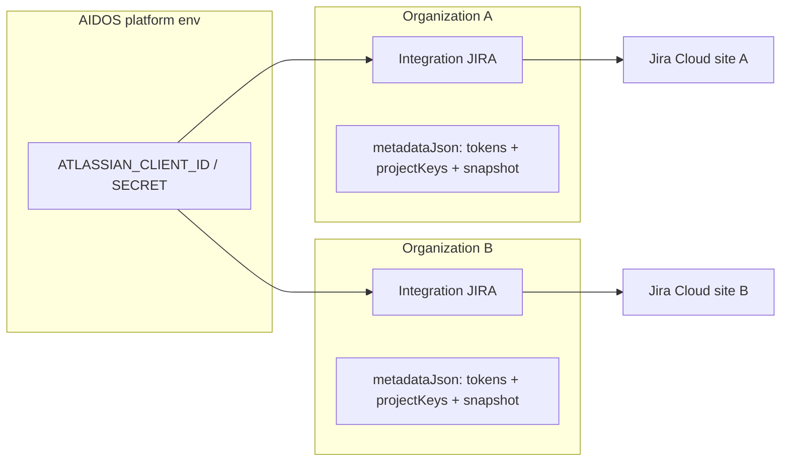
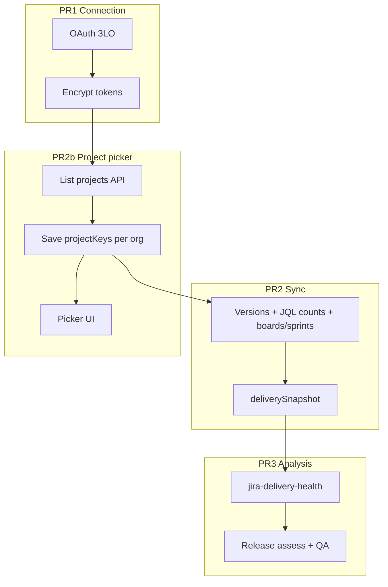

# Jira integration — single source of truth

**Last updated:** 2026-06-02  
**Status:** PR1 ✅ · PR2 (sync) ✅ · PR2b (project picker) ✅ · **PR3 (delivery health)** ✅  
**Owner agents:** `/backend` (OAuth, API, sync), `/frontend` (Integrations UI), `/architect` (review before merge)

**Related docs:** [`MVP-DEVELOPMENT-PLAN.md`](./MVP-DEVELOPMENT-PLAN.md) · [`AIDOS-PHASE-1-EXECUTION.md`](./AIDOS-PHASE-1-EXECUTION.md)

> **This document is the only spec for Jira integration.** Do not duplicate scope, API contracts, or tenancy rules elsewhere. Link here from MVP plan / agent prompts.

---

## 1. Purpose

Connect **Jira Cloud** to AIDOS with **read-only** access so the platform can:

1. Pull **boards**, **issues**, and **release/fix versions** (per org, per selected projects)
2. Run **delivery health analysis** (blockers, overdue work, version slip, sprint progress)
3. Feed **release governance** and QA intelligence (`assessQAIntelligence`, `assessReleaseGovernance`)

**AIDOS never writes to Jira** — no issue/epic/version creation, updates, comments, or transitions.

---

## 2. Product constraints (non-negotiable)

| Rule | Detail |
|------|--------|
| Read-only | No `write:jira-work` or admin write scopes |
| Human-governed | Sync and analysis inform recommendations only |
| **Multi-tenant SaaS** | Each **organization** connects its own Jira site; tokens and project selection live in that org’s `Integration.metadataJson` — **never** in per-customer env vars |
| Platform OAuth app | One `ATLASSIAN_CLIENT_ID` / `SECRET` for the AIDOS deployment (all tenants); each org gets its own tokens via OAuth |
| MVP autonomy | Recommend-only; no automated Jira mutations |
| Verify build | Run `npm run build` before marking any PR complete |

---

## 3. Implementation status

| Phase | Scope | Status |
|-------|--------|--------|
| **PR1** | OAuth connect/disconnect, encrypted tokens, connection probe | ✅ Done |
| **PR2** | Read sync → `deliverySnapshot`, sync API + panel button | ✅ Done |
| **PR2b** | Per-org project picker (SaaS) | ✅ Done |
| **PR3** | `jira-delivery-health.ts`, wire release assess + QA | ✅ Done |

### 3.1 Shipped files

| Area | Path |
|------|------|
| OAuth (shared state) | `src/lib/oauth-state.ts` |
| Jira OAuth | `src/lib/jira-oauth.ts` — scopes in `JIRA_OAUTH_SCOPES` |
| Meta + snapshot types | `src/lib/jira-meta.ts` |
| Jira API client | `src/lib/jira-api.ts` |
| Sync engine | `src/lib/jira-sync.ts` |
| Delivery health | `src/lib/jira-delivery-health.ts` |
| Project selection | `src/lib/jira-project-selection.ts` |
| Routes | `authorize`, `callback`, `sync`, `projects` under `src/app/api/integrations/jira/` |
| UI | `src/components/integrations/jira-integration-panel.tsx` |
| Integrations page | `src/app/(platform)/integrations/page.tsx` |
| QA `hasJira` fix | `src/lib/qa-intelligence.ts` — real OAuth only |

### 3.2 Not shipped
- Multi-site picker (`availableSites.length > 1`)
- Scheduled / webhook-driven sync
- `JiraSyncSnapshot` Prisma table (historical trends)

### 3.3 Intentionally unchanged

| Item | Reason |
|------|--------|
| Accelerator `jiraEpicsJson` | Offline generated epics — not Jira API |
| Discovery “Jira” checkbox | Org intent; may seed `PENDING` integration |
| `POST /api/integrations/connect` for JIRA | Returns `400` — OAuth only |

---

## 4. SaaS architecture



| Data | Where it lives |
|------|----------------|
| OAuth app credentials | Platform `.env` only |
| Access / refresh tokens | Per org `Integration.metadataJson` (encrypted) |
| Selected project keys | Per org `metadataJson.projectKeys` |
| Delivery snapshot | Per org `metadataJson.deliverySnapshot` |
| Last sync time | `Integration.lastSyncAt` |

**Project key resolution for sync (PR2b+):**

1. Request body `projectKeys` (optional one-off override on sync)
2. Org metadata `projectKeys` (saved via project picker — **primary path**)
3. ~~`JIRA_SYNC_PROJECT_KEYS` env~~ — **removed** (was platform-wide; invalid for SaaS)
4. ~~Auto-discover first 10 projects~~ — **removed** (includes Atlassian sample projects; bad UX)

If no projects are selected, sync returns `400` with *“Select at least one Jira project before syncing.”*

---

## 5. Phase overview



---

## 6. PR1 — Connection (complete)

### 6.1 Atlassian developer setup

1. Create OAuth 2.0 (3LO) app: [developer.atlassian.com/console/myapps/](https://developer.atlassian.com/console/myapps/)
2. **Callback URL:** `{NEXT_PUBLIC_APP_URL}/api/integrations/jira/callback`
3. **Permissions (read-only)** — enable in app **and** request in authorize URL:

| Scope | Purpose |
|-------|---------|
| `read:jira-work` | Issues, JQL counts, versions |
| `read:jira-user` | User profile |
| `read:project:jira` | Browse projects |
| `read:board-scope:jira-software` | Boards |
| `read:sprint:jira-software` | Sprints |
| `offline_access` | Refresh token |

4. Do **not** request write scopes.

Canonical scope string: `JIRA_OAUTH_SCOPES` in `src/lib/jira-oauth.ts`.

### 6.2 Platform environment variables

```bash
# Platform only — NOT per tenant
ATLASSIAN_CLIENT_ID=""
ATLASSIAN_CLIENT_SECRET=""
NEXT_PUBLIC_APP_URL="http://localhost:3000"
AUTH_SECRET=""   # token encryption
```

### 6.3 `JiraIntegrationMeta`

```ts
export type JiraIntegrationMeta = {
  mode: "oauth-readonly";
  cloudId: string;
  siteUrl: string;
  siteName?: string;
  accountId?: string;
  displayName?: string;
  scopes?: string;
  accessTokenEnc: string;
  refreshTokenEnc?: string;
  connectedBy: string;
  availableSites?: Array<{ cloudId: string; siteUrl: string; siteName?: string }>;
  lastConnectionCheckAt?: string;
  connectionStatus?: "ok" | "error";
  lastError?: string;
  projectKeys?: string[];           // PR2b — org-selected sync targets
  lastSyncSummary?: string;
  deliverySnapshot?: JiraDeliverySnapshot;
};
```

### 6.4 PR1 acceptance

- [x] OAuth connect/disconnect only
- [x] Tokens encrypted; org-scoped callback
- [x] Audit + activity on connect
- [x] `hasJira` requires real connection

---

## 7. PR2 — Read sync (complete)

### 7.1 `POST /api/integrations/jira/sync`

- Auth: session + `manage_integrations`
- Body (optional): `{ projectKeys?: string[] }`
- Returns: `{ ok: true, summary, syncedAt, projectCount }`

### 7.2 Jira API endpoints (current)

| Use | Endpoint | Notes |
|-----|----------|--------|
| Issue counts | `POST /rest/api/3/search/approximate-count` | Replaces removed `POST /rest/api/3/search` (410) |
| List projects | `GET /rest/api/3/project/search` | Project picker |
| Project detail | `GET /rest/api/3/project/{key}` | |
| Versions | `GET /rest/api/3/project/{key}/versions` | |
| Boards | `GET /rest/agile/1.0/board?projectKeyOrId=` | Optional; skipped on 401/403/404 |
| Sprints | `GET /rest/agile/1.0/board/{id}/sprint` | Scrum only |

Base URL: `https://api.atlassian.com/ex/jira/{cloudId}/...`

### 7.3 `JiraDeliverySnapshot`

```ts
export type JiraDeliverySnapshot = {
  syncedAt: string;
  projects: Array<{
    key: string;
    name: string;
    openIssues: number;
    blockedCount: number;
    overdueCount: number;
    bugsOpen: number;
    unassignedCount: number;
    versions: Array<{
      id: string;
      name: string;
      released: boolean;
      releaseDate?: string;
      overdue?: boolean;
    }>;
    board?: { id: number; name: string; type: string };
    activeSprint?: {
      id: number;
      name: string;
      state: string;
      startDate?: string;
      endDate?: string;
      committed?: number;
      done?: number;
    };
  }>;
};
```

**JQL count patterns** (via approximate-count):

| Metric | JQL |
|--------|-----|
| Open | `project = KEY AND statusCategory != Done` |
| Blocked | `... AND (status = Blocked OR labels = blocked) AND statusCategory != Done` |
| Overdue | `... AND duedate < now() AND statusCategory != Done` |
| Bugs | `... AND issuetype = Bug AND statusCategory != Done` |
| Unassigned | `... AND assignee is EMPTY AND statusCategory != Done` |

**P2b enrichment** (per project, capped at 5 fix versions for per-version JQL):

| Metric | JQL |
|--------|-----|
| Resolved (7d) | `project = KEY AND resolved >= -7d` |
| To Do | `project = KEY AND statusCategory = "To Do"` |
| In progress | `project = KEY AND statusCategory = "In Progress"` |
| Done (total) | `project = KEY AND statusCategory = Done` |
| Open in version | `project = KEY AND fixVersion = "NAME" AND statusCategory != Done` |

Stored on `JiraDeliverySnapshot.projects[]` as `resolvedLast7d`, `statusBreakdown`, and `versions[].openIssuesInVersion`.

### 7.4 PR2 acceptance

- [x] Manual sync stores snapshot in org metadata
- [x] `lastSyncAt` updated; errors on `lastError`
- [x] Panel shows summary + snapshot counts
- [x] `npm run build` passes

---

## 8. PR2b — Per-org project picker (complete)

### 8.1 Goal

Each org admin chooses which Jira projects AIDOS syncs. Selection persists in org metadata — no platform env allowlist.

### 8.2 API routes

**`GET /api/integrations/jira/projects`**

- Auth: session + `manage_integrations`
- Loads org’s Jira integration, refreshes token if needed
- Returns:

```ts
{
  ok: true,
  projects: Array<{ key: string; name: string }>,
  selectedKeys: string[],
  maxProjects: 10
}
```

**`PUT /api/integrations/jira/projects`**

- Auth: session + `manage_integrations`
- Body (Zod): `{ projectKeys: string[] }` — 1–10 unique keys
- Validates keys exist on org’s Jira site (best-effort `getJiraProject` per key)
- Saves to `metadataJson.projectKeys`
- Audit: `integration.jira.projects_updated`

### 8.3 Sync resolution (updated)

```
body.projectKeys?  →  metadata.projectKeys  →  error if empty
```

### 8.4 Frontend — `JiraIntegrationPanel`

When connected + `canManage`:

1. Load projects on mount (`GET .../projects`)
2. Checkbox list with project key + name
3. **Save selection** → `PUT .../projects`
4. **Sync Jira data** disabled until ≥1 project selected
5. Show `selectedKeys` for all users (read-only if !canManage)

View-only users: see selected projects and snapshot; cannot connect, save, or sync.

### 8.5 PR2b acceptance

- [x] Org A and Org B can connect different Jira sites with different project selections
- [x] Sync fails with clear message if no projects selected
- [x] No `JIRA_SYNC_PROJECT_KEYS` usage in sync path
- [x] `npm run build` passes

---

## 9. PR3 — Delivery health analysis (complete)

### 9.1 `src/lib/jira-delivery-health.ts`

Input: `JiraDeliverySnapshot` → `JiraDeliveryHealth` (score 0–100, signals, gaps).

### 9.2 Wire assessors

- `src/lib/qa-intelligence.ts` — blend Jira health into readiness
- `src/app/api/releases/[id]/assess/route.ts` — load org snapshot, run health, pass to assessors
- Match release name/version to Jira fixVersion (fuzzy)

### 9.3 PR3 acceptance

- [x] Release assess uses real Jira gaps when connected + synced
- [x] Gap “Run Jira sync” when connected but no snapshot
- [x] `npm run build` passes

---

## 10. Future (post-PR3)

| Item | Notes |
|------|--------|
| Multi-site picker | When `availableSites.length > 1` |
| Inbound webhooks | Read-only snapshot refresh |
| Scheduled sync | `POST /api/platform/jira/sync` with `PLATFORM_WORKER_SECRET` (external cron; see `delivery-analysis.md` §8) |
| `JiraSyncSnapshot` table | Historical trends |
| Architect review | `docs/reviews/YYYY-MM-DD-jira-oauth-architecture-review.md` |

---

## 11. Security checklist

- [x] OAuth `state` JWT, org match on callback
- [x] Tokens encrypted in `metadataJson` only
- [x] No tokens in audit logs, API responses, or client props
- [x] All queries filter by `session.organizationId`
- [x] Connect / sync / project APIs require `manage_integrations`
- [x] Read-only Atlassian scopes only

---

## 12. Testing guide

### Connect

1. Platform env: `ATLASSIAN_CLIENT_ID`, `ATLASSIAN_CLIENT_SECRET`, `NEXT_PUBLIC_APP_URL`
2. Register callback on Atlassian app; enable scopes from §6.1
3. Login → `/integrations` → Connect Jira → approve consent

### Project picker + sync

1. Select projects in panel → Save selection
2. Sync → verify `lastSyncAt`, snapshot counts, `metadataJson.projectKeys`
3. Second org: different Jira account → different projects (tenancy check)

### PR3 (when shipped)

1. Create release matching a Jira fix version name
2. Assess release → Jira-derived gaps in response

---

## 13. Agent handoff prompts

**PR2b — Backend:**

> Per `docs/jira-integration.md` §8: add `jira-project-selection.ts`, GET/PUT `/api/integrations/jira/projects`, remove env/auto-discover from sync resolution; require metadata `projectKeys`.

**PR2b — Frontend:**

> Project picker in `JiraIntegrationPanel` per §8.4; disable sync until selection saved.

**PR3:**

> Implement `jira-delivery-health.ts` and wire release assess per §9.

**Architect:**

> Review tenancy, token storage, read-only scopes, and SaaS project isolation.

---

*End of plan.*
