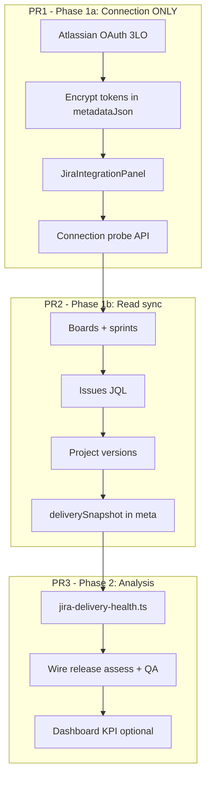

# Jira integration — implementation plan

**Last updated:** 2026-06-02  
**Status:** PR1 (Phase 1a — connection) implemented; pending manual OAuth test + merge  
**Owner agents:** `/backend` (OAuth, API, sync), `/frontend` (Integrations UI), `/architect` (review before merge)

**Related docs:** [`MVP-DEVELOPMENT-PLAN.md`](./MVP-DEVELOPMENT-PLAN.md) · [`AIDOS-PHASE-1-EXECUTION.md`](./AIDOS-PHASE-1-EXECUTION.md) · [`reviews/2026-05-17-github-oauth-architecture-review.md`](./reviews/2026-05-17-github-oauth-architecture-review.md)

---

## 1. Purpose

Connect **Jira Cloud** to AIDOS with **read-only** access so the platform can:

1. Pull **boards**, **issues**, and **release/fix versions**
2. Run **delivery health analysis** (blockers, overdue work, version slip, sprint progress)
3. Feed **release governance** and QA intelligence (`assessQAIntelligence`, `assessReleaseGovernance`)

**AIDOS never writes to Jira** — no issue/epic/version creation, updates, comments, or transitions. Cancel any “push to Jira” / Sprint A3 write flows from the MVP plan.

---

## 2. Product constraints (non-negotiable)

| Rule | Detail |
|------|--------|
| Read-only | OAuth scopes must not include `write:jira-work` or admin write scopes |
| Human-governed | Sync and analysis inform recommendations only; no automated Jira mutations |
| Multi-tenant | All `Integration` rows and API calls scoped by `session.organizationId` |
| MVP autonomy | Recommend-only; connection + sync do not auto-change releases or approvals |
| Verify build | Run `npm run build` before marking any PR complete |

---

## 3. Current repo state

### 3.1 What exists

| Area | Path / note |
|------|-------------|
| Prisma enum | `IntegrationProvider.JIRA` in `prisma/schema.prisma` |
| Integration model | `metadataJson`, `status`, `lastSyncAt`, etc. |
| Integrations UI | `src/app/(platform)/integrations/page.tsx` — Jira card uses **stub connect** |
| Stub connect API | `POST /api/integrations/connect` — marks JIRA `CONNECTED` with fake `read-only-stub` metadata |
| Disconnect | `POST /api/integrations/disconnect` — works for all providers |
| QA check | `src/lib/qa-intelligence.ts` — `hasJira` if connected **or** discovery tool `jira` (misleading) |
| Discovery | Seeds integration rows when tools include `jira` |
| Accelerator | **Local** `jiraEpicsJson` from rule engine — **not** Jira API (keep) |
| Webhook ingest map | `src/lib/webhook-ingest.ts` — `jira: "JIRA"` (optional later) |
| Token encryption | `src/lib/token-crypto.ts` — reuse for `accessTokenEnc` / `refreshTokenEnc` |

### 3.2 What does NOT exist (PR2+)

- `src/lib/jira-sync.ts`, `jira-delivery-health.ts`
- Real sync or analysis wired to releases/dashboard

### 3.3 Reference implementation (mirror this)

| Concern | GitHub reference |
|---------|------------------|
| OAuth state JWT | `src/lib/github-oauth.ts` (`signOAuthState`, `verifyOAuthState`) |
| Authorize route | `src/app/api/integrations/github/authorize/route.ts` |
| Callback route | `src/app/api/integrations/github/callback/route.ts` |
| Token in metadata | `buildOAuthMeta` in `src/lib/github-api.ts` + `encryptToken` |
| Integration meta | `src/lib/integration-meta.ts` |
| Sync + telemetry | `src/lib/github-sync.ts`, `POST .../github/sync` |
| UI panel | `src/components/integrations/github-integration-panel.tsx` |
| OAuth connect button | `GitHubOAuthConnect` in `integration-actions.tsx` |

---

## 4. Code to remove or change

Implement these changes as part of **PR1 (connection)** so Jira cannot appear connected without OAuth.

| Item | Action |
|------|--------|
| `StubConnectButton` for `JIRA` on integrations page | Remove — render `JiraIntegrationPanel` instead |
| `POST /api/integrations/connect` when `provider === "JIRA"` | Return `400` `{ error: "Connect Jira via OAuth on the Integrations page" }` |
| `hasJira` in `qa-intelligence.ts` | **Only** true when `JIRA` integration is `CONNECTED` with valid `cloudId` + `accessTokenEnc` in metadata — **not** `tools.includes("jira")` alone |
| MVP plan “push-jira” / write APIs | Do not implement; update `MVP-DEVELOPMENT-PLAN.md` when PR1 merges |

### Keep (not part of Jira API integration)

| Item | Reason |
|------|--------|
| Accelerator `jiraEpicsJson`, `JiraEpic`, `JiraEpicsList` | Offline generated epics for export/copy — no API |
| Discovery checkbox “Jira” | Org intent; may create `PENDING` integration, not `CONNECTED` |
| `IntegrationProvider.JIRA` enum | Required |

---

## 5. Phase overview



**Implement PR1 first.** Do not start sync/analysis until OAuth connect/disconnect is verified manually.

---

## 6. PR1 — Phase 1a: Connection only

### 6.1 Goal

Org admin connects Jira Cloud once. AIDOS stores encrypted tokens, binds a `cloudId` / site URL, proves the link via Atlassian APIs. **No** board/issue/version sync in this PR.

### 6.2 Atlassian developer setup

1. Create OAuth 2.0 (3LO) app: [developer.atlassian.com/console/myapps/](https://developer.atlassian.com/console/myapps/)
2. **Callback URL:** `{NEXT_PUBLIC_APP_URL}/api/integrations/jira/callback`  
   Example local: `http://localhost:3000/api/integrations/jira/callback`
3. **Scopes (read-only):**
   - `read:jira-work`
   - `read:jira-user`
   - `offline_access` (refresh token)
4. Do **not** request `write:jira-work` or project-admin write scopes.

### 6.3 Environment variables

Add to `.env.example`:

```bash
# Jira Cloud (Atlassian OAuth 3LO) — https://developer.atlassian.com/console/myapps/
ATLASSIAN_CLIENT_ID=""
ATLASSIAN_CLIENT_SECRET=""

# Optional — used in PR2 sync allowlist (comma-separated project keys)
# JIRA_SYNC_PROJECT_KEYS="PROJ,ENG"
```

Uses existing `NEXT_PUBLIC_APP_URL` and `AUTH_SECRET` (token encryption via `token-crypto.ts`).

### 6.4 New / modified files (PR1)

| File | Action |
|------|--------|
| `src/lib/oauth-state.ts` | **Create** — extract `signOAuthState`, `verifyOAuthState`, `OAuthState` type from `github-oauth.ts`; update GitHub to import from here |
| `src/lib/jira-oauth.ts` | **Create** — config, authorize URL, code exchange, refresh |
| `src/lib/jira-meta.ts` | **Create** — `JiraIntegrationMeta`, `parseJiraMeta`, `mergeJiraMeta` |
| `src/lib/jira-api.ts` | **Create** — `JiraApiError`, `getJiraAccessToken`, connection probe only in PR1 |
| `src/app/api/integrations/jira/authorize/route.ts` | **Create** — GET, session required |
| `src/app/api/integrations/jira/callback/route.ts` | **Create** — GET, exchange code, upsert integration |
| `src/components/integrations/jira-integration-panel.tsx` | **Create** |
| `src/components/integrations/integration-actions.tsx` | **Add** `JiraOAuthConnect` |
| `src/app/(platform)/integrations/page.tsx` | **Wire** Jira panel; remove stub for JIRA |
| `src/app/api/integrations/connect/route.ts` | **Reject** JIRA |
| `src/components/integrations/integration-alerts.tsx` | **Add** Jira success/error keys |
| `src/lib/qa-intelligence.ts` | **Fix** `hasJira` logic |
| `src/lib/github-oauth.ts` | **Refactor** to use `oauth-state.ts` |

### 6.5 OAuth flow (backend)

**Authorize (`GET /api/integrations/jira/authorize`):**

1. `getSession()` — redirect `/login` if missing
2. If `!getJiraOAuthConfig().configured` → redirect `/integrations?error=jira_oauth_not_configured`
3. `signOAuthState({ organizationId, userId })`
4. Redirect to Atlassian authorize URL:

```
https://auth.atlassian.com/authorize
  ?audience=api.atlassian.com
  &client_id={ATLASSIAN_CLIENT_ID}
  &scope=read:jira-work read:jira-user offline_access
  &redirect_uri={callback}
  &state={jwt}
  &response_type=code
  &prompt=consent
```

**Callback (`GET /api/integrations/jira/callback`):**

1. Handle `error` query → `/integrations?error=jira_{error}`
2. Require `code` + `state`; verify JWT; **reject** if `oauthState.organizationId !== session.organizationId` → `jira_org_mismatch`
3. `POST https://auth.atlassian.com/oauth/token` with `grant_type=authorization_code`, `client_id`, `client_secret`, `code`, `redirect_uri`
4. `GET https://api.atlassian.com/oauth/token/accessible-resources` with `Authorization: Bearer {access_token}`
5. Pick site: if one resource, use it; if multiple, use first and store `availableSites[]` in meta for future UI picker (PR2)
6. Build metadata (encrypt tokens); upsert `Integration` where `provider: JIRA`
7. `ActivityEvent` + `AuditLog` (see §6.8)
8. Redirect `/integrations?connected=jira`

**Token refresh (in `jira-oauth.ts` or `jira-api.ts`):**

```
POST https://auth.atlassian.com/oauth/token
  grant_type=refresh_token
  client_id, client_secret, refresh_token
```

Call before sync (PR2) or connection re-check when access token returns 401.

### 6.6 `JiraIntegrationMeta` schema (PR1)

Store in `Integration.metadataJson`:

```ts
export type JiraIntegrationMeta = {
  mode: "oauth-readonly";
  cloudId: string;
  siteUrl: string;              // e.g. https://acme.atlassian.net
  siteName?: string;
  accountId?: string;
  displayName?: string;
  scopes?: string;
  accessTokenEnc: string;
  refreshTokenEnc?: string;
  connectedBy: string;
  availableSites?: Array<{ cloudId: string; siteUrl: string; siteName?: string }>;
  lastConnectionCheckAt?: string;  // ISO
  connectionStatus?: "ok" | "error";
  lastError?: string;
  // PR2+:
  projectKeys?: string[];
  lastSyncSummary?: string;
  deliverySnapshot?: JiraDeliverySnapshot;
};
```

Use `encryptToken` / `decryptToken` from `src/lib/token-crypto.ts` (same as GitHub).

### 6.7 Jira API base URLs (PR1 probe)

| Call | URL |
|------|-----|
| Accessible resources | `GET https://api.atlassian.com/oauth/token/accessible-resources` |
| Current user (optional) | `GET https://api.atlassian.com/ex/jira/{cloudId}/rest/api/3/myself` |

All Jira REST calls in PR2+ use:

```
https://api.atlassian.com/ex/jira/{cloudId}/rest/api/3/...
```

Agile API (boards/sprints):

```
https://api.atlassian.com/ex/jira/{cloudId}/rest/agile/1.0/...
```

### 6.8 Audit & activity (PR1)

| Event | `AuditLog.action` | Notes |
|-------|-------------------|--------|
| Connect | `integration.jira.connected` | `metadataJson`: `{ siteUrl, cloudId }` — no raw tokens |
| Disconnect | `integration.jira.disconnected` | Clear secrets from metadata |
| Activity | `integration.connected` | `title`: "Jira connected via OAuth" |

### 6.9 Frontend — `JiraIntegrationPanel` (PR1)

Mirror `GitHubIntegrationPanel` patterns:

- **Disconnected:** `JiraOAuthConnect` → `/api/integrations/jira/authorize`
- **Missing env:** banner if `ATLASSIAN_CLIENT_ID` not set (server passes `configured: boolean`)
- **Connected:** site name/URL, connected date, connection status, Disconnect (existing `DisconnectButton`)
- **Do not show** Sync button until PR2

Respect `canManage` from `hasPermission(session, "integrations", "manage_integrations")` — view-only users see status without connect/disconnect.

### 6.10 Integration alerts (PR1)

Add to `MESSAGES` in `integration-alerts.tsx`:

| Query key | Tone | Message |
|-----------|------|---------|
| `connected=jira` | success | Jira connected successfully. Read-only access is active. |
| `jira_oauth_not_configured` | error | Jira OAuth is not configured. Add ATLASSIAN_CLIENT_ID and ATLASSIAN_CLIENT_SECRET to .env. |
| `jira_access_denied` | error | Atlassian authorization was cancelled. |
| `jira_callback_failed` | error | Jira connection failed. Check OAuth callback URL and credentials. |
| `jira_org_mismatch` | error | Organization mismatch during Jira callback. |
| `jira_missing_params` | error | Invalid Jira callback. Missing code or state. |

Update `IntegrationAlerts` key resolver for `connected === "jira"`.

### 6.11 PR1 acceptance criteria

- [x] Connect/disconnect Jira Cloud via OAuth only
- [x] Stub `POST /connect` cannot connect JIRA
- [x] Tokens encrypted in `metadataJson`; never logged or returned to client
- [x] `verifyOAuthState` org match enforced on callback
- [x] `hasJira` in QA intelligence requires real OAuth connection
- [x] Audit + activity events on connect
- [x] `npm run build` passes
- [ ] Manual test: connect → see site on card → disconnect → status DISCONNECTED

### 6.12 PR1 out of scope

- JQL issue search, boards, sprints, versions
- `POST /api/integrations/jira/sync`
- `jira-delivery-health.ts`
- Changes to `POST /api/releases/[id]/assess` beyond `hasJira` fix
- Inbound webhooks
- Jira Server/Data Center (Cloud only for v1)

---

## 7. PR2 — Phase 1b: Read sync

### 7.1 Goal

Pull boards, issues, and release/fix versions into a **delivery snapshot** for analysis. Still zero writes to Jira.

### 7.2 API route

`POST /api/integrations/jira/sync`

- Session + `requirePermission(session, "integrations", "manage_integrations")` (same as GitHub sync)
- Body (optional Zod): `{ projectKeys?: string[] }` — override env allowlist
- Returns `{ ok: true, summary: string, syncedAt: string }`

### 7.3 `src/lib/jira-sync.ts`

1. Load `Integration` for org + `JIRA`, status `CONNECTED`
2. Decrypt access token; refresh if 401
3. Resolve project keys: `JIRA_SYNC_PROJECT_KEYS` env → metadata `projectKeys` → body → else all visible projects (cap e.g. 10)
4. For each project:
   - **Versions:** `GET /rest/api/3/project/{projectIdOrKey}/versions`
   - **Boards:** `GET /rest/agile/1.0/board?projectKeyOrId={key}` — take first scrum/kanban board
   - **Sprints:** `GET /rest/agile/1.0/board/{boardId}/sprint?state=active,future` (if scrum)
   - **Issues:** `POST /rest/api/3/search` with JQL, e.g.  
     `project = {KEY} AND statusCategory != Done ORDER BY updated DESC`  
     paginate with `maxResults=50`, cap total per project (e.g. 200)
5. Build `JiraDeliverySnapshot` (see §7.4)
6. `mergeJiraMeta({ deliverySnapshot, lastSyncSummary, projectKeys })`
7. `markIntegrationSync(organizationId, "JIRA")` from `integration-health.ts`
8. Optional: push summary events via `ingestNormalizedEvents` (`eventType: CUSTOM`, `source: jira`)

### 7.4 `JiraDeliverySnapshot` (stored in metadata or DB)

```ts
export type JiraDeliverySnapshot = {
  syncedAt: string;
  projects: Array<{
    key: string;
    name: string;
    openIssues: number;
    blockedCount: number;
    overdueCount: number;
    bugsOpen: number;
    unassignedCount: number;
    versions: Array<{
      id: string;
      name: string;
      released: boolean;
      releaseDate?: string;
      overdue?: boolean;  // unreleased && releaseDate < today
    }>;
    board?: { id: number; name: string; type: string };
    activeSprint?: {
      id: number;
      name: string;
      state: string;
      startDate?: string;
      endDate?: string;
      committed?: number;
      done?: number;
    };
  }>;
};
```

**JQL helpers (examples):**

| Metric | JQL fragment |
|--------|----------------|
| Blocked | `status = Blocked` or `labels = blocked` (make configurable later) |
| Overdue | `duedate < now() AND statusCategory != Done` |
| Bugs open | `type = Bug AND statusCategory != Done` |
| Unassigned | `assignee is EMPTY AND statusCategory != Done` |

If payload exceeds ~100KB, add Prisma model `JiraSyncSnapshot` in a follow-up migration; start with metadata for speed.

### 7.5 Frontend (PR2)

- Sync button on `JiraIntegrationPanel` (like GitHub)
- Show `lastSyncSummary`, `lastSyncAt`, project keys
- Loading/error states on sync

### 7.6 PR2 acceptance criteria

- [ ] Manual sync pulls versions + issues + board/sprint for at least one project
- [ ] `lastSyncAt` updated; errors set `integration.lastError`
- [ ] Snapshot visible in server-rendered panel (counts summary, not full issue list)
- [ ] `npm run build` passes

---

## 8. PR3 — Phase 2: Delivery health analysis

### 8.1 `src/lib/jira-delivery-health.ts`

Input: `JiraDeliverySnapshot`  
Output:

```ts
export type JiraDeliveryHealth = {
  score: number;  // 0-100
  signals: Array<{
    id: string;
    label: string;
    value: string;
    severity: "info" | "warning" | "critical";
  }>;
  gaps: Array<{ area: string; gap: string; priority: "low" | "medium" | "high" }>;
};
```

**Scoring guidelines (tune weights in code):**

| Signal | Penalty direction |
|--------|-------------------|
| Any blocker issues | High |
| Overdue % of open issues | High |
| Unreleased version past `releaseDate` | High |
| Open bugs count | Medium |
| Unassigned % | Medium |
| Active sprint completion &lt; 70% near end date | Medium |

Store `deliveryHealthScore` on snapshot or meta after sync.

### 8.2 Wire assessors

**`src/lib/qa-intelligence.ts`:**

- Accept optional `jiraHealth?: JiraDeliveryHealth`
- When present: replace synthetic traceability line; add real `testGaps` from `jiraHealth.gaps`
- Blend `readinessScore` e.g. `Math.round(0.6 * baseScore + 0.4 * jiraHealth.score)` (document constant)

**`src/app/api/releases/[id]/assess/route.ts`:**

- Load Jira integration meta; if `deliverySnapshot` exists, run `computeJiraDeliveryHealth`
- Pass into `assessReleaseGovernance` / `assessQAIntelligence`

**Release ↔ version matching:**

- Match `release.name` or `release.version` to Jira `fixVersion` / version name (fuzzy: case-insensitive contains)
- If no match, still use org-wide Jira health with gap “Release not linked to Jira fix version”

### 8.3 Dashboard (optional in PR3)

- `src/lib/org-data.ts`: expose `jiraDeliveryHealth` in `stats` when connected + snapshot exists
- Enterprise dashboard KPI: “Delivery health (Jira)” — skip for MVP workspace if product prefers

### 8.4 PR3 acceptance criteria

- [ ] Release assess uses real Jira gaps when connected + synced
- [ ] `hasJira` false when connected but never synced → gap “Run Jira sync”
- [ ] Recommendations still human-governed; no Jira writes
- [ ] `npm run build` passes

---

## 9. Future (optional, post-PR3)

| Item | Notes |
|------|--------|
| Inbound Jira webhooks | `POST /api/webhooks/jira` — update snapshot on issue/version events; read-only processing |
| Scheduled sync | Cron/worker — not required for MVP |
| Multi-site picker | When `availableSites.length > 1` |
| `JiraSyncSnapshot` table | Historical trends |
| Architect review | `docs/reviews/YYYY-MM-DD-jira-oauth-architecture-review.md` |

---

## 10. Security checklist (all PRs)

- [ ] OAuth `state` JWT signed with `AUTH_SECRET`, 10-minute expiry
- [ ] Callback verifies `organizationId` matches session
- [ ] Tokens only in encrypted `metadataJson` fields
- [ ] No tokens in audit logs, API responses, or client props
- [ ] All Prisma queries filter by `session.organizationId`
- [ ] Sync/authorize require `manage_integrations` where applicable
- [ ] Read-only scopes only on Atlassian app

---

## 11. Testing guide

### PR1 manual test

1. Set `ATLASSIAN_CLIENT_ID`, `ATLASSIAN_CLIENT_SECRET`, `NEXT_PUBLIC_APP_URL` in `.env`
2. Register callback URL on Atlassian app
3. `npm run dev` → login → `/integrations`
4. Connect Jira → approve consent → land with `?connected=jira`
5. Confirm integration row `CONNECTED`, site name shown, encrypted meta (DB inspect)
6. Disconnect → `DISCONNECTED`, tokens cleared
7. Confirm stub connect returns 400 for JIRA

### PR2 manual test

1. Set `JIRA_SYNC_PROJECT_KEYS` to a real project key
2. Sync → `lastSyncAt` updates, summary shows issue/version counts
3. Inspect `metadataJson.deliverySnapshot` structure

### PR3 manual test

1. Register release with name matching a fix version
2. Assess release → Jira-derived gaps in response / release detail UI

---

## 12. Agent handoff prompts

**PR1 — Backend:**

> Implement Jira OAuth per `docs/jira-integration.md` §6: oauth-state extract, jira-oauth, jira-meta, jira-api (probe only), authorize/callback routes, reject JIRA in connect stub, fix hasJira in qa-intelligence. Mirror GitHub callback transaction pattern.

**PR1 — Frontend:**

> Add JiraIntegrationPanel and JiraOAuthConnect per §6.9–6.10; wire integrations page; remove Jira stub connect.

**PR2:**

> Implement jira-sync and POST /api/integrations/jira/sync per §7; extend panel with sync button.

**PR3:**

> Implement jira-delivery-health and wire release assess per §8.

**Architect (after PR1):**

> Review Jira OAuth slice for tenancy, token storage, and audit — read-only scope compliance.

---

## 13. Document maintenance

When PR1 merges:

- Update `docs/MVP-DEVELOPMENT-PLAN.md`: remove “push-jira”; add “Jira read-only OAuth (§ jira-integration.md)”
- Update `docs/AGENT-WORKFLOW.md`: replace stub connect example with Jira OAuth paths

---

*End of plan.*
