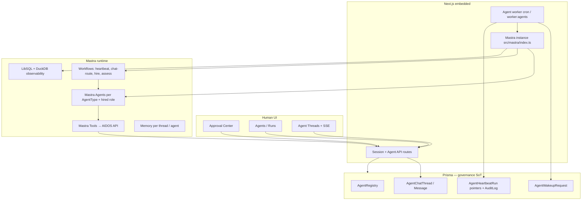

# AIDOS → Mastra Migration Plan

**Status:** Draft · **Created:** 2026-06-14  
**Audience:** Engineering (backend, frontend, architect)  
**References:** [ai-agents-workflow.md](./ai-agents-workflow.md) · [ai-agents-chat-system.md](./ai-agents-chat-system.md) · [AGENTS.md](../AGENTS.md)

---

## 1. Executive summary

AIDOS has a **production-grade custom agent control plane** (Phases 5.0–5.5 complete; agent chat 5.6a–f/h complete) built on a bespoke Anthropic Messages API client, tool loop, and SSE streaming layer. Mastra is **scaffolded only** (`src/mastra/` weather demo; not wired to the worker or API routes).

This plan migrates **all agent-related AI workflows** to **Mastra-native orchestration** embedded in the existing Next.js app, with Mastra storage as the **primary observability and trace store** and Prisma retained for **governance, tenancy, and audit pointers**. Delivery DNA and MVP Accelerator remain rule-based in the first release but are **in scope for a follow-on Mastra phase**.

**Cutover:** Big bang — replace `runLlmAdapter` / `anthropic.ts` in one release after validation; remove the legacy LLM path.

---

## 2. Decisions (from clarifying questions)

| # | Question | Decision |
|---|----------|----------|
| 1 | Migration scope | Agent control plane **plus** future LLM surfaces (Delivery DNA, MVP Accelerator planned; not replaced in Phase M1) |
| 2 | Integration pattern | **Full Mastra orchestration** — workflows own multi-step flows; Prisma = persistence + audit |
| 3 | Deployment | **Embedded in Next.js** — import `mastra` from worker and API routes; no separate Mastra server in prod |
| 4 | Observability | **Mastra storage primary** (LibSQL + DuckDB observability domain); Prisma keeps lightweight run/audit pointers |
| 5 | Cutover | **Big bang** — single release swap after pre-release validation |

---

## 3. Current state analysis

### 3.1 What exists today

| Layer | Location | Role |
|-------|----------|------|
| Wakeup queue + worker | `src/lib/agent-control-plane/worker.ts`, `scripts/agent-worker-loop.ts`, `POST /api/cron/agents/worker` | Timer/event/chat/approval wakeups → heartbeat runs |
| LLM adapter | `src/lib/agent-control-plane/adapters/llm.ts` | Loads `AGENTS.md`, skills, builds prompt, runs tool loop |
| Anthropic client | `src/lib/agent-control-plane/llm/anthropic.ts` | Messages API, retries, streaming (`runAnthropicWithToolsStreaming`) |
| AIDOS tools (14) | `src/lib/agent-control-plane/adapters/llm-tools.ts` | HTTP calls to `/api/agents/me/*` with ephemeral API key |
| Tool governance | `src/lib/agent-control-plane/tools/registry.ts` | Per-`AgentType` allowlist |
| Instructions | `src/lib/agent-control-plane/instructions/`, `skills/aidos/`, `skills/aidos-create-agent/` | Paperclip-style managed bundles |
| Agent chat | `src/lib/agent-chat/*`, Phase 5.6a–f/h | Threads, SSE, streaming chunks, approvals in-thread |
| Alternate adapters | `adapters/http.ts`, `adapters/process.ts`, `adapters/internal.ts` | External webhooks, CLI spawn, deprecated rule engine |
| Prisma models | `AgentRegistry`, `AgentWakeupRequest`, `AgentHeartbeatRun`, `AgentChat*` | Org-scoped control plane + chat |
| Mastra scaffold | `src/mastra/index.ts`, weather agent/workflow/tool | **Not integrated**; separate `mastra.db` |

### 3.2 AIDOS tools to migrate → Mastra tools

| Current tool | Governance notes |
|--------------|------------------|
| `aidos_get_me` | All agents |
| `aidos_get_inbox` | All agents |
| `aidos_assess_release` | QA_INTELLIGENCE (+ registry) |
| `aidos_create_recommendation` | Specialists (+ registry) |
| `aidos_complete_work_item` | All agents |
| `aidos_hire_agent` | Super only; `canCreateAgents` permission |
| `aidos_complete_initialization` | Super only |
| `aidos_delegate_wakeup` | Super only |
| `aidos_invite_agent_to_thread` | Super only |
| `aidos_post_thread_message` | Chat participants |
| `aidos_close_thread` / `aidos_reopen_thread` | Super only |
| `aidos_await_human_input` | Chat agents |
| `aidos_request_approval` | Chat + governance |

Each tool today is a thin HTTP wrapper to agent-authenticated API routes. **Keep those API routes** — Mastra tools call the same endpoints (preserves approval gates and audit).

### 3.3 What is *not* LLM-driven today (future Mastra phase)

| Surface | Location | Today |
|---------|----------|-------|
| Delivery DNA | `src/lib/delivery-dna.ts` | Rule-based from discovery wizard |
| MVP Accelerator | `src/lib/mvp-accelerator.ts` | Template generation |
| Release assess (server) | `src/lib/agent-control-plane/tools/release-tools.ts` | Deterministic + agent-triggered |

Phase **M3** (below) adds Mastra workflows for these without blocking the control-plane migration.

### 3.4 Gaps / risks in current Mastra scaffold

- `src/mastra/index.ts` uses **top-level `await`** — must be compatible with Next.js worker import graph.
- Storage path `file:./mastra.db` is **not production-safe** for Coolify multi-container — needs env-driven URL (LibSQL file on shared volume or Postgres adapter when available).
- No `mastra dev` script in `package.json`; weather demo is unregistered from app lifecycle.
- `tsconfig.json` target is ES2017; Mastra docs recommend **ES2022 modules** — verify bundler compatibility (`serverExternalPackages` for `@mastra/*`).

---

## 4. Target architecture



### 4.1 Responsibility split after migration

| Concern | Owner |
|---------|-------|
| Org tenancy, agent roster, statuses | Prisma `AgentRegistry` |
| Wakeup scheduling, idempotency, coalescing | Existing `enqueueWakeup` + worker (unchanged) |
| LLM execution, tool loop, multi-step logic | **Mastra** agents + workflows |
| Traces, spans, token usage detail | **Mastra storage** (primary) |
| Run summary, link to thread, compliance audit | Prisma `AgentHeartbeatRun` (pointer: `mastraRunId`, `mastraTraceId`, summary, status) |
| Human approvals, recommendations | Existing Prisma + API routes (unchanged) |
| Chat timeline + SSE | Existing `agent-chat` module; stream bridge reads Mastra stream events |
| Per-agent instructions (`AGENTS.md`) | Still managed on disk/DB; **injected as dynamic system context** into Mastra agent runs |

### 4.2 Mastra primitives mapping

| AIDOS concept | Mastra primitive |
|---------------|------------------|
| Super Agent heartbeat | `Agent` + optional `heartbeatWorkflow` step wrapper |
| Specialist heartbeat | `Agent` with type-scoped tools |
| Chat routing (invite, delegate, close) | `chatRoutingWorkflow` (multi-step, resumable) |
| Governed hire | `hireAgentWorkflow` (validate → draft AGENTS.md → create approval → wait hook) |
| Release assess | `assessReleaseWorkflow` or specialist agent with `assess_release` tool |
| Tool calls to AIDOS API | `createTool()` wrappers in `src/mastra/tools/aidos/` |
| Thread context | Mastra `Memory` keyed by `threadId` + existing `buildChatContextMarkdown` for bootstrap |
| Streaming to UI | Mastra stream API → adapter bridge → `AgentChatStreamChunk` |

### 4.3 Agent model

One **Mastra Agent definition per `AgentType`**, with runtime context overrides for hired specialists:

- `superOrchestratorAgent`
- `qaIntelligenceAgent`
- `devopsIntelligenceAgent`
- `governanceAgent`
- `incidentCorrelationAgent`
- `integrationAgent`

Hired agents share the specialist agent template; **dynamic `AGENTS.md` content** is passed as run context (same as today). Do not duplicate Mastra agents per hired row.

---

## 5. Migration phases

### Phase M0 — Foundation (1 week)

**Goal:** Mastra loads reliably inside Next.js worker; storage and observability production-ready.

| ID | Task | Paths / notes |
|----|------|---------------|
| M0.1 | Add `MASTRA_STORAGE_URL`, `MASTRA_OBSERVABILITY_PATH` to `.env.example` | Docker volume: `/data/mastra` |
| M0.2 | Refactor `src/mastra/index.ts` — lazy init factory (`getMastra()`) to avoid top-level await issues in Next | `src/mastra/index.ts`, `src/mastra/server.ts` |
| M0.3 | Configure Next.js `serverExternalPackages` for `@mastra/*` | `next.config.ts` |
| M0.4 | Wire model via Mastra model router; map existing `ANTHROPIC_*` env to `anthropic/MiniMax-M3` or provider-compatible id | Run `.agents/skills/mastra/scripts/provider-registry.mjs` |
| M0.5 | Remove weather demo from default export OR move to `src/mastra/examples/` | Keep as Studio test fixture only |
| M0.6 | Add `npm run mastra:studio` (optional local debug via `mastra dev`) without changing prod embedded path | `package.json` |
| M0.7 | Prisma migration: add `mastraRunId`, `mastraTraceId` nullable columns on `AgentHeartbeatRun` | `prisma/schema.prisma` |

**Exit criteria:** Worker can `import { getMastra }` and execute a no-op workflow; `npm run build` passes; storage file created on configured path.

---

### Phase M1 — Tools & agents (2 weeks)

**Goal:** Parity with `llm-tools.ts` and per-type tool allowlists as Mastra tools.

| ID | Task | Paths / notes |
|----|------|---------------|
| M1.1 | Create `src/mastra/tools/aidos/` — one `createTool` per `aidos_*` tool | Reuse HTTP logic from `llm-tools.ts` `agentFetch` |
| M1.2 | Shared tool context factory: `{ apiBaseUrl, agentApiKey, runId, wakePayload }` from worker | `src/mastra/tools/aidos/context.ts` |
| M1.3 | Port allowlist logic to tool registration per agent type | `src/mastra/agents/toolsets.ts` |
| M1.4 | Implement six agent definitions + dynamic instructions loader | `src/mastra/agents/*.ts` |
| M1.5 | Instruction/skill loader service shared with legacy path until cutover | `src/mastra/context/instructions.ts` |
| M1.6 | Register all agents and tools in `src/mastra/index.ts` | Per AGENTS.md |
| M1.7 | Unit tests: tool allowlist + mock fetch for one tool per category | `src/mastra/tools/aidos/*.test.ts` |

**Exit criteria:** Mastra agent can run a dry heartbeat against mock API; tool count and schemas match legacy definitions.

---

### Phase M2 — Workflows & worker integration (2–3 weeks)

**Goal:** Replace `runLlmAdapter` with Mastra workflow/agent execution; preserve chat streaming and governance.

| ID | Task | Paths / notes |
|----|------|---------------|
| M2.1 | `heartbeatWorkflow` — single entry: resolve agent type → run agent with wakeup prompt | `src/mastra/workflows/heartbeat.ts` |
| M2.2 | `chatRoutingWorkflow` — branch on Super vs specialist vs `@mention` target | Replaces inline chat branches in `llm.ts` |
| M2.3 | `hireAgentWorkflow` — multi-step: draft instructions → API hire → approval wait (suspend/resume) | Aligns with Phase 5.3 |
| M2.4 | New adapter: `runMastraAdapter(ctx)` mirroring `AdapterExecutionResult` | `src/lib/agent-control-plane/adapters/mastra.ts` |
| M2.5 | Stream bridge: Mastra stream events → `AgentChatStreamChunk` kinds | `src/lib/agent-chat/mastra-stream-bridge.ts` |
| M2.6 | Token usage: read from Mastra observability export → rollup fields on Prisma run | Replace `tokenUsageJson` population |
| M2.7 | Worker switch: `adapterType === "llm"` → `runMastraAdapter` | `worker.ts` |
| M2.8 | Set all seeded agents to `adapterType: "mastra"` in seed + migration script | `enterprise-seed.ts` |
| M2.9 | Deprecate and remove `anthropic.ts`, `llm.ts`, `llm-tools.ts` after parity tests | Big bang |
| M2.10 | Update run detail UI to link Mastra trace id (optional Studio deep link in dev) | `agent-run-detail-panel.tsx` |

**Exit criteria:**

- [ ] Timer, manual invoke, chat message, approval decided, release-created wakeups succeed.
- [ ] SSE streaming works on agent threads.
- [ ] Super hire + delegate + in-thread approval E2E passes (§12.1 in chat doc).
- [ ] `AgentHeartbeatRun` has `mastraRunId`; detailed trace in Mastra storage.
- [ ] `npm run build` passes.

---

### Phase M3 — Future LLM surfaces (2 weeks, post-M2)

**Goal:** Mastra workflows for non-agent LLM features (scoped in decision #1).

| ID | Task | Notes |
|----|------|-------|
| M3.1 | `discoveryDnaWorkflow` — optional LLM enrichment of Delivery DNA narrative | Keep deterministic core; LLM adds summary/rationale |
| M3.2 | `mvpAcceleratorWorkflow` — multi-step PRD → architecture → epics pipeline | Human approval gates between steps |
| M3.3 | Phase 5.6g Slack ingress → invoke `chatRoutingWorkflow` via ingress API | Build on Mastra from day one |

**Exit criteria:** Feature-flagged LLM paths for discovery/accelerator; 5.6g ingress stub calls Mastra workflow.

---

### Phase M4 — Cleanup & hardening (1 week)

| ID | Task |
|----|------|
| M4.1 | Remove `adapters/internal.ts` if no longer referenced |
| M4.2 | Update `docs/ai-agents-workflow.md` and `docs/agent-heartbeat-protocol.md` |
| M4.3 | Architect review: tenancy, audit trail completeness, approval bypass check |
| M4.4 | Load test: 10 concurrent chat wakeups; verify storage growth and worker drain |
| M4.5 | Coolify deploy doc: shared volume for Mastra DB, worker + web both mount `/data/mastra` |

---

## 6. Big-bang cutover checklist

Execute in order during the release window:

1. **Pre-deploy:** Run full E2E script on staging with `adapterType: mastra` for all test orgs.
2. **Deploy schema migration** (`mastraRunId`, `mastraTraceId` columns).
3. **Deploy application** with Mastra adapter active; legacy `llm` adapter removed.
4. **Run data migration script:** `UPDATE AgentRegistry SET adapterType = 'mastra' WHERE adapterType = 'llm'`.
5. **Smoke test:** Org with Super Agent — manual invoke, chat thread message, approval flow.
6. **Monitor:** Worker error rate, Mastra storage disk, P95 heartbeat duration for 24h.
7. **Rollback trigger:** If smoke fails, revert deploy and set `adapterType = 'llm'` (keep legacy branch for one release tag only).

> **Note:** Because cutover is big bang, keep the previous release artifact available for 48h. Do not delete `anthropic.ts` from git until production is stable.

---

## 7. File-level migration map

| Legacy | Mastra / new |
|--------|----------------|
| `adapters/llm.ts` | `adapters/mastra.ts` + workflows |
| `adapters/llm-tools.ts` | `src/mastra/tools/aidos/*.ts` |
| `llm/anthropic.ts` | Mastra agent `.generate()` / stream API |
| `llm/config.ts` | `src/mastra/config/models.ts` |
| `skills/aidos/SKILL.md` | Still loaded; injected as system context |
| `instructions/service.ts` | `src/mastra/context/instructions.ts` (shared) |
| `agent-chat/stream.ts` | + `mastra-stream-bridge.ts` |
| `src/mastra/agents/weather-agent.ts` | Move to `examples/` or delete |

---

## 8. Environment variables

| Variable | Purpose |
|----------|---------|
| `ANTHROPIC_API_KEY`, `ANTHROPIC_BASE_URL`, `ANTHROPIC_MODEL` | Model provider (until fully on Mastra router aliases) |
| `MASTRA_STORAGE_URL` | LibSQL URL, e.g. `file:/data/mastra/store.db` |
| `MASTRA_OBSERVABILITY_PATH` | DuckDB domain path for traces |
| `AIDOS_API_URL` | Tool callbacks from worker container |
| `AGENT_INSTRUCTIONS_ROOT` | Unchanged |
| `AGENT_WORKER_*` | Unchanged |

---

## 9. Testing strategy

| Level | Coverage |
|-------|----------|
| Unit | Tool allowlists, instruction loader, stream event mapping |
| Integration | `runMastraAdapter` with mocked Mastra + real Prisma test DB |
| E2E manual | Existing §12.1 chat happy path + hire + release assess |
| Regression | Approval cannot be bypassed; cross-org tool calls fail |
| Load | 10 parallel chat wakeups; timer drain under 15s interval |

Add CI job: `npm run build` + `npm run test:agent-chat` + new `npm run test:mastra` (M1.7).

---

## 10. Risks and mitigations

| Risk | Impact | Mitigation |
|------|--------|------------|
| Next.js bundling breaks Mastra | Worker fails at runtime | M0.2 lazy init + `serverExternalPackages`; test in `AIDOS_PROCESS_ROLE=worker` locally |
| Mastra storage on ephemeral container FS | Trace loss on restart | M0.1 shared volume in Coolify; document backup |
| Big bang regression in chat SSE | Broken UX | Pre-release staging E2E; 48h rollback artifact |
| Suspend/resume for hire workflow | Stuck runs | Fallback: hire remains agent-tool-driven until workflow suspend API verified |
| MiniMax via Anthropic-compatible API | Model router mismatch | Verify with `provider-registry.mjs`; keep custom base URL in Mastra provider config |
| Duplicate source of truth for token counts | Billing drift | Mastra storage authoritative; Prisma stores rollup only |

---

## 11. Timeline estimate

| Phase | Duration | Depends on |
|-------|----------|------------|
| M0 Foundation | 1 week | — |
| M1 Tools & agents | 2 weeks | M0 |
| M2 Workflows & cutover | 2–3 weeks | M1 |
| M3 Future LLM | 2 weeks | M2 (can parallel partially) |
| M4 Hardening | 1 week | M2 |

**Total to production cutover:** ~6–7 weeks (M0–M2 + M4).

---

## 12. Suggested execution order (Cursor)

```text
/architect Review this plan: embedded Mastra, Prisma audit pointers, big-bang cutover

/backend M0 — getMastra() factory, env storage, Prisma columns, next.config externals

/backend M1 — aidos Mastra tools + agent definitions + registration in src/mastra/index.ts

/backend M2 — heartbeat + chat workflows, runMastraAdapter, stream bridge, worker switch

/backend M2 — remove legacy llm adapter (big bang), migration script adapterType → mastra

/frontend M2 — run detail Mastra trace link

/architect M4 — end-to-end governance review before production cutover
```

---

## 13. Open items (resolve during M0)

- [ ] Confirm LibSQL file locking behavior when **web** and **worker** containers share `/data/mastra` (may require worker-only writes or Postgres storage adapter).
- [ ] Decide whether `http` / `process` adapters remain for external agents or are also routed through Mastra invoke.
- [ ] Confirm MiniMax model string in Mastra provider registry vs raw Anthropic API model id.

---

## 14. Summary

AIDOS built a complete governed agent control plane on custom LLM infrastructure. Mastra replaces **execution and orchestration** while preserving **governance APIs, approvals, org tenancy, and chat UX**. Prisma stays the system of record for *who ran what and whether it was approved*; Mastra storage becomes the system of record for *how the LLM ran* (traces, tools, tokens). The migration is a **big bang** after M0–M2 validation, with Delivery DNA and MVP Accelerator following in M3.
