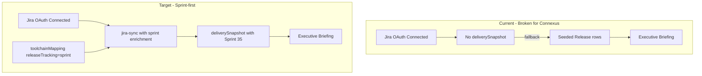

# Connexus Platform Data Accuracy — Refactoring Guide

**Generated:** 2026-07-07  
**Audience:** AIDOS dev team  
**Ground truth:** [`connexus-sprint35-analysis-2026-07-07.md`](./connexus-sprint35-analysis-2026-07-07.md) + live Jira API (Sprint 35, project CX)  
**Verified in browser:** Dashboard, Integrations, Delivery analysis (blocked state) as user `connexus@neoito.com`

---

## Executive summary

The Connexus executive dashboard is **not showing Jira delivery reality**. It headlines a seeded placeholder release (`Platform onboarding release`) that does not exist in Jira, while the organization's actual delivery unit — **Sprint 35** on the CX board — is invisible across briefing, portfolio, and delivery analysis.

This is not a single bug. It is a **stack of pipeline breaks**:

1. Jira OAuth is connected, but **`projectKeys` and `deliverySnapshot` are empty** in integration metadata (likely cleared on reconnect 2026-07-07).
2. Without a snapshot, the entire Jira delivery layer is treated as disconnected.
3. The executive briefing falls back to **AIDOS `Release` rows** created at discovery onboarding — not Jira sprints.
4. Even after sync is restored, **`jira-sync.ts` skips sprint enrichment** for Connexus because the SCRUM board reports `type: "simple"`, not `"scrum"`.
5. Toolchain mapping (`releaseTracking: "sprint"`) was **never persisted** for Connexus.

Until these are fixed, leaders see fictional release data and miss sprint completion, spillover, QA bottlenecks, and overdue sprint status that the ground-truth report documents.

---

## 1. Browser vs ground truth — discrepancy matrix

| What leaders need to see | Jira ground truth (Sprint 35 / CX) | Platform shows today (browser) | Severity |
|--------------------------|-------------------------------------|--------------------------------|----------|
| **Active delivery unit** | Sprint 35 (id 807), SCRUM board | "Platform onboarding release" (seeded, not in Jira) | **Critical** |
| **Sprint completion** | 66–70% done (49–52 / 74 issues) | 50% "ready to ship" (GitHub QA assess of fake release) | **Critical** |
| **Open sprint work** | 22–25 issues open | Not shown | **Critical** |
| **Sprint state** | Active, 7 days past end date (2026-06-30) | Not shown | **High** |
| **Spillover from Sprint 34** | 11/11 carry-over items still open | Not shown | **High** |
| **Testing bottleneck** | 11 items in Ready for Testing / In Test | Not shown | **High** |
| **Story points** | 0% of 29 SP on done work | Not shown | **Medium** |
| **Bug-heavy sprint** | 51 bugs / 9 stories (5.7:1) | Not shown | **Medium** |
| **Assignee concentration** | Vysakh R J — 7/25 open (28%) | Not shown | **Medium** |
| **Jira connection status** | Connected, token valid, projects listable (CX, AI) | "Jira not connected" + "Connect Jira to score momentum" | **High** (misleading) |
| **Project selection** | CX project exists | "No projects found" on Integrations; Delivery analysis blocked | **Critical** |
| **Release portfolio** | Should reflect active sprint | 2× duplicate "Platform onboarding release" at 0% ready | **Critical** |
| **Data freshness** | Live API works | Briefing "Updated 6d ago"; Jira last sync 180h ago | **High** |

### Live Jira numbers (2026-07-07, `npx tsx scripts/query-connexus-sprint.ts`)

```json
{
  "activeSprint": { "id": 807, "name": "Sprint 35", "state": "active", "endDate": "2026-06-30" },
  "sprintProgress": {
    "totalIssues": 74,
    "byStatusName": { "Done": 52, "Ready for Testing": 6, "To Do": 7, "...": "..." },
    "completionPct": 70,
    "storyPoints": { "committed": 29, "done": 0, "unestimatedIssues": 69 }
  }
}
```

Small variance vs the written report (49 Done vs 52 Done) is due to **done counting method** (`status = Done` in analysis scripts vs `statusCategory = Done` in sync). Align these in refactor (see §4.3).

### Connexus DB state (2026-07-07, `npx tsx scripts/audit-connexus-platform-state.ts`)

```json
{
  "releases": [
    { "name": "Platform onboarding release", "version": "1.0.0-rc1", "readinessScore": 50, "assessedAt": "2026-06-22" },
    { "name": "Platform onboarding release", "version": "1.0.0-rc1", "readinessScore": 32, "assessedAt": "2026-06-15" }
  ],
  "jira": { "status": "CONNECTED", "projectKeys": null, "hasSnapshot": false, "lastSyncAt": "2026-06-29" },
  "toolchainMapping": "NOT CONFIGURED"
}
```

---

## 2. Root cause analysis

### RC-1: Seeded placeholder release drives the executive narrative

**Where:** `src/app/api/discovery/route.ts` (lines 209–217)

On discovery completion, AIDOS unconditionally creates:

```typescript
await tx.release.create({
  data: {
    name: "Platform onboarding release",
    version: "1.0.0-rc1",
    environment: "STAGING",
    status: "DETECTED",
  },
});
```

**Effect:** `composeExecutiveBriefing` and `composeExecutiveDeck` use `ctx.releases[0]` and `latestRelease` from the AIDOS `Release` table — not Jira. Headline, highlights, release portfolio, and "Ready to ship" KPI all reference this fake release.

**Why Connexus is wrong:** Connexus uses **sprint-based delivery** in Jira. There is no "Platform onboarding release" fix version or sprint.

---

### RC-2: Jira delivery snapshot is missing — pipeline treated as disconnected

**Where:**
- `src/lib/delivery-analysis/resolve.ts` — returns `null` when `deliverySnapshot.projects` is empty
- `src/lib/executive-briefing/health-score.ts` (line 245) — `if (!input.deliverySnapshot) dataGaps.push("Jira not connected")`
- `src/lib/executive-briefing/load-briefing-context.ts` — `deliverySnapshot = jiraStored ? ... : null`

**Effect:** Jira OAuth **is** connected (Integrations shows site + user), but without `metadataJson.deliverySnapshot` the platform behaves as if Jira were absent. Delivery momentum dimension is null; delivery analysis shows empty state; briefing lists "Jira not connected" in blind spots.

**Trigger:** Connexus reconnected Jira on 2026-07-07. `projectKeys` is now `undefined` and `deliverySnapshot` is absent. Prior sync data was lost or never re-established.

---

### RC-3: Project picker blocked — cannot select CX

**Where:**
- `src/components/integrations/jira-integration-panel.tsx` — `GET /api/integrations/jira/projects`
- `src/app/(platform)/delivery-analysis/page.tsx` — gates on `projectKeys.length === 0`

**Browser observation:** Integrations shows *"No projects found on this site, or unable to load the list"* despite `listJiraProjects()` returning `[{ key: "CX" }, { key: "AI" }]` when called server-side with the same token.

**Likely causes to investigate:**
1. API error swallowed in `loadProjects()` — sets `message` but UI shows generic empty state
2. OAuth scope regression on reconnect — browser session token path differs from script path
3. `canManage` / RBAC edge case on the projects endpoint

**Effect:** Cannot save project selection → cannot sync → cannot calibrate → delivery analysis permanently blocked.

---

### RC-4: Sprint sync skipped for Connexus board type

**Where:** `src/lib/jira-sync.ts` (lines 250–286)

```typescript
if (picked.type === "scrum") {
  const sprints = await listBoardSprints(...);
  // activeSprint, spilloverCount populated here
}
```

**Connexus board:** SCRUM board (id 1) reports `type: "simple"` from `/rest/agile/1.0/board` — not `"scrum"`.

**Effect:** Even after a successful sync, **`activeSprint` will be undefined** in the delivery snapshot. Sprint completion %, spillover, sprint signals, and sprint-based release matching all fail silently.

This alone explains why sprint metrics would be missing even with a healthy sync.

---

### RC-5: Toolchain mapping not configured for sprint-based releases

**Where:** `DeliveryWorkflow.toolchainMappingJson` — empty for Connexus

**Expected (per product config):** `methodology: "scrum"`, `releaseTracking: "sprint"`, `usesSprints: true`, calibrated `doneStatusNames`, story point field `customfield_10016`.

**Actual:** Defaults to `releaseTracking: "fixVersion"` in `jira-delivery-health.ts` when mapping absent.

**Effect:** Release assess, governance, and health scoring look for fix versions — irrelevant for Connexus. Sprint-to-release matching (`matchReleaseToSprint`) never activates.

---

### RC-6: Release portfolio reads AIDOS DB, not Jira sprints

**Where:** `src/lib/executive-briefing/compose-executive-deck.ts` — `buildPortfolio(ctx)`

```typescript
const active = ctx.releases.filter((r) => r.status !== "DEPLOYED").slice(0, 4);
```

**Effect:** Shows all non-deployed `Release` rows — including **two duplicates** of the seeded release. No deduplication, no Jira sprint substitution.

---

### RC-7: Spillover semantics differ from ground-truth analysis

**Platform JQL** (`src/lib/jira-jql.ts`):

```sql
sprint = {activeSprintId} AND sprint in closedSprints()
```

**Ground-truth report:** Changelog-based carry-over from Sprint 34 (18 moved, 11 still open) + created-before-sprint-start heuristic.

**Effect:** Platform spillover count will not match the report's 11-item Sprint 34 carry-over list. Leaders cannot trust spillover KPIs without changelog-aware analysis or improved JQL.

---

### RC-8: Stale executive briefing snapshot

**Browser:** Headline and meta line show *"Updated 6d ago · drawn from GitHub"* — cached briefing from before Jira reconnect.

**Where:** `src/lib/executive-briefing/snapshot-utils.ts`, invalidation in `src/lib/executive-briefing/invalidate-snapshot.ts`

**Effect:** UI can show outdated LLM-enriched copy even after integration state changes.

---

## 3. Target state — what accurate Connexus data looks like

When fixed, the dashboard and delivery analysis for Connexus should surface:

| Surface | Target content |
|---------|----------------|
| **Executive headline** | "Connexus Sprint 35 is active — 70% complete, 7 days past end date, delivery at risk." |
| **Primary KPI** | Sprint completion: **70%** (52/74 done) — not "50% ready to ship" on a fake release |
| **Release portfolio** | **Sprint 35** (active, overdue) linked to Jira sprint board — not "Platform onboarding release" |
| **Delivery momentum** | Scored from Jira snapshot: open work, blocked, resolved last 7d, sprint completion |
| **Delivery analysis** | Full KPI strip: 25 open, spillover signal, 13 in QA pipeline, sprint card with severity |
| **Blind spots** | None for Jira when connected + synced + calibrated |
| **Integrations** | CX selected, sync < 24h old, projects list visible |

---

## 4. Refactoring plan (prioritized)

### P0 — Restore data pipeline (unblock Connexus today)

| # | Task | Files | Acceptance criteria |
|---|------|-------|---------------------|
| P0.1 | **Fix project picker** — surface API errors; verify `GET /api/integrations/jira/projects` in browser session | `jira-integration-panel.tsx`, `api/integrations/jira/projects/route.ts` | CX and AI visible; admin can save CX |
| P0.2 | **Re-sync Jira** after CX selected | `jira-sync.ts`, Integrations UI | `metadataJson.deliverySnapshot.syncedAt` within last hour |
| P0.3 | **Fix board type gate** — treat boards with active sprints as sprint-capable regardless of `type` label | `jira-sync.ts` `syncProject()` | Snapshot includes `activeSprint: { id: 807, name: "Sprint 35", committed: 74, done: 52 }` |
| P0.4 | **Invalidate briefing snapshot** on Jira reconnect, project save, and sync | `invalidate-snapshot.ts`, OAuth callback, sync route | Dashboard meta shows fresh timestamp after sync |

**Ops script for verification:**

```bash
npx tsx scripts/audit-connexus-platform-state.ts
npx tsx scripts/query-connexus-sprint.ts
```

---

### P1 — Sprint-first release model (architectural)

| # | Task | Files | Acceptance criteria |
|---|------|-------|---------------------|
| P1.1 | **Stop seeding fake releases** for scrum/sprint orgs; or mark seeded release `source: "onboarding_demo"` and exclude from briefing | `discovery/route.ts`, `enterprise-seed.ts` | Connexus briefing never headlines "Platform onboarding release" |
| P1.2 | **When `releaseTracking === "sprint"`**, derive primary release from `activeSprint` | `compose-briefing.ts`, `compose-executive-deck.ts`, `load-briefing-context.ts` | Headline uses sprint name; portfolio shows sprint row |
| P1.3 | **Auto-upsert sprint releases** on Jira sync (optional `Release` row per active sprint, `jiraSprintId` field) | `prisma/schema.prisma`, `jira-sync.ts` | `/releases` lists Sprint 35 with Jira link |
| P1.4 | **Deduplicate portfolio** — collapse releases with same name+version | `compose-executive-deck.ts` | Single portfolio entry, not 2× duplicate |
| P1.5 | **Persist toolchain mapping** on calibration: `releaseTracking: "sprint"`, `methodology: "scrum"` | `jira-calibration/persist.ts`, governance mapping form | `audit-connexus-platform-state.ts` shows sprint tracking |

---

### P1 — Fix misleading connection messaging

| # | Task | Files | Acceptance criteria |
|---|------|-------|---------------------|
| P1.6 | Replace `"Jira not connected"` with precise states: connected / no projects / not synced / calibrating | `health-score.ts`, `connect-jira-empty.tsx`, briefing blind spots | Connexus shows "Jira connected — sync required" not "not connected" |
| P1.7 | Delivery momentum CTA: link to Integrations project picker when `projectKeys` empty; link to sync when no snapshot | `briefing-executive-deck.tsx`, health dimension summaries | Actionable CTA matches actual blocker |

---

### P2 — Metric accuracy (match ground-truth report)

| # | Task | Files | Acceptance criteria |
|---|------|-------|---------------------|
| P2.1 | **Align done counting** — document and unify `status = Done` vs `statusCategory = Done`; prefer calibrated `doneStatusNames` | `jira-sync.ts`, `jira-jql.ts` | Sprint done count within ±1 of Jira board |
| P2.2 | **Sprint overdue signal** — flag active sprint where `endDate < today` | `jira-delivery-health.ts`, `compute-snapshot.ts` | Signal: "Sprint 35 overdue by 7 days" |
| P2.3 | **QA pipeline signal** — count issues in Ready for Testing + In Test + Ready for review | New enrichment in sync or snapshot compute | Signal matches report's 11–13 testing queue |
| P2.4 | **Improved spillover** — add changelog-based carry-over (like `scripts/analyze-sprint-spillover.ts`) or fix JQL semantics | `jira-jql.ts`, new `jira-spillover.ts` | Spillover count ≥ 11 for Sprint 35 carry-over |
| P2.5 | **Status breakdown in snapshot** — persist per-status-name counts (not just category) | `jira-meta.ts`, `jira-sync.ts` | Delivery analysis can show Ready for Testing: 9 |
| P2.6 | **Story point completion** — track SP done vs committed in sprint row | `jira-sync.ts`, sprint cards UI | Shows 0/29 SP (0%) |
| P2.7 | **Assignee workload** — optional P2b enrichment for open sprint issues by assignee | `compute-snapshot.ts` or new API | Top assignee load visible in delivery analysis |

---

### P3 — Hardening

| # | Task | Files |
|---|------|-------|
| P3.1 | Preserve `projectKeys` + `deliverySnapshot` across OAuth token refresh (only clear on explicit disconnect) | `jira-oauth-connection.ts`, callback route |
| P3.2 | Add integration health check: connected but no snapshot > 24h → degraded status | `integration-health.ts` |
| P3.3 | E2E test: scrum org with `board.type = simple` still gets sprint snapshot | `jira-sync.test.ts` |
| P3.4 | Contract test: Connexus fixture snapshot matches ground-truth script output ±tolerance | new test file |

---

## 5. File-by-file change guide

### 5.1 `src/lib/jira-sync.ts` — critical path

**Current problem:**

```typescript
// Line 250 — sprint block never runs for Connexus
if (picked.type === "scrum") {
```

**Recommended change:**

```typescript
// Fetch sprints for any board that supports the agile API
const sprints = await listBoardSprints(accessToken, cloudId, picked.id);
const sprint = sprints.find((s) => s.state === "active") ?? sprints[0];
if (sprint) {
  // populate activeSprint, spilloverCount — existing logic
}
```

Also consider: if `picked.type === "simple"` but project has sprint field on issues, treat as scrum (check calibration `usesSprints`).

---

### 5.2 `src/lib/executive-briefing/compose-briefing.ts` — headline logic

**Current:** `buildProductionHeadline` prefers `input.latestRelease` from AIDOS DB.

**Recommended:** Add branch before release check:

```typescript
const sprint = input.deliverySnapshot?.sprints?.[0];
const tracking = input.mapping?.jira?.releaseTracking ?? "fixVersion";

if (tracking === "sprint" && sprint) {
  // Headline: "{org} {sprint.name} — {sprint.pct}% complete"
  // Include overdue warning when sprint.endDate < today
}
```

---

### 5.3 `src/lib/executive-briefing/compose-executive-deck.ts` — portfolio

**Current:** `buildPortfolio(ctx)` maps `ctx.releases`.

**Recommended:**

```typescript
function buildPortfolio(ctx, deliverySnapshot?, mapping?) {
  if (mapping?.jira?.releaseTracking === "sprint" && deliverySnapshot?.sprints?.length) {
    return deliverySnapshot.sprints.map(sprintToPortfolioItem);
  }
  // fallback to AIDOS releases, excluding source=onboarding_demo
}
```

---

### 5.4 `src/app/api/discovery/route.ts` — stop fake release

**Options (pick one):**
- **A)** Remove `tx.release.create` entirely; let first real release come from Jira sync or manual register
- **B)** Create with `metadataJson: { source: "onboarding_demo" }` and filter out in briefing/deck
- **C)** If discovery detects scrum methodology, skip release seed

---

### 5.5 `src/lib/executive-briefing/health-score.ts` — data gaps

**Change line 245:**

```typescript
// Before
if (!input.deliverySnapshot) dataGaps.push("Jira not connected");

// After
if (!input.jiraConnected) dataGaps.push("Jira not connected");
else if (!input.deliverySnapshot) dataGaps.push("Jira connected — run sync to load delivery data");
else if (input.jiraCalibrationPending) dataGaps.push(input.jiraCalibrationMessage ?? "...");
```

Requires passing `jiraConnected: boolean` into `HealthScoreInput`.

---

## 6. Verification checklist (dev QA)

After implementing P0 + P1, verify against live Connexus:

```bash
# 1. Platform state audit
npx tsx scripts/audit-connexus-platform-state.ts
# Expect: projectKeys: ["CX"], hasSnapshot: true, activeSprint populated

# 2. Ground truth comparison
npx tsx scripts/query-connexus-sprint.ts
npx tsx scripts/sprint-analysis-completion.ts

# 3. API snapshot
curl -b <session> http://localhost:3000/api/delivery-analysis/snapshot | jq '.snapshot.kpis'
# Expect: sprintCompletionPct ~ 70, openWork ~ 22-25, spillover > 0
```

### Browser acceptance

| Page | Pass criteria |
|------|---------------|
| **Dashboard** | Headline mentions **Sprint 35**, not "Platform onboarding release" |
| **Dashboard KPIs** | Sprint completion ~70%; no duplicate portfolio entries |
| **Delivery analysis** | KPI strip, sprint card, signals for spillover + sprint pace |
| **Integrations** | CX checked; last sync < 24h; projects list loads |
| **Blind spots** | No "Jira not connected" when synced |

---

## 7. Connexus data remediation (immediate ops)

Until code ships, restore Connexus manually:

1. **Integrations → Jira** — fix project picker (or PATCH `projectKeys: ["CX"]` via API if UI blocked)
2. **Save selection** → **Sync Jira data**
3. **Governance → Toolchain mapping** — set methodology Scrum, release tracking Sprint; run calibration
4. **Delete or archive** duplicate `Platform onboarding release` rows in DB (optional, for demo cleanliness)
5. **Refresh executive briefing** — trigger sync or call briefing invalidation endpoint

---

## 8. Helper scripts (ground truth)

| Script | Purpose |
|--------|---------|
| `scripts/audit-connexus-platform-state.ts` | DB + live Jira vs stored snapshot audit |
| `scripts/query-connexus-sprint.ts` | Quick Sprint 35 snapshot |
| `scripts/sprint-analysis-completion.ts` | Completion & scope |
| `scripts/analyze-sprint-spillover.ts` | Spillover & carry-over |
| `scripts/connexus-sprint35-risk-profile.ts` | Risk register |

Use these as **contract tests** when refactoring — platform output should converge on these numbers.

---

## 9. Architecture diagram — current vs target



---

## 10. Summary for product

The platform has the **building blocks** for accurate Connexus data (Jira sync, sprint cards, spillover signals, sprint release matching in `jira-delivery-health.ts`). They are **not wired end-to-end** because:

- The data pipeline is empty (no projects, no snapshot)
- Sprint sync is gated on the wrong board type
- The executive layer defaults to a onboarding placeholder release instead of Jira sprints
- Toolchain mapping for sprint-based methodology was never saved

**P0 restores the pipe. P1 makes the narrative sprint-native. P2 aligns metrics with the ground-truth report.**

---

*Audit script added: `scripts/audit-connexus-platform-state.ts`*
