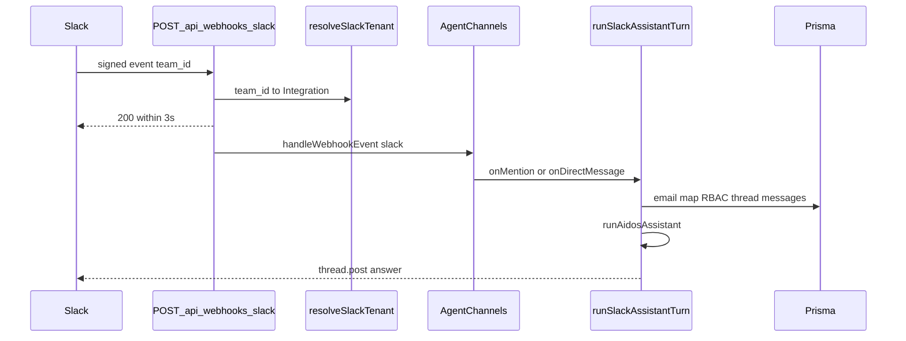

# Slack integration — multi-tenant, read-only Q&A

**Last updated:** 2026-08-04  
**Status:** v1 (OAuth install + Events API assistant) ✅  
**Owner agents:** `/backend` (OAuth, webhook, run-turn), `/frontend` (Integrations UI)

**Related docs:** [`MVP-DEVELOPMENT-PLAN.md`](./MVP-DEVELOPMENT-PLAN.md) · [`migration-plan.md`](./migration-plan.md)

---

## 1. Purpose

Each customer organization installs the **AIDOS Slack app** into their workspace. Members `@mention` the bot or DM it and get answers from `aidosAssistant` using the existing read-only `aidos_*` tools.

- **Multi-tenant:** one Slack app for the AIDOS deployment; per-org bot tokens in `Integration.metadataJson`
- **Governed:** Slack email → ACTIVE AIDOS user → `agents:view` RBAC → audited `AgentChatThread`
- **Recommend-only:** no approvals, writes, or mutations from Slack in v1

---

## 2. Architecture



Transport uses **Mastra Channels** + `@chat-adapter/slack` with `gateway: false`. Handler overrides bypass Mastra's default `agent.stream` so AIDOS keeps org scoping, toolsets, persistence, and audit.

---

## 3. Slack app setup

Create an app at [api.slack.com/apps](https://api.slack.com/apps) (or paste the manifest below).

### 3.1 Env vars

```bash
SLACK_CLIENT_ID=
SLACK_CLIENT_SECRET=
SLACK_SIGNING_SECRET=
# Optional (default 30):
# SLACK_ASSISTANT_HOURLY_LIMIT=30
```

### 3.2 Redirect URLs

- `{APP_URL}/api/integrations/slack/callback`
- `{APP_URL}/api/integrations/external/slack/callback`

### 3.3 Event Subscriptions

- Request URL: `{APP_URL}/api/webhooks/slack`
- Bot events: `app_mention`, `message.im`

### 3.4 Bot Token Scopes

`app_mentions:read`, `chat:write`, `im:history`, `im:read`, `im:write`, `channels:history`, `channels:read`, `groups:history`, `groups:read`, `users:read`, `users:read.email`, `assistant:write`

`users:read.email` is required for identity mapping.

### 3.5 App manifest (reference)

```json
{
  "display_information": {
    "name": "AIDOS",
    "description": "Governance-aware operational intelligence assistant"
  },
  "features": {
    "bot_user": {
      "display_name": "AIDOS",
      "always_online": true
    }
  },
  "oauth_config": {
    "redirect_urls": [
      "https://YOUR_APP_HOST/api/integrations/slack/callback",
      "https://YOUR_APP_HOST/api/integrations/external/slack/callback"
    ],
    "scopes": {
      "bot": [
        "app_mentions:read",
        "chat:write",
        "im:history",
        "im:read",
        "im:write",
        "channels:history",
        "channels:read",
        "groups:history",
        "groups:read",
        "users:read",
        "users:read.email",
        "assistant:write"
      ]
    }
  },
  "settings": {
    "event_subscriptions": {
      "request_url": "https://YOUR_APP_HOST/api/webhooks/slack",
      "bot_events": ["app_mention", "message.im"]
    },
    "org_deploy_enabled": false,
    "socket_mode_enabled": false,
    "token_rotation_enabled": false
  }
}
```

---

## 4. Key files

| Area | Path |
|------|------|
| OAuth | `src/lib/slack-oauth.ts`, `src/lib/slack-oauth-connection.ts` |
| Meta | `src/lib/slack-meta.ts` |
| Tenant + install lookup | `src/lib/slack/tenant.ts` |
| Turn runner | `src/lib/slack/run-turn.ts` |
| Budget | `src/lib/slack/budget.ts` |
| Channels config | `src/mastra/channels/slack.ts` |
| Webhook | `src/app/api/webhooks/slack/route.ts` |
| UI | `src/components/integrations/slack-integration-panel.tsx` |

---

## 5. Out of scope (v1)

Outbound digests, approve/deny buttons, Socket Mode, Google Chat.
