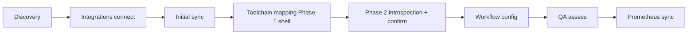

# Field introspection & assess wiring — Phase 2 implementation plan

**Last updated:** 2026-06-08  
**Status:** Draft — Phase 1 (toolchain mapping shell) ✅ · **Phase 2 (this doc) not started**  
**Owner agents:** `/backend` (Jira/GitHub introspection APIs, sync/assess wiring), `/frontend` (mapping UI upgrades), `/architect` (review before merge)

**Related docs:** [`docs/jira-integration.md`](docs/jira-integration.md) · [`docs/AIDOS-USP.md`](docs/AIDOS-USP.md) · [`delivery-analysis.md`](delivery-analysis.md) · [`code-analysis.md`](code-analysis.md) · [`integration-setup-external-link-plan.md`](integration-setup-external-link-plan.md)

> **This document is the spec for Phase 2 of Delivery toolchain mapping** — introspecting real Jira field/status/issue-type semantics (and GitHub branch/PR patterns) from connected integrations, presenting them in a human-governed confirmation UI, and wiring confirmed mappings into sync, delivery health, release assess, and QA intelligence. Phase 1 shipped a free-text mapping shell at `/governance/toolchain-mapping`; Phase 2 replaces guesswork with API-backed discovery.

---

## 1. Purpose

Every organization runs Jira and GitHub differently: custom statuses, issue types, story-point fields, release tracking via fix versions vs labels vs sprints, and branch strategies that do not match industry defaults.

AIDOS today **assumes universal semantics** in sync JQL and health scoring:

| Assumption | Location | Risk |
|------------|----------|------|
| Blocked = `status = Blocked OR labels = blocked` | `src/lib/jira-sync.ts` | Teams using "On Hold", "Waiting", or custom blocked fields get wrong blocker counts |
| Bugs = `issuetype = Bug` | `src/lib/jira-sync.ts` | Teams using "Defect", "Incident", or sub-task bugs miss quality signals |
| Done = `statusCategory = Done` | `src/lib/jira-sync.ts`, sprint JQL | Usually correct on Jira Cloud, but done *status names* vary for UX |
| Release match = fuzzy fixVersion name | `src/lib/jira-delivery-health.ts` | Wrong when org tracks releases via labels or sprint names |
| GitHub = default branch only | `src/lib/code-analysis/sync.ts` | GitFlow/release branches ignored |
| Discovery `workflowsJson` | `OrganizationProfile` | Written at discovery, **never consumed** |

Phase 2 closes the gap between **what the org said in discovery** and **what their tools actually use**, then makes downstream intelligence **mapping-aware**.

### Product alignment (AIDOS USP)

| USP pillar | How Phase 2 supports it |
|------------|---------------------------|
| Govern first, automate safely | Human confirms field semantics before sync/assess uses them |
| Operational intelligence | Delivery health, QA readiness, and release assess speak the customer's Jira language |
| Explainable recommendations | Gaps cite mapped fields ("12 issues in status *On Hold*") not generic "blocked" |
| Multi-tenant SaaS | Schema snapshot and confirmed mapping live per org in existing profile/integration metadata |

### Audience

| Persona | Need |
|---------|------|
| Delivery manager | Confirm AIDOS understands their Jira workflow before trusting health scores |
| Engineering lead | Map GitHub branch strategy so code analysis aligns with release process |
| AIDOS admin | One step after integration sync — no re-running full discovery |

---

## 2. Product constraints (non-negotiable)

| Rule | Detail |
|------|--------|
| Read-only | No new Jira write scopes; introspection uses existing OAuth scopes where possible |
| Human-governed | AIDOS **suggests** mappings from API introspection; user **confirms** (same pattern as Prometheus `serviceScopes`) |
| Multi-tenant | All introspection scoped by `session.organizationId`; per-org `projectKeys` / `repoFullNames` |
| No issue storage | Continue aggregate JQL counts only — introspection caches **schema**, not issue rows |
| Backward compatible | Orgs without confirmed mapping fall back to Phase 1 defaults (`Blocked`, `Bug`, `Done`) |
| Verify build | Run `npm run build` before marking any PR complete |

---

## 3. Current state (Phase 1 baseline)

### Shipped in Phase 1

| Item | Path |
|------|------|
| Enterprise workflow step | `src/lib/enterprise-workflow.ts` — `toolchain-mapping` (order 4) |
| Mapping types + inference | `src/lib/toolchain-mapping.ts` |
| Confirm API | `GET/POST /api/governance/toolchain-mapping` |
| Mapping UI | `src/app/(platform)/governance/toolchain-mapping/page.tsx` |
| Storage | `OrganizationProfile.toolchainMappingJson`, `toolchainMappingConfirmedAt` |
| Onboarding banner step | `src/lib/onboarding.ts` |

### Phase 1 inference sources (limited)

- Jira: board type + active sprint from `metadataJson.deliverySnapshot` (post-sync)
- GitHub: `defaultBranch` from `metadataJson.repos`
- Discovery: `workflowsJson` array (scrum, gitflow, etc.)
- Defaults: hardcoded `Blocked`, `Bug`, `fixVersion`, `Done`

### Hardcoded consumers (must wire in Phase 2)

| Consumer | File | Uses mapping today? |
|----------|------|-------------------|
| Jira sync JQL | `src/lib/jira-sync.ts` | ❌ |
| Delivery health | `src/lib/jira-delivery-health.ts` | ❌ |
| Release assess | `src/app/api/releases/[id]/assess/route.ts` | ❌ (Jira context only) |
| QA intelligence | `src/lib/qa-intelligence.ts` | ❌ |
| Code analysis sync | `src/lib/code-analysis/sync.ts` | ❌ |
| Delivery analysis compute | `src/lib/delivery-analysis/compute-snapshot.ts` | ❌ |

### Insertion in enterprise workflow



Phase 2 enhances step **D/E** without adding a new workflow step ID.

---

## 4. Goals & non-goals

### Goals (Phase 2)

1. **Jira field introspection** — fetch issue types, statuses (with categories), and relevant custom fields for selected projects
2. **Smart defaults** — rank/suggest blocked status, bug type, story-point field, release-tracking mode from introspected schema + snapshot heuristics
3. **Mapping UI upgrade** — replace free-text inputs with selects populated from introspection; show confidence/reason per suggestion
4. **Sync wiring** — `jira-sync.ts` builds JQL from confirmed `ToolchainMapping`
5. **Assess wiring** — release assess + QA intelligence + delivery health use confirmed mapping
6. **GitHub light introspection** — branch list + PR label patterns from existing repo metadata (no new GitHub scopes required for P2a)
7. **Refresh path** — re-introspect when projects change or user clicks "Refresh schema"

### Non-goals (defer to Phase 3+)

| Item | Reason |
|------|--------|
| Full Jira workflow transition graph | Often requires admin scopes; low MVP value vs status/issue-type mapping |
| Storing individual Jira issues | Scope creep; aggregate counts remain sufficient |
| Auto-mutating Delivery DNA | Optional future enhancement; confirm mapping only in P2 |
| GitHub protected-branch API | Extra App permissions; infer from branch names in P2 |
| Multi-site Jira picker | Separate roadmap item in `docs/jira-integration.md` §10 |
| Scheduled schema refresh | Manual + post-sync trigger sufficient for P2 |

---

## 5. Architecture

```mermaid
flowchart TB
  subgraph connect [Post-connect]
    OAuth[Jira OAuth / GitHub App]
    Pick[Project / repo picker]
    Sync[Initial delivery sync]
  end

  subgraph introspect [Phase 2 — introspection]
    IntroAPI[POST .../jira/introspect]
    JiraREST[Jira REST: statuses, issuetypes, fields]
    Cache[jiraSchemaSnapshot in metadataJson]
    Infer[inferMappingFromSchema]
  end

  subgraph confirm [Human-governed confirm]
    UI[/governance/toolchain-mapping]
    Save[POST /api/governance/toolchain-mapping]
    Profile[toolchainMappingJson + confirmedAt]
  end

  subgraph consume [Mapping-aware intelligence]
    JSync[jira-sync.ts]
    Health[jira-delivery-health.ts]
    Assess[releases assess route]
    QA[qa-intelligence.ts]
    Code[code-analysis/sync.ts]
  end

  OAuth --> Pick --> Sync
  Sync --> IntroAPI
  IntroAPI --> JiraREST --> Cache --> Infer --> UI
  UI --> Save --> Profile
  Profile --> JSync
  Profile --> Health
  Profile --> Assess
  Profile --> QA
  Profile --> Code
```

### Trigger points for introspection

| Event | Action |
|-------|--------|
| First successful Jira sync after project selection | Auto-run introspection (async best-effort) |
| User opens toolchain mapping page | Load cached snapshot; stale if >7d or project keys changed |
| User clicks "Refresh schema" | `POST /api/integrations/jira/introspect` |
| Jira project keys saved (`PUT .../projects`) | Invalidate schema cache flag |

---

## 6. Data model

### 6.1 Extend `ToolchainMapping` (`src/lib/toolchain-mapping.ts`)

```ts
export type JiraFieldRef = {
  /** Jira field id, e.g. customfield_10016 or "status" */
  id: string;
  name: string;
  /** For custom fields */
  schemaType?: string;
};

export type ToolchainMapping = {
  jira?: {
    methodology: "scrum" | "kanban" | "mixed" | "custom";
    boardType?: string;
    usesSprints: boolean;
    releaseTracking: "fixVersion" | "sprint" | "labels" | "none";
    /** Status *name* for JQL status = "..." */
    blockedStatusName: string;
    blockedStatusId?: string;
    bugIssueType: string;
    bugIssueTypeId?: string;
    doneStatusCategory: "Done" | "Complete" | "Closed";
    /** Optional: specific done status names when category alone is too broad */
    doneStatusNames?: string[];
    storyPointField?: JiraFieldRef;
    releaseLabelPrefix?: string; // when releaseTracking = labels
    sprintField?: JiraFieldRef;
    /** Per-project overrides (optional P2c) */
    projectOverrides?: Record<string, Partial<ToolchainMapping["jira"]>>;
  };
  github?: {
    primaryDefaultBranch: string;
    branchStrategy: "trunk" | "gitflow" | "release-branches" | "custom";
    tracksPrsForRelease: boolean;
    releaseBranchPattern?: string; // e.g. release/*
    productionBranch?: string;
  };
  inferredFrom?: {
    jiraSyncedAt?: string;
    githubSyncedAt?: string;
    jiraSchemaSyncedAt?: string;
    discoveryWorkflows?: string[];
    suggestionConfidence?: "high" | "medium" | "low";
  };
  confirmedAt?: string;
};
```

### 6.2 New cache: `jiraSchemaSnapshot` in `Integration.metadataJson`

Stored on Jira `Integration` (same pattern as `deliverySnapshot`):

```ts
export type JiraSchemaSnapshot = {
  syncedAt: string;
  projectKeys: string[];
  issueTypes: Array<{ id: string; name: string; subtask: boolean; scope?: string }>;
  statuses: Array<{
    id: string;
    name: string;
    statusCategory: { key: string; name: string };
    scope?: { projectKey?: string; projectName?: string };
  }>;
  fields: Array<{
    id: string;
    name: string;
    custom: boolean;
    schema?: { type: string; custom?: string };
    /** Present when field is relevant to selected projects */
    projectKeys?: string[];
  }>;
  /** Ranked suggestions — not authoritative until user confirms */
  suggestions: {
    blockedStatus?: { name: string; id: string; reason: string; confidence: number };
    bugIssueType?: { name: string; id: string; reason: string; confidence: number };
    storyPointField?: { id: string; name: string; reason: string; confidence: number };
    releaseTracking?: { mode: ToolchainMapping["jira"]["releaseTracking"]; reason: string };
  };
};
```

Add types to `src/lib/jira-meta.ts`; parse/merge helpers mirror `deliverySnapshot`.

### 6.3 GitHub schema cache (lightweight)

Extend `GitHubIntegrationMeta` in `src/lib/integration-meta.ts`:

```ts
githubSchemaSnapshot?: {
  syncedAt: string;
  repos: Array<{
    fullName: string;
    defaultBranch: string;
    branches?: string[]; // top N from API if fetched
    commonPrLabels?: string[]; // from recent PRs in metadata sync
  }>;
  suggestions: {
    branchStrategy?: { value: string; reason: string };
    productionBranch?: { value: string; reason: string };
  };
};
```

No new Prisma tables in Phase 2 — JSON in existing integration/profile columns.

---

## 7. Jira API introspection (backend)

### 7.1 OAuth scopes audit

Current scopes (`src/lib/jira-oauth.ts`):

```
read:jira-work
read:jira-user
read:project:jira
read:board-scope:jira-software
read:sprint:jira-software
```

**Verify during P2a spike** (document results in this file §13):

| Endpoint | Expected scope | Fallback if 403 |
|----------|----------------|-----------------|
| `GET /rest/api/3/field` | `read:jira-work` | Ship with project-scoped createmeta only |
| `GET /rest/api/3/issuetype` | `read:jira-work` | Per-project issuetypes |
| `GET /rest/api/3/project/{key}/statuses` | `read:jira-work` | Global `/rest/api/3/status` |
| `GET /rest/api/3/search/jql` (sample) | `read:jira-work` | Skip label-based release detection |

Do **not** add write scopes. If workflow scheme endpoints require admin scopes, skip workflow graph in P2.

### 7.2 New module: `src/lib/jira-introspection.ts`

| Export | Responsibility |
|--------|----------------|
| `introspectJiraSchema(input)` | Orchestrate calls for org's `projectKeys` |
| `fetchProjectStatuses(accessToken, cloudId, projectKey)` | Statuses + categories per project |
| `fetchIssueTypes(accessToken, cloudId, projectKeys)` | Dedupe issue types across projects |
| `fetchRelevantFields(accessToken, cloudId)` | All fields; filter to mappable subset |
| `rankMappingSuggestions(snapshot, schema)` | Heuristic suggestions (§7.4) |
| `buildJqlFragments(mapping)` | Shared JQL builders for sync |

**Jira REST calls (v3, cloudId path):**

```http
GET /rest/api/3/field
GET /rest/api/3/issuetype
GET /rest/api/3/project/{projectKey}/statuses
GET /rest/api/3/project/{projectKey}   # project id for createmeta if needed
```

Optional (P2c, rate-limit aware):

```http
POST /rest/api/3/search/approximate-count
  { "jql": "project = KEY AND labels is not EMPTY" }  # detect label-heavy workflows
```

### 7.3 API route

`POST /api/integrations/jira/introspect`

| | |
|--|--|
| Auth | Session + `integrations.manage_integrations` |
| Body | `{ projectKeys?: string[] }` — optional override; default from metadata |
| Flow | 1. Resolve token · 2. Call `introspectJiraSchema` · 3. Persist `jiraSchemaSnapshot` · 4. Return snapshot + merged mapping suggestions |
| Errors | `400` no projects · `401/403` scope · `502` Jira unavailable |

`GET /api/integrations/jira/introspect` — return cached snapshot (view-only allowed for mapping page).

### 7.4 Suggestion heuristics (`rankMappingSuggestions`)

| Field | Detection logic | Confidence |
|-------|-----------------|------------|
| **Blocked status** | Status name matches `/block\|hold\|wait\|impediment/i`; else label `blocked` usage in snapshot; else default `"Blocked"` | High if exact name match in schema |
| **Bug issue type** | Issue type name matches `/bug\|defect\|incident/i`; prefer non-subtask | High if single match |
| **Story points** | Custom field name matches `/story point\|story points\|points\|estimate/i`; prefer `com.atlassian.jira.plugin.system.customfieldtypes:float` | Medium |
| **Release tracking** | If fix versions exist in delivery snapshot → `fixVersion`; active sprint + scrum board → `sprint`; high label count JQL → `labels`; else `fixVersion` default | Medium |
| **Methodology** | Board type from snapshot (existing Phase 1 logic) | Unchanged |
| **Done category** | Prefer `Done` category; list status names where `statusCategory.key === 'done'` for optional narrowing | High |

Return `suggestionConfidence` = lowest of critical fields (blocked, bug type).

### 7.5 JQL builder (`buildJqlFragments`)

Centralize in `src/lib/jira-jql.ts` (new) or `jira-introspection.ts`:

```ts
export function buildBlockedJql(baseJql: string, mapping: JiraMappingSlice): string;
export function buildBugJql(baseJql: string, mapping: JiraMappingSlice): string;
export function buildOpenJql(baseJql: string, mapping: JiraMappingSlice): string;
export function buildDoneJql(baseJql: string, mapping: JiraMappingSlice): string;
```

Examples:

```jql
-- blocked (mapping-aware)
{base} AND (status = "On Hold" OR labels = blocked) AND {notDone}

-- bugs
{base} AND issuetype = "Defect" AND {notDone}

-- notDone
statusCategory != Done   -- or != {mapping.doneStatusCategory}
```

**Rule:** If `toolchainMappingConfirmedAt` is null, use legacy defaults for sync (backward compatible).

---

## 8. GitHub introspection (light — P2b)

### 8.1 Module: `src/lib/github-introspection.ts`

Uses existing App installation token — no new permissions for P2b:

| Source | Data |
|--------|------|
| `metadataJson.repos` | `defaultBranch`, `openPrs` |
| Code analysis / metadata sync | Recent merged PR titles, labels (extend `github-sync.ts` to capture top PR labels) |
| Optional: `GET /repos/{owner}/{repo}/branches?per_page=30` | Branch name patterns |

### 8.2 Suggestions

| Field | Logic |
|-------|--------|
| `branchStrategy` | `develop` branch present → gitflow; `release/*` → release-branches; else trunk |
| `productionBranch` | `main` or `master` if present |
| `primaryDefaultBranch` | Most common default across selected repos |

### 8.3 API

`POST /api/integrations/github/introspect` — cache `githubSchemaSnapshot`, return suggestions.

Can run in parallel with Jira introspect after integration sync.

---

## 9. Frontend — mapping UI (P2c)

### 9.1 Page upgrades (`toolchain-mapping-form.tsx`)

| Section | Phase 1 | Phase 2 |
|---------|---------|---------|
| Blocked status | Text input | `<select>` from `jiraSchemaSnapshot.statuses` + "Other…" |
| Bug issue type | Text input | `<select>` from `issueTypes` |
| Story points | Hidden | Optional `<select>` from ranked custom fields |
| Release tracking | Select | Same + helper text from suggestion reason |
| Done semantics | Category enum | Show list of detected done statuses (read-only info) |
| GitHub branch | Text + select | Select default branch from repo list |
| Actions | Save draft / Confirm | + **Refresh schema** button |

### 9.2 UX copy (governance tone)

- Banner when schema stale: *"Project selection changed — refresh schema before confirming."*
- Per-field hint: *"Suggested because 3 statuses match 'blocked' pattern; you use 'On Hold' (142 open issues)."*
- Low confidence warning: *"We couldn't detect a bug issue type — pick one manually."*

### 9.3 Empty / blocked states

| State | UI |
|-------|-----|
| Jira not connected | Link to `/integrations` |
| Connected, no projects | Link to Jira panel project picker |
| Projects saved, no sync | Prompt sync first (introspection needs project context; sync may run introspect) |
| Introspection 403 | Scope upgrade message + reconnect link (reuse `formatJiraSyncError`) |

---

## 10. Wiring into sync & assess (P2d)

### 10.1 `jira-sync.ts`

1. Load confirmed mapping: `parseToolchainMapping(profile.toolchainMappingJson)` when `toolchainMappingConfirmedAt` set
2. Replace hardcoded JQL in `syncProject` and `enrichProjectP2b` with `buildJqlFragments(mapping)`
3. Optionally store mapping version in snapshot metadata: `deliverySnapshot.mappingVersion`

**Files touched:** `src/lib/jira-sync.ts`, new `src/lib/jira-jql.ts`

### 10.2 `jira-delivery-health.ts`

1. Accept optional `mapping?: ToolchainMapping["jira"]` in `analyzePortfolioDeliveryHealth` / `analyzeJiraDeliveryHealth`
2. Gap copy references mapped names: *"Defect backlog"* when `bugIssueType = Defect`
3. `matchReleaseToFixVersion` — when `releaseTracking !== "fixVersion"`, use alternate matchers:
   - `sprint`: match active/future sprint name to release name
   - `labels`: `labels = "{releaseLabelPrefix}{releaseName}"` approximate count via JQL (P2d optional)
   - `none`: skip version match; portfolio-only health

**Files touched:** `src/lib/jira-delivery-health.ts`, `src/lib/delivery-analysis/compute-snapshot.ts`

### 10.3 Release assess (`assess/route.ts`)

1. Load org profile mapping in assess transaction
2. Pass mapping into `resolveJiraAssessContext` (extend to accept mapping)
3. QA intelligence: `assessQAIntelligence({ ..., toolchainMapping })` — adjust signals when Jira not mapped

**Files touched:** `src/app/api/releases/[id]/assess/route.ts`, `src/lib/qa-intelligence.ts`, `src/lib/release-governance.ts`

### 10.4 Code analysis (`code-analysis/sync.ts`)

When GitHub mapping confirmed:

- Filter commits/PRs by `productionBranch` or `releaseBranchPattern` when `branchStrategy !== "trunk"`
- Wire `CodeAnalysisFilters.branch` to actually filter (known gap from Phase 1 audit)

**Files touched:** `src/lib/code-analysis/sync.ts`, `src/lib/code-analysis/compute-snapshot.ts`

### 10.5 Helper: `resolveToolchainMapping(organizationId)`

New server helper in `src/lib/toolchain-mapping.ts`:

```ts
export async function resolveConfirmedToolchainMapping(
  organizationId: string,
): Promise<ToolchainMapping | null>;
```

Returns null if not confirmed — callers use legacy defaults.

---

## 11. Phased delivery

### P2a — Jira introspection spike (1 week)

| Task | Agent | Done when |
|------|-------|-----------|
| Scope verify against real Jira Cloud tenant | `/backend` | Results documented in §13 of this file |
| `jira-introspection.ts` + types in `jira-meta.ts` | `/backend` | Unit tests for `rankMappingSuggestions` with fixture JSON |
| `POST/GET .../jira/introspect` | `/backend` | Returns snapshot; persists to metadata |
| Trigger introspect after successful sync (best-effort) | `/backend` | `jira-sync.ts` calls introspect when cache missing/stale |
| Architect review | `/architect` | Tenancy + no token leakage in responses |

### P2b — GitHub light introspection (3–4 days)

| Task | Agent | Done when |
|------|-------|-----------|
| Extend metadata sync to capture PR labels | `/backend` | Labels in `GitHubRepoSummary` or snapshot |
| `github-introspection.ts` + route | `/backend` | Branch/label suggestions returned |
| Merge GitHub suggestions into `inferToolchainMapping` | `/backend` | Mapping GET includes GitHub confidence |

### P2c — Mapping UI upgrade (1 week)

| Task | Agent | Done when |
|------|-------|-----------|
| Dropdowns from schema snapshot | `/frontend` | No free-text for status/issue type when schema loaded |
| Refresh schema button + stale banner | `/frontend` | Calls introspect API |
| Suggestion hints + confidence badges | `/frontend` | Matches §9.2 copy |
| Loading/error states | `/frontend` | Scope error links to reconnect |

### P2d — Sync & assess wiring (1–1.5 weeks)

| Task | Agent | Done when |
|------|-------|-----------|
| `jira-jql.ts` + sync refactor | `/backend` | Confirmed mapping changes JQL counts in manual test |
| Delivery health + assess + QA wiring | `/backend` | Assess on org with custom "Defect" type uses correct JQL |
| Code analysis branch filter | `/backend` | GitFlow mapping limits commit scope |
| Regression: unmapped orgs behave as Phase 1 | `/backend` | Existing tests / manual checklist pass |
| `npm run build` | either | Green |

### P2e — Documentation & workflow polish (2 days)

| Task | Done when |
|------|-----------|
| Update `docs/jira-integration.md` §10 with link here | Linked |
| Add troubleshooting for introspection 403 | In jira-integration.md |
| Optional: invalidate mapping when project keys change | Banner on mapping page |

---

## 12. API contract summary

| Method | Path | Auth | Purpose |
|--------|------|------|---------|
| `GET` | `/api/governance/toolchain-mapping` | Session | Mapping + inferred (existing) |
| `POST` | `/api/governance/toolchain-mapping` | Session | Save/confirm (extend body with field ids) |
| `GET` | `/api/integrations/jira/introspect` | Session | Cached `jiraSchemaSnapshot` |
| `POST` | `/api/integrations/jira/introspect` | manage_integrations | Fetch + cache schema |
| `GET` | `/api/integrations/github/introspect` | Session | Cached GitHub schema |
| `POST` | `/api/integrations/github/introspect` | manage_integrations | Refresh GitHub schema |

**Never return** encrypted tokens or full field catalogs to client if >500 entries — paginate or filter to mappable subset server-side.

---

## 13. Security checklist

- [ ] Introspect routes filter by `session.organizationId`
- [ ] View-only users may read schema for mapping page; only `manage_integrations` may POST introspect
- [ ] Schema snapshot contains no issue titles/descriptions — metadata only
- [ ] Audit log on mapping confirm (existing) + optional `jira.schema.introspected` event
- [ ] Rate limit: max 1 full introspect per org per 5 minutes (in-memory or DB throttle)

---

## 14. Testing guide

### Jira introspection

1. Connect Jira → select projects → sync delivery data
2. `POST /api/integrations/jira/introspect` → verify `jiraSchemaSnapshot` in DB metadata
3. Open `/governance/toolchain-mapping` → statuses populated in dropdowns
4. Change blocked status to team-specific name → confirm mapping
5. Re-sync Jira → verify blocked count JQL uses new status (compare with Jira UI filter)

### Assess wiring

1. Create release named like a fix version (or sprint, depending on mapping)
2. Assess release → Jira gaps reference correct terminology
3. Org without confirmed mapping → legacy `Bug` / `Blocked` behavior unchanged

### GitHub

1. Repo with `develop` default on one repo → gitflow suggested
2. Confirm mapping → code analysis respects branch strategy (when P2d complete)

### Tenancy

1. Org A and Org B different Jira sites → different schema snapshots and mappings

---

## 15. Acceptance criteria (Phase 2 complete)

- [ ] Jira schema introspection runs for selected projects and caches in integration metadata
- [ ] Toolchain mapping UI shows API-backed selects for status and issue type (not free-text when schema available)
- [ ] User can refresh schema and confirm mapping with audit trail
- [ ] Confirmed mapping changes Jira sync JQL for blocked/bug/open counts
- [ ] Release assess uses mapping for fix-version vs sprint vs label release tracking
- [ ] Unconfirmed orgs retain Phase 1 backward-compatible defaults
- [ ] GitHub branch strategy suggestions shown and stored on confirm
- [ ] `npm run build` passes
- [ ] Architect review filed in `docs/reviews/`

---

## 16. Agent handoff prompts

**P2a — Backend:**

> Implement `src/lib/jira-introspection.ts` and `POST/GET /api/integrations/jira/introspect` per `field-introspection-and-asses-plan.md` §7. Add `JiraSchemaSnapshot` to `jira-meta.ts`. Trigger best-effort introspect after `syncJiraIntegration`. Document scope verification in §13.

**P2c — Frontend:**

> Upgrade `ToolchainMappingForm` to load schema from GET introspect; dropdowns for blocked status and bug issue type; Refresh schema button per §9.

**P2d — Backend:**

> Extract `jira-jql.ts`; wire confirmed `ToolchainMapping` into `jira-sync.ts`, `jira-delivery-health.ts`, and release assess per §10.

**Architect:**

> Review read-only scope boundaries, schema snapshot size limits, and multi-tenant isolation on introspect routes before P2d merge.

---

## 17. Open questions (resolve in P2a spike)

| # | Question | Default if unresolved |
|---|----------|------------------------|
| 1 | Does `GET /rest/api/3/field` work with current scopes on customer tenants? | Fall back to per-project createmeta |
| 2 | Cache TTL for schema snapshot? | 7 days + invalidate on project key change |
| 3 | Per-project mapping overrides needed in P2? | Defer to P3 unless multi-project keys diverge wildly |
| 4 | Re-run introspection on every sync? | No — only when stale or manual refresh |
| 5 | Should confirmed mapping bump Delivery DNA `workflowMode`? | No in P2; log recommendation only |

---

## 18. Relationship to other roadmap items

| Doc | Relationship |
|-----|--------------|
| [`docs/jira-integration.md`](docs/jira-integration.md) | OAuth/sync foundation — Phase 2 extends, does not replace |
| [`delivery-analysis.md`](delivery-analysis.md) | Dashboard benefits from mapping-aware health scores |
| [`code-analysis.md`](code-analysis.md) | Branch filter wiring shared with P2d |
| [`prometheus-analysis.md`](prometheus-analysis.md) | Parallel pattern: connect → scope → sync → **configure semantics** |
| [`integration-setup-external-link-plan.md`](integration-setup-external-link-plan.md) | External connect still ends at project picker; mapping is in-app admin step after sync |

---

*End of plan.*
