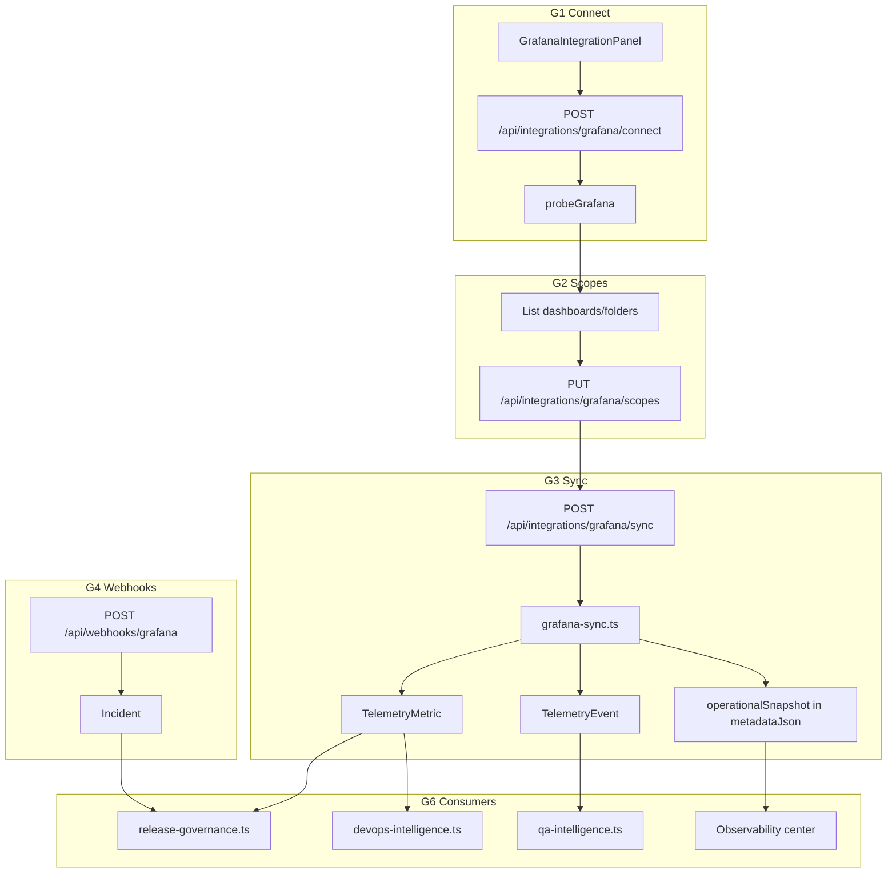

# Grafana integration — implementation plan

**Status:** Stub only · no real API client · downstream modules partially wired  
**Last updated:** 2026-06-09  
**Related:** [`docs/prometheus-integration.md`](docs/prometheus-integration.md), [`prometheus-analysis.md`](prometheus-analysis.md) (Prometheus is a **separate**, independent integration)

---

## 1. Executive summary

Grafana in AIDOS today is a **dev stub**: clicking “Connect (dev stub)” on the Integrations page upserts an `Integration` row with `metadataJson.mode = "observability-stub"`. No Grafana URL, credentials, API calls, sync, or alert ingestion exist.

Several platform modules **already reference** Grafana (discovery, Delivery DNA recommendations, QA intelligence, operational telemetry source selection, webhooks), but they treat “connected” as a boolean flag — not live observability data.

This plan implements a **read-only Grafana connector** that:

1. Connects per-org Grafana (self-hosted or Grafana Cloud) with encrypted service-account token
2. Syncs dashboard health, firing alerts, and annotations into AIDOS telemetry stores
3. Accepts Grafana alert webhooks for real-time incident correlation
4. Feeds **QA intelligence**, **release governance**, **Observability center**, and **DevOps intelligence** with honest, source-attributed signals

**Product constraint (non-negotiable):** Grafana and Prometheus are **independent**. Do not assume the org’s Grafana instance reads from their Prometheus integration. AIDOS may surface both sources side-by-side with clear attribution.

---

## 2. Current state audit

### 2.1 What exists today

| Area | Path | Status |
|------|------|--------|
| Prisma enum | `IntegrationProvider.GRAFANA`, `MetricSource.GRAFANA` | ✅ Schema ready |
| Stub connect | `POST /api/integrations/connect` | ✅ Sets `mode: "observability-stub"` for Grafana |
| Stub disconnect | `POST /api/integrations/disconnect` | ✅ Works |
| Integrations UI | `src/app/(platform)/integrations/page.tsx` | ⚠️ Grafana uses generic `StubConnectButton` — no dedicated panel |
| Discovery tool pick | `discovery-wizard.tsx`, `POST /api/discovery` | ✅ Creates `PENDING` integration when `grafana` selected |
| Delivery DNA rec | `src/lib/delivery-dna.ts` | ✅ Recommends “Add Grafana observability connector” when tool not selected |
| QA intelligence | `src/lib/qa-intelligence.ts` | ⚠️ `hasGrafana` gates performance signal; **ignores Prometheus** |
| Release governance | `src/lib/release-governance.ts` | ⚠️ Hardcoded `observabilityCoverage: "Partial — Grafana/Prometheus stub"` |
| Operational telemetry | `src/lib/operational-intelligence.ts` | ⚠️ Picks `GRAFANA` as `MetricSource` label but **generates synthetic values** |
| Telemetry ingest | `src/lib/telemetry-service.ts` | ⚠️ Calls synthetic `collectOperationalTelemetry` regardless of integration |
| Webhook receiver | `POST /api/webhooks/[provider]` + `webhook-ingest.ts` | ⚠️ Generic handler accepts `grafana` slug; **no signature/secret verify** |
| Metric source mapping | `src/lib/telemetry-normalizer.ts` | ✅ `GRAFANA` → `MetricSource.GRAFANA` |
| Observability center | `src/app/(platform)/observability/page.tsx` | ❌ **Prometheus-only** — Grafana not referenced |
| Nav gate | `src/lib/nav-availability.ts` | ❌ `observability` gate checks **Prometheus only** |
| Grafana libs / routes / panel | — | ❌ **Not built** |

### 2.2 Stub connect behavior (evidence)

```47:56:src/app/api/integrations/connect/route.ts
        metadataJson: JSON.stringify({
          mode: provider === "GRAFANA" ? "observability-stub" : "read-only-stub",
          phase: 2,
        }),
```

The Integrations page renders Grafana with `StubConnectButton` — the same pattern used for Jenkins and Slack before real connectors ship.

### 2.3 Downstream modules that expect Grafana

| Consumer | Expectation today | Gap after stub “connect” |
|----------|-------------------|--------------------------|
| `qa-intelligence.ts` | `hasGrafana` → synthetic “+4% vs 7d baseline” | Shows fake positive signal; production gap not cleared meaningfully |
| `release-governance.ts` | Telemetry snapshot always stub text | No real `openIncidents`, `errorRateDelta`, or coverage % |
| `operational-intelligence.ts` | Labels metrics `source: GRAFANA` | Values are still hardcoded synthetic |
| `delivery-dna.ts` | Recommends Grafana if discovery tool missing | Correct; should suppress rec when truly connected |
| `telemetry-service.ts` | Post-deploy pipeline | No Grafana-derived degradation detection |
| Observability center | Not wired | Users with only Grafana see empty / blocked UX |
| Incidents | Webhook path exists | No Grafana alert → incident mapping |

### 2.4 Known cross-integration bug (fix in this work)

`qa-intelligence.ts` gates the performance signal on **`hasGrafana` only**, while copy says “connect Grafana/Prometheus”. Prometheus P5 work called this out. The Grafana plan should introduce a shared helper:

```ts
// src/lib/observability-connectivity.ts (new)
export function hasLiveObservability(integrations, tools): {
  grafana: boolean;
  prometheus: boolean;
  any: boolean;
}
```

Use `any` (truly connected Grafana **or** truly connected Prometheus) for QA gates, release coverage, and production observability gaps.

---

## 3. Product scope

### 3.1 In scope (MVP Grafana v1)

| Capability | Grafana API / mechanism | AIDOS outcome |
|------------|----------------------|---------------|
| Connect + health probe | `GET /api/health`, `GET /api/org` | Encrypted token, connection status on Integrations |
| Dashboard inventory | `GET /api/search?type=dash-db` | Scope picker (folders/dashboards/tags) |
| Firing alerts | Unified alerting: `GET /api/alertmanager/grafana/api/v2/alerts` | `openAlerts` KPI, incident correlation |
| Annotations | `GET /api/annotations` (time-bounded) | Deploy markers, release correlation |
| Alert webhooks | Grafana contact point → AIDOS | Real-time `Incident` + `TelemetryEvent` |
| Operational snapshot | Computed rollup in `metadataJson` | Observability center Grafana tab |
| Sync → `TelemetryMetric` | Derived KPIs from alerts + annotation density | Release assess, DevOps post-deploy |

### 3.2 Explicit non-goals (v1)

- Replacing Grafana UI (no dashboard editor, no panel builder)
- Writing to Grafana (no dashboard/alert/rule mutations)
- Assuming Prometheus datasource linkage
- Log/trace ingestion (Loki/Tempo — Phase 2+)
- ML anomaly detection (rule-based thresholds only)
- Per-tenant Grafana env vars (org `Integration.metadataJson` only, same as Prometheus)
- Automated rollback execution (recommend-only via existing `Approval` flow)

### 3.3 Positioning copy

AIDOS frames Grafana as **governance visibility** — “which dashboards cover production?”, “what alerts are firing?”, “do deploy annotations line up with releases?” — not “build dashboards here.”

---

## 4. Architecture

### 4.1 High-level flow



### 4.2 Relationship to Prometheus

| Dimension | Prometheus integration | Grafana integration |
|-----------|------------------------|---------------------|
| Primary signal | PromQL metric time series | Dashboard coverage + alert state + annotations |
| Connect metadata | `prometheusUrl`, PromQL templates | `grafanaUrl`, dashboard scopes |
| Observability UI | Primary KPI strip (metrics) | Secondary tab: “Alerts & dashboards” |
| `MetricSource` | `PROMETHEUS` | `GRAFANA` |
| QA performance gate | `hasPrometheus` (after fix) | `hasGrafana` **or** `hasPrometheus` |
| Independence | Must not call Grafana APIs | Must not call Prometheus APIs |

When both are connected, Observability center shows a **source toggle** (Prometheus | Grafana | Combined summary). Combined view uses Prometheus for numeric KPIs and Grafana for alert/dashboard coverage — never merged into a single fake series.

### 4.3 Data model (no schema migration required v1)

Reuse existing tables:

| Table | Grafana usage |
|-------|-----------------|
| `Integration` | `provider = GRAFANA`, `metadataJson` holds URL, encrypted token, scopes, snapshot |
| `TelemetryMetric` | KPI rollups (`open_alerts`, `dashboard_coverage_pct`, `annotation_count_24h`) with `source = GRAFANA` |
| `TelemetryEvent` | Alert state changes, annotation ingests (`eventType = OBSERVABILITY`) |
| `Incident` | Created from firing Grafana alerts (webhook or sync) |
| `WebhookEvent` | Raw Grafana alert payloads |
| `ActivityEvent` / `AuditLog` | Connect, sync, webhook governance trail |

Optional P2 schema (defer): `GrafanaDashboardScope` normalized table if metadata JSON grows unwieldy — not needed for v1.

---

## 5. Metadata schema

Stored in `Integration.metadataJson` for `provider = GRAFANA`:

| Field | Type | Notes |
|-------|------|-------|
| `mode` | `"grafana-readonly"` | Distinguishes real connect from `observability-stub` |
| `grafanaUrl` | `string` | Base URL, e.g. `https://grafana.example.com` (no trailing slash) |
| `authType` | `"bearer"` \| `"none"` | v1: service account token only; `none` for open dev instances |
| `apiTokenEnc` | `string` | Encrypted via `token-crypto` |
| `dashboardScopes` | `GrafanaDashboardScope[]` | Max 15 — selected dashboards or folder UIDs |
| `tagFilter` | `string[]` | Optional — sync dashboards matching tags |
| `alertLabelSelectors` | `Record<string, string>` | Optional — filter firing alerts (e.g. `team: platform`) |
| `webhookSecret` | `string` | Shared secret for Grafana contact point verification |
| `operationalSnapshot` | `GrafanaOperationalSnapshot` | Latest computed rollup |
| `lastSyncSummary` | `string` | Human-readable sync result |
| `connectionStatus` | `"ok"` \| `"error"` | Last probe result |
| `lastConnectionCheckAt` | ISO string | |
| `lastError` | `string` | |
| `connectedBy` | `string` | User id |

**Never return** `apiTokenEnc` or decrypted tokens from API routes.

### 5.1 `GrafanaDashboardScope`

```ts
type GrafanaDashboardScope = {
  uid: string;
  title: string;
  folderTitle?: string;
  type: "dashboard" | "folder";
  tags?: string[];
};
```

### 5.2 `GrafanaOperationalSnapshot`

Mirror Prometheus snapshot shape where sensible (`src/lib/observability-analysis/types.ts`), Grafana-specific fields:

```ts
type GrafanaOperationalSnapshot = {
  generatedAt: string;
  grafanaUrl: string;
  dashboardScopes: GrafanaDashboardScope[];
  kpis: {
    openAlerts: number;
    firingCritical: number;
    dashboardCoveragePct: number;  // scoped dashboards with recent data
    annotations24h: number;
    healthScore: number;           // rule-based from alerts + coverage
  };
  alerts: Array<{
    fingerprint: string;
    alertname: string;
    severity: string;
    state: "firing" | "resolved";
    service?: string;
    startsAt: string;
    dashboardUid?: string;
  }>;
  dashboards: Array<{
    uid: string;
    title: string;
    hasRecentData: boolean;
    panelCount: number;
    missingDatasource?: boolean;
  }>;
  gaps: Array<{ area: string; gap: string; priority: "low" | "medium" | "high" }>;
  signals: Array<{ id: string; label: string; value: string; severity: "info" | "warning" | "critical" }>;
};
```

---

## 6. HTTP client (`grafana-api.ts`)

Read-only Grafana HTTP API wrapper. Pattern: mirror `src/lib/prometheus-api.ts`.

### 6.1 Auth

| `authType` | Header |
|------------|--------|
| `bearer` | `Authorization: Bearer <service_account_token>` |
| `none` | *(none)* |

Grafana Cloud and self-hosted v9+ use the same REST paths under `/api/...`.

### 6.2 Probe (connect validation)

1. `GET /api/health` — expect `database: "ok"`
2. Fallback: `GET /api/org` — confirms auth

Timeout: 15s (match Prometheus).

### 6.3 Sync endpoints (read-only)

| Purpose | Endpoint | Notes |
|---------|----------|-------|
| List dashboards | `GET /api/search?type=dash-db&limit=500` | Scope discovery |
| Dashboard meta | `GET /api/dashboards/uid/{uid}` | Panel count, datasource refs |
| Firing alerts | `GET /api/alertmanager/grafana/api/v2/alerts` | Unified alerting |
| Annotations | `GET /api/annotations?from={ms}&to={ms}&limit=100` | Deploy markers |
| Folder dashboards | `GET /api/search?folderIds={id}&type=dash-db` | Folder scope expansion |

### 6.4 Error handling

Export `GrafanaApiError` + `formatGrafanaConnectError` (401 → “check service account token”, 502 → network).

---

## 7. API routes

### 7.1 G1 — Connect

`POST /api/integrations/grafana/connect`

**Body (Zod):**

```ts
{
  grafanaUrl: string;
  authType: "bearer" | "none";
  apiToken?: string;  // required on first bearer connect; optional on update
}
```

**Flow:**

1. Session + `integrations.manage_integrations`
2. Normalize URL; reject non-http(s)
3. Encrypt token; preserve existing `apiTokenEnc` when token omitted on update
4. `probeGrafana(url, auth)`
5. Upsert `Integration` — `status: CONNECTED`, `mode: grafana-readonly`
6. `ActivityEvent` + `AuditLog`

**Response:** `{ ok: true, grafanaUrl, connectionStatus: "ok" }`

**Block stub:** Update `POST /api/integrations/connect` to return `400` for `GRAFANA` (same pattern as Prometheus).

### 7.2 Disconnect

Reuse `POST /api/integrations/disconnect` with `{ provider: "GRAFANA" }`.

### 7.3 G2 — Scopes

| Route | Purpose |
|-------|---------|
| `GET /api/integrations/grafana/scopes` | List discoverable dashboards/folders (server-side search) |
| `PUT /api/integrations/grafana/scopes` | Save `dashboardScopes` + optional `tagFilter`, `alertLabelSelectors` (max 15 scopes) |

### 7.4 G3 — Sync

`POST /api/integrations/grafana/sync`

1. Load org integration + decrypt token
2. For each scoped dashboard: fetch meta, detect stale/missing datasource
3. Fetch firing alerts (filter by `alertLabelSelectors`)
4. Fetch annotations (last 24h)
5. Compute `GrafanaOperationalSnapshot` + rule-based `healthScore`
6. Write `TelemetryMetric` rows (`source: GRAFANA`)
7. Upsert `metadataJson.operationalSnapshot`, `lastSyncSummary`, `integration.lastSyncAt`
8. `ActivityEvent` + `AuditLog`

### 7.5 G4 — Alert webhook

`POST /api/webhooks/grafana?organizationId=<id>`

**Verification:** compare `X-AIDOS-Webhook-Secret` header or `?secret=` query param to `metadata.webhookSecret`.

**Grafana contact point config (customer docs):**

- URL: `{APP_URL}/api/webhooks/grafana?organizationId={ORG_ID}&secret={SECRET}`
- Payload: Grafana unified alerting webhook JSON

**Processing:**

1. Parse alert groups → normalize via `telemetry-normalizer.ts`
2. Create/update `Incident` when state = firing (dedupe by `fingerprint`)
3. Resolve incident when alert resolves
4. `receiveWebhook` → `TelemetryEvent`
5. Link to `Release` when annotation/tags match `releaseName` (best-effort)

### 7.6 Scheduled sync (G7)

`POST /api/cron/integrations/sync` (or extend existing worker pattern)

- Reuse `PLATFORM_WORKER_SECRET` (same as Jira/Prometheus planned worker)
- Sync all orgs where `isGrafanaTrulyConnected(integration)` and `lastSyncAt` > 15 min ago

---

## 8. UI

### 8.1 Integrations page

Add `GrafanaIntegrationPanel` — mirror `PrometheusIntegrationPanel`:

| State | UI |
|-------|-----|
| Disconnected | URL + service account token form + Connect |
| Connected, no scopes | Scope picker (search dashboards/folders) |
| Scoped, no snapshot | “Run sync” CTA |
| Synced | Last sync summary, open alerts count, link to Observability |
| Error | `lastError` + retry |

Wire in `integrations/page.tsx`:

```tsx
} : integration.provider === "GRAFANA" ? (
  <GrafanaIntegrationPanel ... />
```

Remove Grafana from generic `StubConnectButton` branch.

### 8.2 Observability center

Upgrade `observability/page.tsx` + `ObservabilityPageClient`:

| Condition | UX |
|-----------|-----|
| Neither connected | Empty state: “Connect Prometheus and/or Grafana on Integrations” |
| Prometheus only | Current Prometheus dashboard (unchanged) |
| Grafana only | Grafana tab: alerts, dashboard coverage, gaps |
| Both | Source tabs: **Metrics (Prometheus)** | **Alerts & dashboards (Grafana)** |

Add components:

- `connect-grafana-empty.tsx` — parallel to `connect-prometheus-empty.tsx`
- `grafana-observability-dashboard.tsx` — KPI strip + alert table + dashboard health list
- Extend `PageHeader` description to mention both sources when applicable

### 8.3 Nav availability

Update `getIntegrationNavGates`:

```ts
observability: isPrometheusTrulyConnected(prometheus) || isGrafanaTrulyConnected(grafana),
```

### 8.4 Discovery / Delivery DNA

- `generateRecommendations`: suppress Grafana rec when `isGrafanaTrulyConnected` (not just discovery tool flag)
- Add complementary rec: “Connect Prometheus for metric KPIs” when Grafana connected but Prometheus not (optional, lower priority)

---

## 9. Downstream module wiring (G6)

### 9.1 Shared connectivity helper

**New:** `src/lib/observability-connectivity.ts`

```ts
export function isGrafanaTrulyConnected(integration): boolean;
export function resolveObservabilityContext(integrations, tools): {
  grafana: GrafanaAssessContext | null;
  prometheus: PrometheusAssessContext | null;
};
```

`GrafanaAssessContext` carries `connected`, `synced`, `snapshot`, `openAlerts`.

### 9.2 `qa-intelligence.ts`

| Signal | Before | After |
|--------|--------|-------|
| Performance (P95) | `hasGrafana` → fake delta | Prefer Prometheus snapshot delta; else Grafana `healthScore` trend; else warning |
| Production gap | `!hasGrafana` | `!hasLiveObservability.any` |
| New signal | — | “Grafana — firing alerts” when `snapshot.kpis.openAlerts > 0` |

Pass `grafana?: GrafanaAssessContext` into `assessQAIntelligence` (mirror `jira?: JiraAssessContext`).

### 9.3 `release-governance.ts`

Replace hardcoded telemetry snapshot:

```ts
observabilityCoverage: formatObservabilityCoverage(grafanaCtx, prometheusCtx),
openIncidents: grafanaCtx?.snapshot?.kpis.openAlerts ?? syntheticFallback,
errorRateDelta: prometheusCtx?.snapshot?.kpis.errorRateDelta ?? "unknown",
```

### 9.4 `operational-intelligence.ts`

When `isGrafanaTrulyConnected` and `operationalSnapshot` present:

- Prefer snapshot KPIs over synthetic `CORE_METRICS`
- Set `source: GRAFANA` only for Grafana-derived metrics; do not label synthetic data as Grafana

Long-term: deprecate synthetic metrics when **any** live observability source is connected.

### 9.5 `telemetry-service.ts`

Post-deploy ingest path:

1. If Prometheus truly connected → call `syncPrometheus` (when built) or read latest snapshot
2. Else if Grafana truly connected → call `syncGrafana` or read snapshot
3. Else → synthetic fallback (current behavior)

Pass real `degradationDetected` from alert state + metric deltas.

### 9.6 `assess/route.ts`

Extend release assess to resolve Grafana context (same pattern as `resolveJiraAssessContext`):

```ts
const grafana = resolveGrafanaAssessContext({ integrations });
const assessment = assessReleaseGovernance({ ..., grafana });
```

### 9.7 `integration-health.ts`

Provider-aware messages for Grafana:

- “Connected — select dashboards to sync” (no scopes)
- “Last sync 26h ago” (stale)
- Parse `connectionStatus` from metadata for probe failures

---

## 10. Implementation phases

### Phase G0 — Prep (0.5 day)

- [ ] Create `src/lib/grafana-meta.ts` (`parseGrafanaMeta`, `isGrafanaTrulyConnected`, `mergeGrafanaMeta`)
- [ ] Create `src/lib/observability-connectivity.ts`
- [ ] Block `GRAFANA` on stub connect route
- [ ] Add `docs/grafana-integration.md` API contract (short form, mirror Prometheus doc)

### Phase G1 — Connect + probe (1 day)

- [ ] `src/lib/grafana-api.ts` — normalize, probe, auth headers
- [ ] `POST /api/integrations/grafana/connect/route.ts`
- [ ] `src/components/integrations/grafana-integration-panel.tsx` (connect form only)
- [ ] Wire panel on Integrations page
- [ ] Unit smoke: connect with invalid URL → 400; bad token → 401

**Exit criteria:** Integrations shows real Grafana URL, health badge, encrypted token stored, stub button removed.

### Phase G2 — Dashboard scope selection (1 day)

- [ ] `src/lib/grafana-scope-selection.ts` — search + folder expansion
- [ ] `GET/PUT /api/integrations/grafana/scopes`
- [ ] Scope picker UI in panel (search, multi-select, max 15)
- [ ] Optional `tagFilter` + `alertLabelSelectors` advanced section

**Exit criteria:** User selects dashboards; metadata persists; health message updates.

### Phase G3 — Sync pipeline (1.5 days)

- [ ] `src/lib/grafana-sync.ts` — alerts, annotations, dashboard meta, snapshot builder
- [ ] `src/lib/grafana/health-score.ts` — rule-based scoring
- [ ] `POST /api/integrations/grafana/sync`
- [ ] Write `TelemetryMetric` + update `operationalSnapshot`
- [ ] Sync button in panel + Observability empty state

**Exit criteria:** Manual sync produces snapshot; `TelemetryMetric` rows with `source: GRAFANA`; `lastSyncAt` set.

### Phase G4 — Alert webhooks (1 day)

- [ ] Grafana webhook parser `src/lib/grafana-webhook.ts`
- [ ] Secret verification in `api/webhooks/[provider]/route.ts` for Grafana
- [ ] Incident create/resolve dedupe by `fingerprint`
- [ ] Webhook URL + secret generator in Integrations panel
- [ ] Customer setup snippet in panel (contact point URL)

**Exit criteria:** Test webhook payload creates `Incident` + `TelemetryEvent`; resolves on `resolved` state.

### Phase G5 — Observability center UI (1 day)

- [ ] `grafana-observability-dashboard.tsx` + empty states
- [ ] Source tabs on `ObservabilityPageClient` when both integrations present
- [ ] Update page header copy
- [ ] Link to Grafana dashboard (external) per scoped UID — `target="_blank"`

**Exit criteria:** Grafana-only org can use Observability center meaningfully.

### Phase G6 — Downstream wiring (1 day)

- [ ] `resolveGrafanaAssessContext` + assess route pass-through
- [ ] Fix `qa-intelligence.ts` (`hasPrometheus` + `hasGrafana` + live snapshots)
- [ ] `release-governance.ts` real telemetry snapshot
- [ ] `operational-intelligence.ts` prefer live snapshot
- [ ] `nav-availability.ts` gate on either source
- [ ] `delivery-dna.ts` suppress rec when truly connected
- [ ] `telemetry-service.ts` post-deploy path uses real data when available

**Exit criteria:** Release assess shows real alert counts; QA performance signal uses Prometheus or Grafana data; no “stub” copy when synced.

### Phase G7 — Worker + polish (0.5 day)

- [ ] Cron/sync worker for Grafana
- [ ] `checkIntegrationHealth` Grafana-specific messages
- [ ] Migration script: orgs with `mode: observability-stub` → prompt reconnect (no auto-migrate)
- [ ] `npm run build` passes

**Total estimate:** ~7 days (1 engineer), assuming Prometheus P2c sync patterns exist to copy.

---

## 11. Security & tenancy

| Rule | Detail |
|------|--------|
| Token storage | Encrypt `apiTokenEnc` via `token-crypto`; never expose in API JSON |
| Tenancy | All routes scoped by `session.organizationId` |
| Permissions | Connect/scope/sync require `integrations.manage_integrations` |
| Webhook | Shared secret per org; reject missing/invalid in production |
| Network | Server-side fetch only; document VPN/agent for internal Grafana |
| RBAC | View Observability: all authenticated org members; manage: integrators only |
| Audit | Connect, disconnect, sync, webhook → `AuditLog` + `ActivityEvent` |

---

## 12. Testing plan

### 12.1 Manual

1. Connect Grafana Cloud trial with service account token (Viewer + alerting read)
2. Select 2 dashboards → sync → verify Observability Grafana tab
3. Fire test alert in Grafana → webhook → Incidents page
4. Run release assess → QA signals show alert count, not stub text
5. Connect Prometheus too → verify source tabs and independent snapshots
6. Disconnect Grafana → downstream falls back honestly (warnings, not fake positives)

### 12.2 Automated (lightweight)

| Test | File |
|------|------|
| `parseGrafanaMeta` / `isGrafanaTrulyConnected` | `grafana-meta.test.ts` |
| Snapshot health score rules | `grafana/health-score.test.ts` |
| Webhook payload → incident mapping | `grafana-webhook.test.ts` |
| `hasLiveObservability` helper | `observability-connectivity.test.ts` |

### 12.3 Build gate

```bash
npm run build
```

Required before marking any phase complete.

---

## 13. File manifest

### New files

| Path | Phase |
|------|-------|
| `docs/grafana-integration.md` | G0 |
| `src/lib/grafana-meta.ts` | G0 |
| `src/lib/observability-connectivity.ts` | G0 |
| `src/lib/grafana-api.ts` | G1 |
| `src/app/api/integrations/grafana/connect/route.ts` | G1 |
| `src/components/integrations/grafana-integration-panel.tsx` | G1 |
| `src/lib/grafana-scope-selection.ts` | G2 |
| `src/app/api/integrations/grafana/scopes/route.ts` | G2 |
| `src/lib/grafana-sync.ts` | G3 |
| `src/lib/grafana/health-score.ts` | G3 |
| `src/app/api/integrations/grafana/sync/route.ts` | G3 |
| `src/lib/grafana-assess-context.ts` | G6 |
| `src/lib/grafana-webhook.ts` | G4 |
| `src/components/observability/connect-grafana-empty.tsx` | G5 |
| `src/components/observability/grafana-observability-dashboard.tsx` | G5 |

### Modified files

| Path | Change |
|------|--------|
| `src/app/api/integrations/connect/route.ts` | Block `GRAFANA` stub |
| `src/app/(platform)/integrations/page.tsx` | Grafana panel |
| `src/app/(platform)/observability/page.tsx` | Load Grafana integration state |
| `src/components/observability/observability-page-client.tsx` | Source tabs |
| `src/lib/nav-availability.ts` | Gate on Grafana or Prometheus |
| `src/lib/qa-intelligence.ts` | Live observability signals |
| `src/lib/release-governance.ts` | Real telemetry snapshot |
| `src/lib/operational-intelligence.ts` | Prefer live snapshot |
| `src/lib/telemetry-service.ts` | Real post-deploy path |
| `src/lib/delivery-dna.ts` | Suppress rec when connected |
| `src/app/api/releases/[id]/assess/route.ts` | Pass Grafana context |
| `src/app/api/webhooks/[provider]/route.ts` | Grafana secret verify |
| `src/lib/integration-health.ts` | Grafana-specific messages |

---

## 14. Acceptance criteria (definition of done)

Grafana integration v1 is **done** when:

1. Org admin can connect Grafana with URL + service account token; stub connect is blocked
2. Dashboard scopes can be selected and persisted (max 15)
3. Manual sync writes `operationalSnapshot` + `TelemetryMetric` with `source: GRAFANA`
4. Observability center renders Grafana alerts/dashboard health (Grafana-only or tabbed with Prometheus)
5. Grafana alert webhook creates/resolves `Incident` records with org isolation
6. Release assess + QA intelligence use **live** Grafana and/or Prometheus data — no synthetic positives when synced
7. `observabilityCoverage` in release governance reflects actual connection state
8. Nav gate opens Observability when either Prometheus or Grafana is truly connected
9. All credentials encrypted; tokens never returned in API responses
10. `npm run build` passes

---

## 15. Open decisions

| # | Question | Recommendation |
|---|----------|----------------|
| 1 | Grafana Cloud vs self-hosted auth differences? | Same bearer token flow; document Cloud URL format (`https://<stack>.grafana.net`) |
| 2 | Legacy alerting vs unified alerting? | Target unified alerting API (Grafana 8+); document minimum version |
| 3 | Combine KPIs when both sources connected? | Side-by-side tabs, not blended metrics |
| 4 | Auto-generate webhook secret on connect? | Yes — `crypto.randomUUID()`, show once in panel |
| 5 | MVP workspace hide Grafana? | Keep hidden in MVP mode (`MVP_PROVIDERS` unchanged); Enterprise only |
| 6 | Jenkins/Slack stub parity? | Out of scope — Grafana only in this spec |

---

## 16. Suggested PR sequence

Split for reviewability (mirror Prometheus PR pattern):

1. **PR1 (G0–G1):** Meta helpers, API client, connect route, panel, block stub
2. **PR2 (G2–G3):** Scopes + sync + `TelemetryMetric` writes
3. **PR3 (G4):** Webhook verify + incident mapping
4. **PR4 (G5–G6):** Observability UI + QA/release/telemetry downstream
5. **PR5 (G7):** Cron worker + health polish + docs

---

*Implementation tracking: update this doc and `docs/AIDOS-PHASE-1-EXECUTION.md` as phases ship.*
