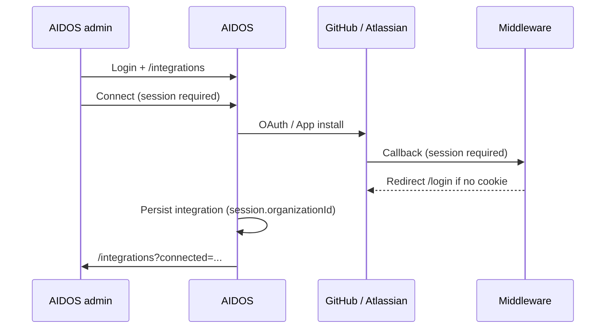

# External integration setup links — implementation plan

**Status:** Draft (approved requirements)  
**Scope:** GitHub App + Jira Cloud OAuth only  
**Last updated:** 2026-06-08  

---

## 1. Problem statement

Today, Jira and GitHub integrations require an AIDOS user to be logged in with `manage_integrations`, navigate to `/integrations`, and complete OAuth or GitHub App installation themselves. In practice, the person with Jira/GitHub admin access is often a customer PM or developer who will not log into AIDOS.

Additionally, post-callback redirects use `request.url` as the base in several places, and `NEXT_PUBLIC_APP_URL` may be unset in deployment — causing redirects to `localhost:3000` or `0.0.0.0`.

---

## 2. Goal

Allow an AIDOS admin to generate a **single-use, 24-hour, revocable share link** per provider (GitHub / Jira). An external user opens the link, authenticates with GitHub or Atlassian **without an AIDOS account**, and lands on a rich confirmation page. The integration is stored on the correct org and behaves identically to the in-app connect flow afterward (project/repo selection remains the AIDOS admin’s job).

---

## 3. Requirements (confirmed)

| # | Decision |
|---|----------|
| GitHub | **GitHub App install only** — no OAuth share link |
| Links | **Separate** per provider (`/connect/github/...`, `/connect/jira/...`) |
| Providers | GitHub + Jira only |
| Who generates | Users with `integrations.manage_integrations` |
| Who consumes | Anyone with the URL |
| Link lifetime | **Single-use**, **24h expiry** |
| Active links | **One pending link** per org + provider at a time; admin can **revoke** |
| Post-connect setup | AIDOS admin selects Jira projects / GitHub repos in-app |
| Already connected | **Block** — no new link while integration is `CONNECTED` |
| Jira sites | External user grants site access on **Atlassian’s consent screen**; AIDOS continues to use primary accessible site (existing behavior) |
| Success UX | **Rich** public confirmation (org name, provider, connected identity) |
| Error UX | **Actionable** messages (expired, used, revoked, already connected, provider denied, config missing) |
| In-app notification | **Not** in this slice |
| Audit | Yes — record invite creation, revocation, and successful external connect |
| Org name on public page | **Allowed** — show AIDOS org name so external user knows what they’re authorizing |
| Email delivery | **Manual copy/paste only** |
| AIDOS account for external user | **Not required** |
| `NEXT_PUBLIC_APP_URL` | Must be set correctly in every deployed environment; harden redirects as part of this work |

---

## 4. Current architecture (baseline)



**Blockers for external users:**

1. `src/middleware.ts` — integration routes are not public; unauthenticated callbacks never reach handlers.
2. `src/app/api/integrations/jira/callback/route.ts` and GitHub equivalents — require `getSession()` and match `oauthState.organizationId` to `session.organizationId`.
3. GitHub App Setup URL currently targets `/integrations` (session-gated) — `installation_id` is lost on redirect to `/login`.
4. Redirect URLs built with `new URL(path, request.url)` can produce wrong hosts behind proxies.

**GitHub note:** Production sync/code-analysis uses **GitHub App** (`persistGitHubAppInstallation`). Legacy OAuth routes remain but are **out of scope** for external links.

---

## 5. Target architecture

```mermaid
sequenceDiagram
  participant Admin as AIDOS admin
  participant Ext as External PM/dev
  participant AIDOS
  participant Provider as GitHub / Atlassian

  Admin->>AIDOS: Generate share link (manage_integrations)
  AIDOS->>AIDOS: Store IntegrationConnectInvite (24h, single-use)
  Admin->>Ext: Copy/paste link (manual)

  Ext->>AIDOS: GET /connect/{provider}/{token} (public)
  AIDOS->>AIDOS: Validate invite; show org name + provider
  AIDOS->>Provider: Redirect to install / OAuth with signed state

  Provider->>AIDOS: Public callback (no session)
  AIDOS->>AIDOS: Verify state + invite; persist integration
  AIDOS->>AIDOS: Mark invite usedAt
  AIDOS->>Ext: Rich success page (/connect/done?...)
```

---

## 6. Data model

Add `IntegrationConnectInvite` to `prisma/schema.prisma`:

```prisma
model IntegrationConnectInvite {
  id             String              @id @default(cuid())
  organizationId String
  provider       IntegrationProvider // GITHUB | JIRA only (enforce in API)
  token          String              @unique // opaque random, URL-safe (e.g. 32 bytes base64url)
  createdById    String              // AIDOS user who generated the link
  expiresAt      DateTime            // createdAt + 24h
  usedAt         DateTime?
  revokedAt      DateTime?
  revokedById    String?
  createdAt      DateTime            @default(now())

  organization Organization @relation(fields: [organizationId], references: [id], onDelete: Cascade)

  @@index([organizationId, provider])
  @@index([expiresAt])
}
```

**Invariants (enforced in service layer):**

- At most **one active invite** per `(organizationId, provider)` where active = `usedAt IS NULL AND revokedAt IS NULL AND expiresAt > now()`.
- Generating a new link **auto-revokes** any existing active invite for that org + provider (or reject with “revoke first” — prefer auto-revoke for simpler UX).
- Cannot generate if `Integration.status === 'CONNECTED'` for that provider.
- Token is opaque (not JWT in URL) — lookup by DB row; state JWT is separate and short-lived for OAuth round-trip.

**Migration:** `npx prisma migrate dev --name integration_connect_invite`

---

## 7. Signed OAuth state (external flow)

Extend `src/lib/oauth-state.ts`:

```typescript
export type OAuthState =
  | { flow: "session"; organizationId: string; userId: string }
  | {
      flow: "external";
      organizationId: string;
      inviteId: string;
      provider: "GITHUB" | "JIRA";
      createdById: string; // for audit / connectedBy fallback
    };
```

- Keep **10-minute TTL** on state JWT (OAuth round-trip only).
- External entry route signs state after invite validation.
- Callbacks verify state `flow === "external"`, load invite by `inviteId`, confirm token matches, invite unused/unrevoked/unexpired, and `organizationId` consistent.

**Do not** put the opaque invite token in OAuth `state` alone — use `inviteId` (internal) inside signed JWT so tampering is rejected.

---

## 8. Canonical app URL helper

Add `src/lib/app-url.ts`:

```typescript
export function getAppUrl(): string {
  const raw = process.env.NEXT_PUBLIC_APP_URL?.trim();
  if (!raw) {
    if (process.env.NODE_ENV === "production") {
      throw new Error("NEXT_PUBLIC_APP_URL is required in production");
    }
    return "http://localhost:3000";
  }
  const url = new URL(raw);
  if (["localhost", "0.0.0.0", "127.0.0.1"].includes(url.hostname) && process.env.NODE_ENV === "production") {
    throw new Error("NEXT_PUBLIC_APP_URL must be a public hostname in production");
  }
  return url.origin;
}

export function appUrl(path: string): URL {
  return new URL(path, getAppUrl());
}
```

**Replace** all integration redirect construction:

- `new URL("/integrations?...", request.url)` → `appUrl("/integrations?...")`
- OAuth `redirect_uri` in `jira-oauth.ts` / `github-oauth.ts` → use `getAppUrl()`

**Deployment checklist (§17):** Set `NEXT_PUBLIC_APP_URL=https://your-domain.com` on the server before enabling external links.

---

## 9. Routes and pages

### 9.1 Public routes (middleware allowlist)

Add to `publicPaths` in `src/middleware.ts`:

```
/connect/jira/[token]          → entry page (or redirect handler)
/connect/github/[token]        → entry page (or redirect handler)
/connect/done                  → success page
/connect/error                 → error page
/api/integrations/external/jira/callback
/api/integrations/external/github/callback
```

Use route groups: `src/app/(public)/connect/...` — no platform shell / no session.

### 9.2 External entry — Jira

**`GET /connect/jira/[token]`** (Server Component or route handler)

1. Lookup invite by `token`; validate active.
2. If integration already `CONNECTED` → redirect `/connect/error?code=already_connected&provider=jira`.
3. Load org name for display.
4. Render **landing page** (minimal public layout):
   - “Connect Jira to **{orgName}** on AIDOS”
   - Read-only scopes summary
   - Button: “Continue to Atlassian” → redirects to Atlassian authorize URL with signed external state.
5. Optional: auto-redirect after 2s if you prefer one-click flow (start with explicit button).

**Atlassian site selection:** During OAuth consent, the user chooses which Jira Cloud sites to grant. AIDOS continues to pick the **primary** site from `accessible-resources` (same as today). Document on the landing page: “Select the Jira site for {customer} when Atlassian asks.”

### 9.3 External entry — GitHub App

**`GET /connect/github/[token]`**

1. Same invite validation as Jira.
2. Render landing: “Install AIDOS GitHub App for **{orgName}**”
3. Button → redirect to:
   ```
   https://github.com/apps/{GITHUB_APP_SLUG}/installations/new?state={signedExternalState}
   ```
4. GitHub returns `installation_id`, `setup_action`, and `state` to Setup URL.

### 9.4 Public callbacks

**`GET /api/integrations/external/jira/callback`**

- No `getSession()`.
- Parse `code`, `state`, `error` from query.
- On provider error → `/connect/error?code=jira_denied&...`
- Verify external state JWT → load invite → exchange code → `buildJiraOAuthMeta` with:
  - `userId`: `createdById` from invite (initiator)
  - Store `connectedVia: "external_link"` and external `displayName` / `accountId` in metadata JSON patch
- Upsert `Integration` for `organizationId` from state (reuse logic from existing Jira callback).
- Mark invite `usedAt = now()`.
- Audit log: `integration.jira.connected_external` with invite id, external Jira identity, `createdById`.
- Redirect → `/connect/done?provider=jira&site=...&org=...`

**`GET /api/integrations/external/github/callback`**

- No session.
- Parse `installation_id`, `setup_action`, `state` (and handle missing params).
- Verify external state → load invite.
- Call `persistGitHubAppInstallation({ organizationId, userId: createdById, installationId, setupAction })` — extend to accept optional `via: "external_link"` in metadata/audit.
- Mark invite used.
- Audit log: `integration.github.app_installed_external`
- Redirect → `/connect/done?provider=github&installation_id=...&org=...`

**GitHub App Setup URL (platform config — required once per environment):**

| Environment | Setup URL |
|-------------|-----------|
| Production | `{NEXT_PUBLIC_APP_URL}/api/integrations/external/github/callback` |
| Staging | `{staging NEXT_PUBLIC_APP_URL}/api/integrations/external/github/callback` |

Update in GitHub App settings → **Setup URL** (and keep callback URL for OAuth unused if OAuth disabled).

**Jira callback URL (Atlassian developer console):**

Add alongside existing callback (same handler can serve both flows, or dedicated external path):

```
{NEXT_PUBLIC_APP_URL}/api/integrations/external/jira/callback
```

Register in Atlassian OAuth app **Callback URL** list.

### 9.5 Public result pages

**`/connect/done`** — rich success (no AIDOS login)

- Headline: “Jira connected to {orgName}” / “GitHub App installed for {orgName}”
- Details:
  - Jira: site name/URL, connected As `{displayName}` (if available)
  - GitHub: installation `#12345`
- Copy: “You can close this window. Your AIDOS administrator will finish project/repository setup.”
- No link to `/integrations` (external user has no account).

**`/connect/error`** — actionable errors

| `code` | User message | Suggested action |
|--------|--------------|------------------|
| `expired` | This link expired. | Ask your AIDOS admin to send a new link. |
| `used` | This link was already used. | Ask admin for a new link if connection failed. |
| `revoked` | This link was revoked. | Ask admin to generate a new one. |
| `invalid` | This link is not valid. | Check the URL or request a new link. |
| `already_connected` | {Provider} is already connected for this organization. | Nothing required; admin can manage in AIDOS. |
| `jira_denied` | Atlassian authorization was cancelled or denied. | Retry the link or contact admin. |
| `github_denied` | GitHub installation was cancelled. | Retry the link. |
| `jira_no_sites` | No Jira sites were authorized. | Re-run and select a site on the Atlassian screen. |
| `config_missing` | Integration is not configured on the server. | Contact AIDOS support (platform env vars). |
| `callback_failed` | Something went wrong completing the connection. | Retry once; then ask admin for a new link. |

---

## 10. Admin API (authenticated)

All require session + `requirePermission(session, "integrations", "manage_integrations")`.

### `POST /api/integrations/connect-invites`

Body: `{ "provider": "GITHUB" | "JIRA" }`

Behavior:

1. Reject if integration for provider is already `CONNECTED` → `409 { error: "already_connected" }`.
2. Revoke any active invite for `(organizationId, provider)`.
3. Create invite: `expiresAt = now + 24h`, cryptographically random `token`.
4. Audit: `integration.connect_invite.created`.
5. Return:
   ```json
   {
     "ok": true,
     "invite": {
       "id": "...",
       "provider": "JIRA",
       "expiresAt": "...",
       "url": "https://app.aidos.example/connect/jira/{token}"
     }
   }
   ```

### `GET /api/integrations/connect-invites?provider=JIRA`

Return active invite for org + provider (if any): url, expiresAt, createdAt — **no** raw token in list if you prefer only on create (or return url only).

### `POST /api/integrations/connect-invites/revoke`

Body: `{ "provider": "GITHUB" | "JIRA" }` or `{ "inviteId": "..." }`

- Set `revokedAt`, `revokedById`.
- Audit: `integration.connect_invite.revoked`.

---

## 11. Admin UI (Integrations page)

Update `JiraIntegrationPanel` and `GitHubIntegrationPanel` when `!connected && canManage`:

**“Share setup link” section**

- Short explanation: “Send this link to someone with Jira/GitHub admin access. Single-use, expires in 24 hours.”
- **Generate link** button → `POST connect-invites` → show URL in read-only input + **Copy** button.
- If active invite exists: show expiry countdown, **Copy link**, **Revoke link**.
- If already connected: hide section (or show disabled “Already connected”).
- If `NEXT_PUBLIC_APP_URL` / provider not configured: show config warning (GitHub slug, Atlassian credentials).

Keep existing **Connect** button for admins who prefer in-app flow (session-based authorize/install) — both paths coexist.

New client component: `ExternalConnectLinkPanel.tsx` (shared props: `provider`, `connected`, `canManage`).

---

## 12. Refactor shared persistence logic

Extract from existing callbacks into lib functions to avoid duplication:

| Function | Source | Used by |
|----------|--------|---------|
| `completeJiraOAuthConnection({ organizationId, userId, code, via })` | `jira/callback/route.ts` | session callback + external callback |
| `completeGitHubAppInstallation({ organizationId, userId, installationId, setupAction, via })` | `github-app-install.ts` + integrations page | session page + external callback |

Add metadata fields (non-breaking):

```typescript
// jira-meta / integration-meta
connectedVia?: "session" | "external_link";
externalConnector?: { displayName?: string; accountId?: string; githubInstallationId?: number };
```

Session flow sets `connectedVia: "session"` (optional, default implicit).

---

## 13. Security considerations

| Risk | Mitigation |
|------|------------|
| Guessable tokens | 256-bit random `token`; rate-limit public entry routes (optional follow-up) |
| Token replay | Single-use: set `usedAt` in same transaction as integration upsert |
| Org hijacking | State JWT signed with `AUTH_SECRET`; binds `inviteId` + `organizationId` |
| Stale links | 24h `expiresAt`; checked on entry and callback |
| Link leakage | Admin can revoke; document treat-as-secret |
| CSRF on public entry | GET-only entry; OAuth state for round-trip |
| Middleware bypass | Explicit allowlist only for connect paths |

**Not in scope:** IP allowlist, email-bound invites, magic-link to specific GitHub user.

---

## 14. Audit log actions

| Action | When | metadataJson |
|--------|------|--------------|
| `integration.connect_invite.created` | Admin generates link | `{ provider, inviteId, expiresAt }` |
| `integration.connect_invite.revoked` | Admin revokes | `{ provider, inviteId }` |
| `integration.jira.connected_external` | External Jira callback success | `{ inviteId, siteUrl, cloudId, externalDisplayName, createdById }` |
| `integration.github.app_installed_external` | External GitHub callback success | `{ inviteId, installationId, setupAction, createdById }` |

`userId` on audit row: `createdById` (AIDOS admin who generated the invite).

---

## 15. Existing in-app flow (unchanged behavior)

Session-based connect remains for admins:

- Jira: `/api/integrations/jira/authorize` → `/api/integrations/jira/callback`
- GitHub App: Install button → `/integrations?installation_id=...` (session)

**Optional cleanup (non-blocking):** Remove or hide legacy GitHub OAuth UI if still visible anywhere.

External flow does **not** replace GitHub Setup URL for session flow — session flow can keep using `/integrations` with `installation_id` **or** unify both to external callback by embedding session state in GitHub `state` param (future simplification). **MVP:** only change Setup URL to external callback; session admins can still install via direct GitHub link on integrations page **if** Setup URL points to external handler that also accepts session state — **recommended:** external callback handles **both** flows via `state.flow`:

- `external` → no session, use invite
- `session` → require session, use `session.organizationId` (migrate integrations page to pass state on install link)

This avoids two Setup URLs. **Phase 1 recommendation:** GitHub Setup URL → external callback only; update in-app “Install GitHub App” to append `?state={sessionFlowState}` so admin install still works without login on callback.

---

## 16. Implementation phases

### Phase A — Foundation (backend)

1. Prisma model + migration
2. `src/lib/app-url.ts` + replace redirect URLs in integration routes
3. `src/lib/integration-connect-invite.ts` — create, revoke, validate, markUsed
4. Extend `oauth-state.ts` for external flow
5. Admin API routes (`connect-invites`)
6. Middleware public path updates

### Phase B — External connect flow

7. Public entry pages `/connect/jira/[token]`, `/connect/github/[token]`
8. External Jira callback + extract `completeJiraOAuthConnection`
9. External GitHub callback + extend `persistGitHubAppInstallation`
10. Public `/connect/done` and `/connect/error` pages
11. Update in-app GitHub install link to include session `state` (if Setup URL moves off `/integrations`)

### Phase C — Admin UI

12. `ExternalConnectLinkPanel` on Jira + GitHub panels
13. Copy-to-clipboard UX
14. Config warnings (`NEXT_PUBLIC_APP_URL`, `GITHUB_APP_SLUG`, Atlassian credentials)

### Phase D — Docs & deploy

15. Update `.env.example` and README with `NEXT_PUBLIC_APP_URL` requirement
16. Document GitHub App Setup URL + Atlassian callback URL changes
17. `npm run build` + manual E2E test matrix (§18)

---

## 17. Deployment checklist

- [ ] Set `NEXT_PUBLIC_APP_URL=https://<production-host>` (no trailing slash; no `0.0.0.0` / `localhost`)
- [ ] GitHub App → **Setup URL** = `{NEXT_PUBLIC_APP_URL}/api/integrations/external/github/callback`
- [ ] Atlassian OAuth app → add callback `{NEXT_PUBLIC_APP_URL}/api/integrations/external/jira/callback`
- [ ] Verify existing callback URLs still registered for in-app admin flow
- [ ] Redeploy after env change (Next.js inlines `NEXT_PUBLIC_*` at build time)

---

## 18. Acceptance criteria

### Admin

- [ ] User **without** `manage_integrations` cannot generate or revoke links.
- [ ] Admin can generate Jira link and GitHub link independently.
- [ ] Only one active link per provider per org; new generate revokes previous.
- [ ] Admin can revoke active link; revoked link shows error on open.
- [ ] Cannot generate link when provider already connected.
- [ ] Copy button copies full URL.

### External user

- [ ] Opens Jira link without AIDOS login → lands on org-named page → completes Atlassian OAuth → rich success page.
- [ ] Opens GitHub link → installs App → rich success page with installation id.
- [ ] Expired link shows actionable error.
- [ ] Used link cannot be reused.
- [ ] No redirect to `localhost` or `0.0.0.0` when `NEXT_PUBLIC_APP_URL` is set correctly.

### Integration behavior

- [ ] After external connect, AIDOS admin sees integration **Connected** on `/integrations`.
- [ ] Jira project picker and GitHub repo picker work as today.
- [ ] Sync endpoints work after admin selects projects/repos.
- [ ] Audit log entries created for invite lifecycle and external connect.

### Regression

- [ ] In-app Jira OAuth connect still works for logged-in admin.
- [ ] In-app GitHub App install still works for logged-in admin (with session state on install URL).
- [ ] `npm run build` passes.

---

## 19. Out of scope

- Email delivery of links
- In-app notification when external user completes connect
- External user selecting Jira projects / GitHub repos
- GitHub OAuth external link
- Prometheus / other providers
- Multiple concurrent active links per provider
- Automatic site picker UI after Jira OAuth (beyond Atlassian consent screen)

---

## 20. Open questions (resolved)

| Question | Resolution |
|----------|------------|
| Jira site pick | User selects sites on **Atlassian OAuth screen**; AIDOS uses primary accessible resource (existing logic) |
| GitHub OAuth | **Not used** for external flow |
| Notification | **Deferred** |
| `NEXT_PUBLIC_APP_URL` | **Required** — likely root cause of localhost redirects; fix in this work |

---

## 21. File touch list (expected)

| Area | Files |
|------|-------|
| Schema | `prisma/schema.prisma` |
| Lib | `src/lib/app-url.ts`, `src/lib/oauth-state.ts`, `src/lib/integration-connect-invite.ts`, `src/lib/jira-oauth.ts`, `src/lib/github-app-install.ts` |
| API | `src/app/api/integrations/connect-invites/route.ts`, `.../revoke/route.ts`, `.../external/jira/callback/route.ts`, `.../external/github/callback/route.ts` |
| Pages | `src/app/(public)/connect/jira/[token]/page.tsx`, `.../github/[token]/page.tsx`, `.../done/page.tsx`, `.../error/page.tsx` |
| UI | `src/components/integrations/external-connect-link-panel.tsx`, `jira-integration-panel.tsx`, `github-integration-panel.tsx` |
| Middleware | `src/middleware.ts` |
| Config | `.env.example`, `README.md` |

---

## 22. Suggested agent split

```
/orchestrator  — track phases A–D, acceptance criteria

/backend       — schema, invite service, external callbacks, app-url, admin API, audit

/frontend      — public connect pages, ExternalConnectLinkPanel, copy UX

/architect     — review security (single-use, public callbacks, org isolation) before merge
```
