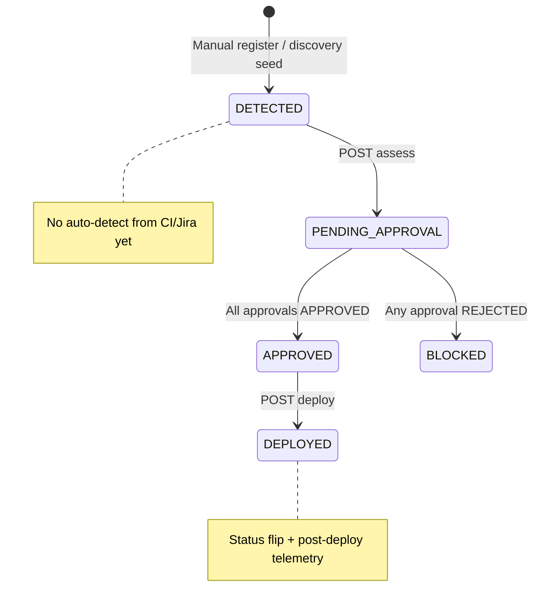
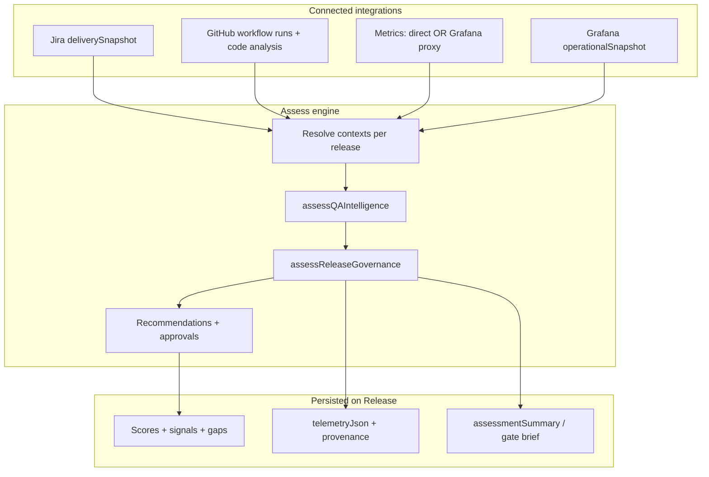

# QA Intelligence & Release Governance — implementation plan

**Status:** Spec · ready for execution  
**Last updated:** 2026-06-09  
**Owner agents:** `/backend` (assess engine, integration wiring), `/frontend` (QA cockpit, release brief UI), `/architect` (review before merge)

**Related:**

- [`docs/AIDOS-USP.md`](docs/AIDOS-USP.md) — Governance + operational intelligence positioning
- [`prometheus-proxy-grafana.md`](prometheus-proxy-grafana.md) — Metrics via Grafana datasource proxy (GP0–GP4 largely shipped)
- [`docs/grafana-integration.md`](docs/grafana-integration.md) — Grafana connect, scopes, sync, proxy metrics
- [`docs/prometheus-integration.md`](docs/prometheus-integration.md) — Direct Prometheus connect + P2c sync
- [`docs/jira-integration.md`](docs/jira-integration.md) — Jira OAuth, sync, delivery snapshot
- [`delivery-analysis.md`](delivery-analysis.md) — Jira portfolio intelligence (complementary)
- [`code-analysis.md`](code-analysis.md) — GitHub / AI-assisted code governance
- [`docs/AIDOS-ENTERPRISE-ROADMAP.md`](docs/AIDOS-ENTERPRISE-ROADMAP.md) — Phase 3 (governance) + Phase 4 (QA intelligence)

---

## 1. Executive summary

AIDOS already ships a **human-governed release loop**: register → assess → recommend → approve → deploy, with audit trail. Jira delivery health and Grafana observability (alerts + proxy metrics) feed release assess today.

The gap is **credibility and synthesis**:

- GitHub CI and code-analysis data sync but are **not used** in assess (synthetic regression/coverage signals remain).
- Observability is split across two layers (metrics vs alerts) but assess UX and scoring do not fully reflect that model.
- Direct Prometheus sync (`prometheus-sync.ts`) is not built; proxy metrics cover private-network orgs.
- `/qa` and release detail pages list signals — they do not deliver a **release gate brief** executives need.
- Governance mechanics (contradictory recs, role enforcement, re-assess) need hardening.

This plan turns release assess into AIDOS’s flagship **Release Confidence** capability: correlate Jira, GitHub, metrics (direct or Grafana proxy), and Grafana alerts into one explainable, source-attributed go/no-go brief — always ending in human approval.

**Product constraint (non-negotiable):**

- **Recommend-only** — no automated deploy or test execution without approval.
- **Govern first** — scores explain *why*; humans decide *whether*.
- **Source attribution** — every signal names its origin (Jira, GitHub, Grafana, Prometheus direct, Grafana→Prometheus proxy).

---

## 2. Problem statement

### 2.1 Target users

| Persona | Primary question | Surface |
|---------|------------------|---------|
| VP Engineering / CTO | Should we ship? What’s the portfolio risk? | `/qa`, release gate brief |
| Release manager | Is this release traceable, tested, and gated? | `/releases/[id]`, assess flow |
| QA lead | What gaps block confidence? | Test gaps, CI signals, approvals |
| DevOps / SRE | Are SLOs and alerts acceptable for prod? | Metrics + Grafana alerts in assess |
| Program lead | Are we trending better? | Org rollup, export |

### 2.2 Current release lifecycle



**Key files today:**

| Area | Path |
|------|------|
| Assess engine | `src/lib/release-governance.ts`, `src/lib/qa-intelligence.ts` |
| Integration contexts | `src/lib/jira-delivery-health.ts`, `src/lib/grafana-assess-context.ts`, `src/lib/observability-connectivity.ts` |
| Assess API | `src/app/api/releases/[id]/assess/route.ts` |
| Deploy API | `src/app/api/releases/[id]/deploy/route.ts` |
| Approvals | `src/app/api/approvals/route.ts` |
| Release UI | `src/app/(platform)/releases/[id]/page.tsx`, `src/app/(platform)/qa/page.tsx` |

### 2.3 Integration utilization in assess (today)

| Source | Synced data | Used in assess | Utilization |
|--------|-------------|----------------|-------------|
| **Jira** | Delivery snapshot, fix versions, sprints | Signals, gaps, readiness blend (45%), recs | **~75%** |
| **Grafana operational** | Alerts, dashboards, annotations | Alert signals, open incidents, deployments24h | **~40%** |
| **Grafana proxy metrics** | `metricsSnapshot` via PromQL | P95, error rate, metrics gaps, performance signal | **~60%** (shipped) |
| **Direct Prometheus** | Connect only; no sync route | Assess wired; snapshot usually empty | **~0%** |
| **GitHub** | Workflow runs, PRs, repos | `CONNECTED` boolean only | **~5%** |
| **Code analysis** | AI attribution, governance signals | Not connected | **0%** |
| **Telemetry events** | CI, webhooks in DB | Not queried at assess | **0%** |

### 2.4 Trust killers (synthetic signals)

| Signal | Current behavior | Fix phase |
|--------|------------------|-----------|
| Regression suite | “94% pass (synthetic)” when GitHub connected | QIR-2 |
| Critical path coverage | Proxy from `dna.governanceScore` | QIR-2 / QIR-3 |
| Error budget burn | Hardcoded “12% consumed” for prod | QIR-1 |
| Regression notes | Fabricated flaky-test narrative | QIR-2 |
| Deployments 24h fallback | `3` when no Grafana sync | QIR-1 |
| Open incidents fallback | `1` if risk HIGH/CRITICAL | QIR-1 |

---

## 3. Target architecture

### 3.1 Observability mental model (two layers)

```text
┌─────────────────────────────────────────────────────────┐
│  METRICS LAYER (PromQL KPIs)                            │
│  Path A: Direct Prometheus (prometheus-sync)            │
│  Path B: Grafana → datasource proxy (metricsSnapshot)   │
│  Resolver: resolveMetricsAssessContext()                │
└─────────────────────────────────────────────────────────┘
┌─────────────────────────────────────────────────────────┐
│  GRAFANA OPERATIONAL LAYER                              │
│  Firing alerts, dashboard coverage, annotations         │
│  Resolver: resolveGrafanaAssessContext()                │
└─────────────────────────────────────────────────────────┘
```

**Exec questions:**

- Metrics layer → “Are SLOs degrading?”
- Grafana operational → “Is anything on fire? Do we have visibility?”

Do **not** collapse these into a single “Grafana health” number in release briefs.

### 3.2 Full assess data flow (target)



### 3.3 Readiness score formula (target)

Replace opaque `88 - penalty` with weighted blend when real data exists:

| Input | Weight (default) | Source |
|-------|------------------|--------|
| Base penalty model | Residual | Gaps + warning signals |
| Jira delivery health | 35% | `jiraHealth.score` |
| Metrics health | 25% | `metrics.snapshot.kpis.healthScore` |
| CI pass rate | 20% | GitHub workflow runs |
| Governance posture | 20% | `dna.governanceScore` |

Weights tunable later via Delivery DNA; v1 use fixed constants in `src/lib/qa-intelligence.ts`.

### 3.4 Signal attribution contract

Extend `QASignal`:

```ts
export type QASignal = {
  id: string;
  category: "regression" | "coverage" | "performance" | "stability";
  label: string;
  value: string;
  severity: "info" | "warning" | "critical";
  source?: "jira" | "github" | "grafana" | "prometheus-direct" | "grafana-proxy" | "dna" | "synthetic";
};
```

UI renders source badges on release detail and gate brief. **No `source: synthetic` in production assess when integration data exists.**

### 3.5 Telemetry snapshot extension

```ts
export type TelemetrySnapshot = {
  deployments24h: number;
  openIncidents: number;
  errorRateDelta: string;
  observabilityCoverage: string;
  metricsProvenance?: MetricsProvenance | null;  // new
  assessedAt?: string;                           // ISO — snapshot freshness
};
```

---

## 4. Product scope

### 4.1 In scope

| Capability | Outcome |
|------------|---------|
| Honest assess signals | No synthetic CI/coverage/SLO when real data exists |
| GitHub assess context | Workflow run pass rate, recent failures, branch scope |
| Code analysis in assess | AI % and review coverage in release window |
| Observability completeness | Direct prometheus-sync + assess cleanup (proxy already shipped) |
| Grafana operational gaps | Merge into testGaps + hold recommendations |
| Release gate brief | Go / Hold / No-go card on release detail + `/qa` |
| Governance hardening | Primary rec, role enforcement, re-assess from BLOCKED |
| Org QA cockpit | Portfolio readiness, gap rollup, pending approvals |
| Explainability | Score breakdown + source links |
| Board export | CSV/PDF per release or quarter |

### 4.2 Explicit non-goals (v1)

- Running tests or triggering CI from AIDOS
- Replacing TestRail, Zephyr, or Grafana/Jira UIs
- Autonomous deploy without approval
- ML forecasting or anomaly detection
- Writing to Jira, GitHub, Grafana, or Prometheus
- Real CI/CD deploy trigger (status + audit only until post-PMF)
- Per-release PromQL or arbitrary query UI

---

## 5. Phased delivery

### QIR-0 — Spec & hygiene (0.5 day)

- [ ] Review and freeze this document
- [ ] Update `prometheus-proxy-grafana.md` status (GP0–GP4 shipped)
- [ ] Add cross-link from `docs/AIDOS-ENTERPRISE-ROADMAP.md` Phase 4

**Exit:** Plan approved; no runtime changes.

---

### QIR-1 — Observability assess cleanup (2–3 days)

**Goal:** Assess reflects the two-layer observability model honestly.

| Task | Detail |
|------|--------|
| Remove duplicate stability signal | When `metrics.synced`, replace hardcoded “Error budget burn” with metrics-derived value; suppress synthetic `metrics-stability` duplication |
| Merge Grafana operational gaps | `operationalSnapshot.gaps` → `testGaps` (in addition to `metricsSnapshot.gaps`) |
| Persist metrics provenance | Write `metricsProvenance` + `assessedAt` into `telemetryJson` on assess |
| Enterprise workflow telemetry step | `hasObservabilitySynced` = Prometheus synced **OR** Grafana `metricsSnapshot` present |
| Fallback removal | No fake `deployments24h: 3` or guessed `openIncidents` when sources connected but unsynced — show “run sync” gap instead |
| Direct Prometheus sync | `src/lib/prometheus-sync.ts` + `POST /api/integrations/prometheus/sync` using shared `runPromqlSync` + direct transport (GP5 / P2c parity) |

**Files:**

| Path | Change |
|------|--------|
| `src/lib/qa-intelligence.ts` | Stability signal logic, gap merge |
| `src/lib/release-governance.ts` | Telemetry snapshot shape, fallback removal |
| `src/lib/enterprise-workflow.ts` | `hasObservabilitySynced` helper |
| `src/lib/prometheus-sync.ts` | **New** |
| `src/app/api/integrations/prometheus/sync/route.ts` | **New** |
| `src/app/api/releases/[id]/assess/route.ts` | Persist extended telemetry |

**Exit:**

- Grafana-only + proxy org: assess shows real P95/error rate, no fake error budget.
- Direct Prometheus org: sync populates snapshot; assess prefers direct over proxy.
- Workflow “Observability & telemetry” completes on Grafana proxy sync.

---

### QIR-2 — GitHub & code analysis wiring (3–4 days)

**Goal:** CI and AI governance signals are real in assess.

#### 2a — GitHub assess context

**New:** `src/lib/github-assess-context.ts`

```ts
export type GitHubAssessContext = {
  connected: boolean;
  synced: boolean;
  ci: {
    passRatePct: number | null;       // last N runs on release branch
    lastConclusion: "success" | "failure" | "cancelled" | null;
    consecutiveFailures: number;
    lastRunAt: string | null;
  } | null;
  changeRisk: {
    openPrs: number;
    mergedPrs7d: number;
  } | null;
};

export function resolveGitHubAssessContext(input: {
  integrations: Integration[];
  releaseBranch?: string | null;   // from Release model (QIR-4) or toolchain default
}): GitHubAssessContext;
```

**Data source:** `Integration.metadataJson.repos[]` + workflow run telemetry from last GitHub sync (`src/lib/github-sync.ts`).

**Wire into `assessQAIntelligence`:**

| Old | New |
|-----|-----|
| “94% pass (synthetic)” | `ci.passRatePct` from workflow runs |
| “No CI signal” | When no runs in scope |
| +5 readiness bonus for connected | +5 only when `ci.passRatePct >= 80` |

#### 2b — Code analysis in assess

**Extend assess input** with optional window filter on `codeAnalysisSnapshot`:

- `aiLinesPct`, `aiPrsPct`, `reviewCoverageOnAiPrsPct`
- Top `governanceSignals` in release window

**New QA signals:**

- `github-ai-coverage` — AI-assisted change % with review coverage
- Governance gap when `reviewCoverageOnAiPrsPct < 70` and `aiLinesPct > 30`

**Files:**

| Path | Change |
|------|--------|
| `src/lib/github-assess-context.ts` | **New** |
| `src/lib/qa-intelligence.ts` | Regression + coverage signals |
| `src/lib/release-governance.ts` | AI governance recommendation |
| `src/app/api/releases/[id]/assess/route.ts` | Pass GitHub context |

**Exit:** Assess with GitHub synced shows real CI pass rate; synthetic regression text removed.

---

### QIR-3 — Readiness scoring & recommendations (2 days)

**Goal:** Scores move when real data moves; recommendations are coherent.

| Task | Detail |
|------|--------|
| Weighted readiness blend | Jira + metrics + CI + governance (§3.3) |
| Primary recommendation | One of: `HOLD`, `APPROVE_WITH_SIGNOFF`, `APPROVE` — supporting items as sub-bullets, not competing approvals |
| Grafana critical + metrics degraded | Keep existing hold rec; tie to primary when severity CRITICAL |
| Jira high gaps | Fold into primary HOLD rationale |
| Block contradictory bundle | Do not emit “Block release” and “Approve for deployment” in same assess |
| `requiredRole` enforcement | `/api/approvals` checks RBAC against `recommendation.requiredRole` |
| Re-assess | Allow from `BLOCKED` and `PENDING_APPROVAL` (with confirm in UI) |

**Files:**

| Path | Change |
|------|--------|
| `src/lib/qa-intelligence.ts` | Readiness formula |
| `src/lib/release-governance.ts` | Primary rec model |
| `src/app/api/approvals/route.ts` | Role enforcement |
| `src/app/api/releases/[id]/assess/route.ts` | Re-assess status rules |
| `src/components/releases/release-actions.tsx` | Re-assess button states |

**Exit:** Readiness score changes when Jira/CI/metrics change; one clear decision per assess.

---

### QIR-4 — Release-scoped correlation (3–4 days)

**Goal:** Assess answers “this release” not “the whole org.”

#### Schema extension (optional fields on `Release`)

```prisma
model Release {
  // ... existing ...
  branch           String?   // e.g. release/2.4
  jiraFixVersion   String?   // override auto-match
  serviceScope     String?   // JSON array of scope ids — matches metricsServiceScopes
}
```

Register form + API accept optional `branch`, `jiraFixVersion`, `serviceScope`.

#### Correlation rules

| Source | Scope filter |
|--------|--------------|
| GitHub CI | Workflow runs on `branch` or default production branch from toolchain mapping |
| Jira | Matched fix version issues; `openIssuesInVersion` |
| Metrics | Filter by `serviceScope` labels when set |
| Code analysis | Commits/PRs merged in 14d before assess, filtered by repo |

**Files:**

| Path | Change |
|------|--------|
| `prisma/schema.prisma` | Optional release fields + migration |
| `src/app/api/releases/route.ts` | Accept new fields |
| `src/components/releases/new-release-form.tsx` | Branch / version fields |
| `src/lib/github-assess-context.ts` | Branch filter |
| `src/lib/jira-delivery-health.ts` | `openIssuesInVersion` in release-scoped health |

**Exit:** Release assess summary references scoped CI branch and matched Jira version issues.

---

### QIR-5 — Release gate brief & QA cockpit UI (3–4 days)

**Goal:** One executive view for go/no-go.

#### 5a — `ReleaseGateBrief` component

**New:** `src/components/releases/release-gate-brief.tsx`

| Section | Content |
|---------|---------|
| Verdict badge | GO / HOLD / NO-GO derived from primary recommendation |
| Score strip | Readiness %, governance risk %, risk level |
| Top blockers | Max 3 high-priority gaps across sources |
| Signal groups | Schedule (Jira) · CI (GitHub) · Metrics · Alerts (Grafana) |
| Observability attribution | “Metrics via Grafana → prod-prom” + alert count |
| Approval status | Pending roles, link to `/approvals` |
| Freshness | Last sync timestamps per source |

#### 5b — Release detail v2

Replace flat signal list with gate brief + expandable signal details (source badges).

**Modify:** `src/app/(platform)/releases/[id]/page.tsx`

#### 5c — QA cockpit (`/qa`)

**Modify:** `src/app/(platform)/qa/page.tsx`

| Block | Content |
|-------|---------|
| Org readiness index | Avg readiness, trend vs last period (when history exists) |
| Pending decisions | Releases in `PENDING_APPROVAL` with verdict preview |
| Open gaps by area | Aggregated test gaps (Traceability, CI, Observability, …) |
| Integration health | Connected / synced status per source |
| Assessed releases | Card per release with gate brief compact |

**Exit:** VP Eng can open `/qa` or release detail and decide without visiting Integrations or Observability.

---

### QIR-6 — Post-deploy closed loop (2 days)

**Goal:** Deploy triggers meaningful correlation, not synthetic fallback.

| Task | Detail |
|------|--------|
| Pre-assess snapshot | Store `assessmentSnapshotJson` on Release at assess time (scores + key KPIs) |
| Post-deploy compare | After deploy ingest, diff error rate / open alerts vs pre-assess |
| Degradation rec | Rollback recommendation when post-deploy metrics worse by threshold |
| Stale snapshot banner | Warn if assess used sync data >24h old |

**Files:**

| Path | Change |
|------|--------|
| `prisma/schema.prisma` | `assessmentSnapshotJson` on Release |
| `src/lib/telemetry-service.ts` | Pre/post compare |
| `src/app/api/releases/[id]/deploy/route.ts` | Persist comparison summary |

**Exit:** Deployed release shows “post-deploy: +0.4% error rate vs assess baseline” or rollback rec.

---

### QIR-7 — Export & auto-detect (2–3 days, optional v1.1)

| Task | Detail |
|------|--------|
| Board export | `GET /api/releases/export?format=csv` — readiness, risk, gaps, approval outcomes, provenance |
| Auto-detect release | Stub: GitHub `release` event or Jira version → create `DETECTED` release (webhook handler) |
| Assessment history | Org-level trend for `/qa` (metadata or `ReleaseAssessmentHistory` table — defer DB table to v1.1) |

**Exit:** Program lead exports quarterly release confidence report.

---

## 6. API contracts

### 6.1 Assess response (extended)

`POST /api/releases/[id]/assess` response includes:

```ts
{
  ok: true;
  release: {
    id: string;
    status: "PENDING_APPROVAL";
    readinessScore: number;
    governanceRiskScore: number;
    riskLevel: string;
    primaryRecommendation: "HOLD" | "APPROVE_WITH_SIGNOFF" | "APPROVE";
    assessmentSummary: string;
  };
  recommendations: Array<{ id: string; title: string; requiredRole?: string }>;
}
```

### 6.2 Re-assess rules

| Current status | Allowed | Notes |
|----------------|---------|-------|
| `DETECTED` | ✅ | Initial assess |
| `PENDING_APPROVAL` | ✅ | Re-run replaces recs (confirm in UI) |
| `BLOCKED` | ✅ | After fixes |
| `APPROVED` | ❌ | Must not re-assess without admin reset (v1.1) |
| `DEPLOYED` | ❌ | Read-only |

---

## 7. Files to create or modify (summary)

### New files

| Path | Phase |
|------|-------|
| `src/lib/github-assess-context.ts` | QIR-2 |
| `src/lib/prometheus-sync.ts` | QIR-1 |
| `src/app/api/integrations/prometheus/sync/route.ts` | QIR-1 |
| `src/components/releases/release-gate-brief.tsx` | QIR-5 |
| `src/components/qa/qa-cockpit.tsx` | QIR-5 |
| `src/lib/release-assess-snapshot.ts` | QIR-6 |
| `src/app/api/releases/export/route.ts` | QIR-7 |

### Modified files

| Path | Phases |
|------|--------|
| `src/lib/qa-intelligence.ts` | QIR-1, 2, 3 |
| `src/lib/release-governance.ts` | QIR-1, 2, 3 |
| `src/lib/observability-connectivity.ts` | QIR-1 |
| `src/lib/jira-delivery-health.ts` | QIR-4 |
| `src/lib/enterprise-workflow.ts` | QIR-1 |
| `src/app/api/releases/[id]/assess/route.ts` | QIR-1–4 |
| `src/app/api/approvals/route.ts` | QIR-3 |
| `src/app/(platform)/releases/[id]/page.tsx` | QIR-5 |
| `src/app/(platform)/qa/page.tsx` | QIR-5 |
| `src/components/releases/new-release-form.tsx` | QIR-4 |
| `prisma/schema.prisma` | QIR-4, QIR-6 |

---

## 8. Testing plan

### Manual matrix

| # | Setup | Action | Expected |
|---|-------|--------|----------|
| 1 | Jira + Grafana proxy synced | Assess prod release | Real Jira + metrics + alert signals; no synthetic CI if no GitHub |
| 2 | + GitHub synced | Assess | Real CI pass rate; no “94% synthetic” |
| 3 | Grafana critical alert firing | Assess prod | Primary HOLD; DevOps rec |
| 4 | Readiness below DNA threshold | Assess | HOLD with QA rec |
| 5 | All green | Assess | Primary APPROVE |
| 6 | Approve all recs | — | Release → APPROVED |
| 7 | Reject one rec | — | Release → BLOCKED; re-assess allowed |
| 8 | Wrong role approves | POST approval | 403 when role enforced |
| 9 | Deploy approved release | POST deploy | Post-deploy summary vs pre-assess baseline |
| 10 | `/qa` | View org | Gate brief cards, pending approvals visible |

### Automated

- Unit: `resolveGitHubAssessContext` pass rate from fixture workflow runs
- Unit: readiness blend formula with partial inputs
- Unit: primary recommendation selection (no contradict pairs)
- Unit: `resolveMetricsAssessContext` priority (direct > proxy > grafana health)
- Integration: assess route persists provenance in `telemetryJson`

---

## 9. Recommended PR sequence

```text
PR1  QIR-1   Observability assess cleanup + prometheus-sync
PR2  QIR-2   GitHub assess context + remove synthetic regression
PR3  QIR-2b  Code analysis signals + AI governance rec
PR4  QIR-3   Readiness blend + primary rec + approval role enforcement
PR5  QIR-4   Release-scoped fields + correlation filters
PR6  QIR-5   Release gate brief + QA cockpit UI
PR7  QIR-6   Post-deploy pre/post compare
PR8  QIR-7   Export + auto-detect stub (optional)
```

**Suggested first vertical slice:** PR1 + PR2 — honest observability + real CI in assess. Highest trust impact with existing integrations.

---

## 10. Exit criteria (feature complete)

1. No synthetic CI, coverage, or error-budget signals when real integration data exists
2. Assess correlates Jira + GitHub CI + metrics (direct or proxy) + Grafana alerts with source attribution
3. Release detail and `/qa` show release gate brief with Go/Hold/No-go verdict
4. Primary recommendation is unambiguous; roles enforced on approval
5. Re-assess works from `BLOCKED` and `PENDING_APPROVAL`
6. Direct Prometheus sync and Grafana proxy metrics share `runPromqlSync`
7. Enterprise workflow telemetry step completes on either metrics path
8. Post-deploy shows comparison vs pre-assess baseline
9. `npm run build` passes; architect sign-off
10. `docs/AIDOS-ENTERPRISE-ROADMAP.md` Phase 4 alignment noted

---

## 11. Open questions (resolve in QIR-0)

| # | Question | Default |
|---|----------|---------|
| 1 | Store assess history in DB table vs release fields only? | v1: `assessmentSnapshotJson` on Release; history table in QIR-7 |
| 2 | Auto-select GitHub branch from toolchain `productionBranch`? | Yes when `Release.branch` unset |
| 3 | Waive critical Grafana alert with explicit approval comment? | v1.1 — v1 always HOLD |
| 4 | Single approval per primary rec vs one per sub-item? | Single approval on primary; sub-items informational |
| 5 | MVP workspace mode: hide `/qa` and releases? | Yes — Enterprise only (existing `workspaceMode` gate) |

---

## 12. Positioning copy (for UI)

**QA Intelligence dashboard:**

> Release confidence for governed delivery — correlate schedule, CI, metrics, and alerts into one human-approved go/no-go.

**Release gate brief:**

> AIDOS recommends; your team approves. Every score is explainable and source-attributed.

**Not:**

> “Run tests in AIDOS” or “Auto-deploy when green.”

---

## 13. Dependency map

```text
prometheus-proxy-grafana.md (GP0–GP4 shipped)
        │
        ▼
    QIR-1 ──► QIR-3 ──► QIR-5
        │
QIR-2 (GitHub) ──► QIR-4 ──► QIR-5
        │
        └──► QIR-6 (post-deploy)
                    │
                    └──► QIR-7 (export)
```

**Parallel work after QIR-1:** QIR-2 (GitHub) and QIR-4 (schema) can proceed in parallel once QIR-0 is frozen.

---

*End of plan.*
