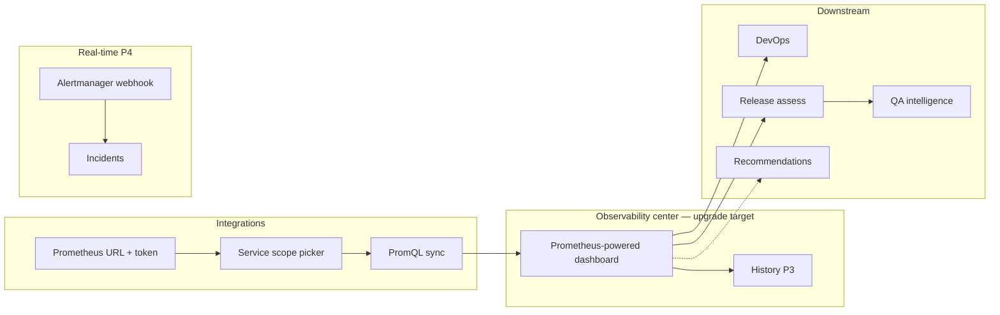

# Prometheus analysis — operational reliability intelligence

**Last updated:** 2026-06-05 (audit pass)  
**Status:** P1 UI shell — done · P2+ not started · codebase audit verified against `src/` and `prisma/schema.prisma`  
**Owner agents:** `/frontend` (page & components), `/backend` (Prometheus connect, PromQL sync, scoring engine), `/architect` (review before merge)

**Related docs:** [`docs/AIDOS-USP.md`](docs/AIDOS-USP.md) · [`delivery-analysis.md`](delivery-analysis.md) · [`code-analysis.md`](code-analysis.md) · [`feature-flag.md`](feature-flag.md) · [`docs/prometheus-integration.md`](docs/prometheus-integration.md) *(to be created — connection & sync contract)*

> **This document is the spec for Prometheus-powered operational intelligence on the existing Observability center (`/observability`).** It is **not** a separate nav page. Jira and GitHub each have a dedicated analysis page because they are distinct product surfaces; runtime metrics already live under **Observability** — this spec **upgrades that page in place** with real PromQL data, trends, signals, and governance drill-downs. Prometheus URL/token connect and sync remain in [`docs/prometheus-integration.md`](docs/prometheus-integration.md).

---

## 1. Purpose

Give **engineering and platform leadership** a single place to see **whether production and staging workloads are healthy** — error rates, latency, resource pressure, SLO burn, and post-deploy regressions — without opening Prometheus directly.

AIDOS sits **above** Prometheus and answers governance questions such as:

- Are our services within SLO — and is error budget burning faster than usual?
- Which namespaces or services are degraded right now, and since when?
- Did the last deploy cause a measurable regression in error rate or latency?
- How does operational health today compare to last week (trend)?
- What should leadership escalate before the next release gate?

This complements **Delivery analysis** (Jira / workflow risk), **Code analysis** (GitHub / AI-assisted change), and **QA intelligence** (release readiness). Together they form the “observe delivery” story in [`docs/AIDOS-USP.md`](docs/AIDOS-USP.md): **govern and observe AI-native delivery**, not replace observability tooling.

### Audience

| Persona | Primary need on this page |
|---------|---------------------------|
| VP Engineering / CTO | Portfolio reliability score, red/yellow signals, trend vs last period |
| Platform / SRE lead | Per-service breakdown, resource saturation, alert volume |
| Release manager | Post-deploy health windows, link to AIDOS release assess |
| DevOps lead | Deployment correlation, rollback evidence, incident drill-down |

### Current implementation audit (verified in repo)

| Component | Path | Status |
|-----------|------|--------|
| Observability page (thin shell) | `src/app/(platform)/observability/page.tsx` | ✅ Exists — 4 KPIs, `MetricBars`, deploy card, incidents list; **no** MVP redirect, **no** DNA guard, **no** filters/tabs/trends; UI copy still says “Grafana or Prometheus” — update to Prometheus-only in P1 |
| Collect telemetry button | `src/components/observability/collect-telemetry-button.tsx` | ✅ Calls `POST /api/telemetry/ingest` (`mode: "collect"`) — **not** the same as planned Prometheus sync |
| Legacy collect route | `src/app/api/observability/collect/route.ts` | ✅ Exists — wraps `ingestTelemetryForOrganization`; **no RBAC** (differs from `/api/telemetry/ingest`) |
| Metric bars | `src/components/observability/metric-bars.tsx` | ✅ Renders latest `TelemetryMetric` rows |
| Synthetic collector | `src/lib/operational-intelligence.ts` | ✅ Stub — fake values; `source: PROMETHEUS` when stub connected |
| Telemetry orchestration | `src/lib/telemetry-service.ts` | ✅ Post-deploy → `DeploymentEvent`, `Incident`, `Recommendation` + `Approval` on degradation |
| Deployment analysis | `src/lib/devops-intelligence.ts` | ✅ Rule-based health from synthetic metrics |
| Org KPI aggregation | `src/lib/org-data.ts` | ✅ `stats.errorRate`, `stats.p95Latency` from latest `TelemetryMetric` |
| Integration stub connect | `POST /api/integrations/connect` | ✅ Sets `mode: "observability-stub"` for `PROMETHEUS` |
| Generic disconnect | `POST /api/integrations/disconnect` | ✅ Supports `PROMETHEUS` — reuse; dedicated disconnect route optional |
| Integrations UI | `src/app/(platform)/integrations/page.tsx` | ✅ `StubConnectButton` for Prometheus; **hidden in MVP** (`MVP_PROVIDERS = GITHUB, JIRA` only) |
| Webhook ingress | `POST /api/webhooks/prometheus` | ✅ Generic — stores `WebhookEvent` + `TelemetryEvent`; **no** Alertmanager parsing or signature verify |
| Release deploy + telemetry | `POST /api/releases/[id]/deploy` | ✅ `postDeploy: true` → `ingestTelemetryForOrganization` |
| Release assess (Jira only today) | `POST /api/releases/[id]/assess` | ✅ `resolveJiraAssessContext` + `assessReleaseGovernance` — **no Prometheus context yet** |
| QA readiness blend | `src/lib/qa-intelligence.ts` | ✅ Jira health blended at **45%** when synced; performance signal gated on **`hasGrafana` only** (not `hasPrometheus`) |
| Release governance telemetry | `src/lib/release-governance.ts` | ✅ Hardcoded `observabilityCoverage: "Partial — Grafana/Prometheus stub"` |
| Scheduled worker pattern | `POST /api/platform/jira/sync` | ✅ `PLATFORM_WORKER_SECRET` via `src/lib/platform-worker-auth.ts` — reuse for Prometheus worker |
| Token encryption | `src/lib/token-crypto.ts` | ✅ Used by Jira/GitHub — reuse for Prometheus API token |
| Prisma history models | `DeliveryAnalysisSnapshot`, `CodeAnalysisRun` | ✅ Pattern to mirror — **`ObservabilityAnalysisSnapshot` does not exist yet** |
| Dashboard snapshot APIs | `/api/observability/snapshot` etc. | ⬜ **Not built** — only `/api/observability/collect` exists today |
| Prometheus connect/sync libs | `prometheus-api.ts`, `prometheus-sync.ts`, … | ⬜ **Not built** |
| `docs/prometheus-integration.md` | — | ⬜ **Not created** |

### What already exists (do not rebuild)

Reuse the rows above. Upgrade — do not duplicate — the Observability page shell, `TelemetryMetric` storage, post-deploy pipeline, and generic webhook receiver.

### Explicit non-goals (MVP)

- Replacing Prometheus UI, alert rule editing, or other observability tools (Grafana is a **separate** integration — out of scope here)
- Writing to Prometheus (no remote write, no rule creation)
- Full distributed tracing UI (OpenTelemetry spans — future phase)
- ML anomaly detection (rule-based thresholds in v1)
- Per-customer Prometheus env vars (SaaS: org `Integration.metadataJson` only)
- Automated rollback execution (recommend-only; human approval via existing `Approval` flow)

---

## 2. Product constraints (non-negotiable)

| Rule | Detail |
|------|--------|
| Read-only | PromQL **query** API only (`/api/v1/query`, `/api/v1/query_range`); no config mutations |
| Human-governed | Insights inform recommendations and release assess — no auto-rollback in MVP |
| Multi-tenant | All data scoped by `session.organizationId`; Prometheus URL + token in org `Integration` (`provider = PROMETHEUS`) |
| Honest scope | Show “last synced”, selected `serviceScopes`, PromQL template version, and “partial data” when queries fail |
| Not an observability tool | Copy frames **governance & operational visibility**, not “build dashboards here” |
| **Grafana out of scope** | Prometheus and Grafana are **independent** integrations. Grafana may use Loki, Tempo, CloudWatch, or other datasources — do not assume Grafana reads from the org’s Prometheus instance. No Grafana URLs, dashboard links, or API calls in this implementation |
| Verify build | Run `npm run build` before marking any PR complete |

---

## 3. Route & navigation

**No new nav item.** Prometheus intelligence ships as an **upgrade to the existing Observability center** — same pattern as wiring live Jira data into Delivery analysis, but the destination page already exists.

| Item | Value |
|------|--------|
| **Path** | `/observability` *(upgrade in place — do not add `/prometheus-analysis`)* |
| **Workspace** | Enterprise only (already in `isEnterpriseOnlyPath`) |
| **Nav label** | **Observability** (unchanged) |
| **Icon** | `Activity` (unchanged) |
| **Feature flag** | Existing `nav.observability` — no new flag |

### Why not a separate page?

| Surface | Jira / GitHub pattern | Prometheus pattern |
|---------|----------------------|-------------------|
| Admin connect + sync | `/integrations` | `/integrations` (same) |
| Executive intelligence | **New page** (`/delivery-analysis`, `/code-analysis`) — no prior home | **Upgrade existing** `/observability` — KPI shell, metrics, deploy intel, incidents already live here |
| Adjacent ops pages | — | `/devops`, `/incidents` stay as focused drill-downs linked from Observability |

Adding `/prometheus-analysis` would duplicate the four KPI cards, live metrics, deployment card, and incidents list already on Observability. This spec **enriches** that page (reliability score, filters, tabs, trends, signals, export) rather than splitting nav.

### Empty / blocked states

| Condition | UI |
|-----------|-----|
| Prometheus not connected | CTA card → `/integrations` (“Connect Prometheus to analyze operational health”) |
| Connected, no service scopes selected | CTA to select services/namespaces on Integrations (same copy as sync `400`) |
| Connected, never synced | “Sync Prometheus data” CTA + explain first sync runs PromQL templates |
| Connected + synced | Full dashboard; banner if sync &gt; 24h old (warning, not blocking) |
| MVP workspace | Redirect to `/accelerator` *(add in P1 — **not** in current `observability/page.tsx`)* |
| No Delivery DNA | Redirect to `/governance/setup` *(add in P1 — **not** in current observability page)* |
| PromQL partial failure | Yellow banner: “N of M metrics unavailable — check scope or templates on Integrations” |

---

## 4. Page information architecture

Single scrollable page with **sticky filter bar**, **executive story above the fold**, and **tabbed drill-downs**. Density similar to Delivery analysis and Code analysis — scannable KPIs, charts for trends, tables for accountability.

```
┌─────────────────────────────────────────────────────────────────────────────┐
│  Observability center                           [Sync now] [Export]           │
│  Prometheus operational intelligence · N services · last synced 8m ago      │
├─────────────────────────────────────────────────────────────────────────────┤
│  [Service ▾] [Environment ▾] [Range: 30d ▾] [Compare: vs prior sync ▾]    │
├─────────────────────────────────────────────────────────────────────────────┤
│  ┌──────────────┐ ┌──────────────┐ ┌──────────────┐ ┌──────────────┐        │
│  │ Reliability  │ │ Error rate   │ │ P95 latency  │ │ Open alerts  │        │
│  │ health 84    │ │ 0.32%        │ │ 142ms        │ │ 2 firing     │        │
│  │  ▲ 3 pts     │ │  ▼ 0.1%      │ │  ▲ 12ms      │ │  ▲ 1         │        │
│  └──────────────┘ └──────────────┘ └──────────────┘ └──────────────┘        │
├─────────────────────────────────────────────────────────────────────────────┤
│  Health mix (stacked bar)        │  Reliability trend (line, P3)             │
│  Healthy · Degraded · Critical │  Score + error rate over sync history     │
├─────────────────────────────────────────────────────────────────────────────┤
│  By service (bars)               │  Resource pressure (CPU / memory cards)   │
├─────────────────────────────────────────────────────────────────────────────┤
│  Tabs: [Overview] [Services] [Deploys] [Alerts] [Signals] [SLO]             │
│  … tables, expand rows …                                                    │
└─────────────────────────────────────────────────────────────────────────────┘
```

### Design tokens

Follow platform patterns (`PageHeader`, `Card`, `Badge`, `Button`):

| Semantic | Token |
|----------|--------|
| Healthy / within SLO | `text-secondary`, accent `#4F8CFF` |
| Warning / elevated | `text-warning` |
| Critical / breach | destructive or strong warning |
| Post-deploy regression | warning border |
| Stale sync | muted + dashed border |

---

## 5. Metrics catalog

### 5.1 Headline KPIs (always visible)

Computed from `PrometheusOperationalSnapshot` for filtered service scope (see §7). Deltas require P3 history; until then show “—” or hide delta with tooltip “Trends after two syncs”.

| Metric | Definition (product) | Source (PromQL template) | Why it matters |
|--------|----------------------|--------------------------|----------------|
| **Reliability health score** | 0–100 composite from error rate, latency, resource pressure, active alerts | Derived in `src/lib/observability-analysis/compute-snapshot.ts` | Single number for leadership standups |
| **HTTP error rate** | 5xx (or configured) error share over 5m window | `sum(rate(http_requests_total{status=~"5.."}[5m])) / sum(rate(http_requests_total[5m])) * 100` | User-facing reliability |
| **P95 latency** | 95th percentile request duration (ms) | `histogram_quantile(0.95, sum(rate(http_request_duration_seconds_bucket[5m])) by (le)) * 1000` | Performance governance |
| **Open alerts** | Count of firing Alertmanager alerts in scope | `count(ALERTS{alertstate="firing"})` or webhook-maintained count | Incident pressure |

Optional fifth/sixth KPI (P2 UI or P2b data):

| Metric | Definition | Source |
|--------|------------|--------|
| **CPU utilization %** | Avg container CPU vs limit/request | `avg(rate(container_cpu_usage_seconds_total[5m])) * 100` |
| **Memory utilization %** | Working set vs limit | `avg(container_memory_working_set_bytes / container_spec_memory_limit_bytes) * 100` |
| **Error budget remaining %** | SLO recording rule or computed burn | Org-configured `slo:error_budget_remaining` or burn-rate template |
| **Deploy success rate %** | CI/deploy metric if exposed to Prometheus | `avg_over_time(deployment_success[1h]) * 100` (optional) |

Each KPI card: value, delta vs prior period (P3), short subtitle (e.g. “Across 4 services · production”).

### 5.2 Health mix chart

Stacked horizontal bar or donut for scoped portfolio:

| Segment | Formula |
|---------|---------|
| Healthy services | `healthScore >= 80` per service |
| Degraded | `60 <= healthScore < 80` |
| Critical | `healthScore < 60` or firing critical alert |

Tooltip: scores computed from PromQL at sync time, not live Prometheus UI.

### 5.3 Trend charts (P3)

- **X-axis:** `syncedAt` from `ObservabilityAnalysisSnapshot` history (one point per successful sync)
- **Series 1:** Reliability health score
- **Series 2 (toggle):** Error rate · P95 latency · Open alerts · CPU
- **Annotation:** deploy events from `DeploymentEvent` + GitHub `workflow_run` telemetry

Until P3: show placeholder card “Sync at least twice to see trends” with mini sparkline from last two metadata snapshots if available (optional P2 shortcut).

### 5.4 Dimensional breakdowns

| Dimension | Visualization | Interaction |
|-----------|---------------|-------------|
| Service / job | Horizontal bars: health score or error rate | Click → filter page to service |
| Environment | Chips: production · staging · development | Filter by `environment` label |
| Namespace | Compact table (K8s deployments) | Filter by `namespace` label |
| Resource pressure | Side-by-side CPU / memory cards per top services | Highlight &gt; 85% as warning |

### 5.5 Drill-down tables (tabs)

#### Overview tab

Summary cards re-stating signals; quick links to Integrations, DevOps, Incidents, Recommendations, Releases.

#### Services tab

| Column | Notes |
|--------|-------|
| Service | `service` or `job` label |
| Environment | from label |
| Health score | 0–100 |
| Error rate | % |
| P95 latency | ms |
| CPU / Memory | % |
| Alerts | firing count |
| Last deploy impact | P5: delta vs pre-deploy baseline |

#### Deploys tab

Correlates `DeploymentEvent` + GitHub deploy telemetry with metric deltas in post-deploy window.

| Column | Notes |
|--------|-------|
| Release | AIDOS release name + version |
| Deployed at | timestamp |
| Environment | |
| Health | HEALTHY / DEGRADED / FAILED |
| Error rate delta | vs 30m pre-deploy |
| P95 delta | vs 30m pre-deploy |
| Rollback recommended | badge + link to Approval |

#### Alerts tab

Normalized from Alertmanager webhook (P4) or instant query at sync.

| Column | Notes |
|--------|-------|
| Alert name | `alertname` label |
| Severity | critical / warning / info |
| Service | |
| State | firing / resolved |
| Since | `startsAt` |
| Release correlation | P5: matched `version` label |

#### Signals tab (governance)

Reuse pattern from `JiraDeliverySignal` / code-analysis governance signals at **org portfolio** level:

| Signal | Example rule |
|--------|----------------|
| Elevated error rate | `http_error_rate > 1.0%` for any scoped service |
| Latency regression | P95 &gt; 1.25× 7d baseline |
| Resource saturation | CPU or memory &gt; 85% for &gt; 1h (range query) |
| Error budget burn | remaining &lt; 20% |
| Post-deploy regression | error rate spike within 30m of deploy (P5) |
| Alert storm | &gt; 5 distinct firing alerts in 1h |
| Stale sync | `syncedAt` older than 48h |
| Missing metrics | PromQL template returned no data for scoped service |

Each signal: severity badge, affected service(s), stub “Create recommendation” (P6).

#### SLO tab (P2b+)

Per-service SLO rows when recording rules or templates configured:

| Column | Notes |
|--------|-------|
| SLO name | e.g. `api-availability` |
| Target | 99.9% |
| Current | rolling 30d |
| Budget remaining | % |
| Burn rate | 1h / 6h windows |

Empty state when org has no SLO templates configured — CTA to configure on Integrations.

### 5.6 Cross-links (executive workflow)

| From | To | When |
|------|-----|------|
| Deploy row | `/releases` + assess | Release linked to `DeploymentEvent.releaseId` |
| Alert row | `/incidents` | Incident created from same `correlationId` |
| Signal card | `/recommendations` | When recommendation exists (P6) |
| Health score | `/qa` | Subtitle “Also reflected in QA readiness when releases assessed” |
| Footer | `/integrations` | Manage connection, scopes, PromQL templates |

---

## 6. Filters & controls

| Control | Options | Default |
|---------|---------|---------|
| **Service scope** | All selected · single service/job | All selected (`metadata.serviceScopes`) |
| **Environment** | All · production · staging · development | All (label filter) |
| **Risk focus** | All · Errors · Latency · Resources · Alerts · Deploy | All (filters signals + highlights KPIs) |
| **Time range** | Labels for P1 mock; P3 uses sync history window (7d · 30d · 90d of sync points) | 30d |
| **Compare** | vs previous sync · vs 7d baseline | Previous sync |

**Actions:**

| Action | API | Auth | Purpose |
|--------|-----|------|---------|
| **Sync now** | `POST /api/integrations/prometheus/sync` *(new)* | `integrations.manage_integrations` | Pull PromQL → `operationalSnapshot` + `TelemetryMetric` |
| **Export** | `GET /api/observability/export` *(new, P2)* | session | CSV for scoped snapshot |
| **Collect telemetry** *(existing)* | `POST /api/telemetry/ingest` `mode: "collect"` | `telemetry.ingest_telemetry` | On-demand synthetic/real collect via `CollectTelemetryButton` — keep for post-deploy; distinct from scheduled PromQL sync |

Do **not** conflate **Sync now** (integration pull) with **Collect telemetry** (manual ingest button). After P2c, both may write `TelemetryMetric`, but sync is the source of dashboard snapshot/history.

Sticky filter bar on scroll (client component). Session required; sync requires `manage_integrations` (button disabled with tooltip for view-only users — same pattern as `delivery-analysis/page.tsx`).

---

## 7. Data architecture

### 7.1 Current state (stub — to replace)

Today, `collectOperationalTelemetry()` in `src/lib/operational-intelligence.ts` generates **hardcoded values** and only changes the `source` label to `PROMETHEUS` when the stub integration is connected. The Observability Center and dashboard KPIs consume `TelemetryMetric` rows produced by this synthetic path.

**Contract to preserve** (downstream code depends on these keys):

```ts
// CORE_METRICS — keep metricKey strings stable
"http_error_rate"        // unit: %
"p95_latency_ms"         // unit: ms
"cpu_utilization"        // unit: %
"memory_utilization"     // unit: %
"deployment_success_rate"// unit: %
"active_incidents"       // unit: count
```

P2c replaces value generation with real PromQL results mapped into the same keys + `labelsJson` (`service`, `environment`, `namespace`).

### 7.2 Raw sync snapshot (new)

Add `PrometheusOperationalSnapshot` stored at `Integration.metadataJson.operationalSnapshot` after each sync (mirror `JiraDeliverySnapshot`, `codeAnalysisSnapshot`).

```ts
// src/lib/prometheus-meta.ts

export type PrometheusServiceScope = {
  id: string;           // stable id — job name or service label value
  label: string;        // display name
  type: "job" | "service" | "namespace";
  environment?: string;
};

export type PrometheusMetricSample = {
  metricKey: string;
  value: number;
  unit: string;
  labels: Record<string, string>;
  queriedAt: string;    // ISO
  promql?: string;      // template id used — auditability
};

export type PrometheusAlertSummary = {
  alertname: string;
  severity: string;
  service?: string;
  state: "firing" | "resolved";
  startsAt?: string;
  endsAt?: string;
  labels: Record<string, string>;
};

export type PrometheusOperationalSnapshot = {
  syncedAt: string;
  prometheusUrl: string;          // host only — no credentials
  serviceScopes: PrometheusServiceScope[];
  samples: PrometheusMetricSample[];  // flat list — all scopes
  alerts: PrometheusAlertSummary[];
  querySummary: {
    succeeded: number;
    failed: number;
    failures: Array<{ templateId: string; error: string }>;
  };
};
```

**Strengths for v1 dashboard:** portfolio-level KPIs, per-service breakdown, alert inventory, multi-scope.

**Gaps for executive richness:**

| Gap | Impact | Phase to address |
|-----|--------|------------------|
| No historical points | No trend / delta | P3 `ObservabilityAnalysisSnapshot` table |
| No post-deploy windows | Deploys tab thin | P5 deploy correlation engine |
| No Alertmanager stream | Alerts only at sync time | P4 webhook ingest |
| No SLO recording rules assumed | SLO tab empty for many orgs | P2b configurable templates |
| Org health not in release assess | QA uses synthetic performance signal | P5 `analyzePrometheusOperationalHealth` |
| QA gates on Grafana only today | QA shows “No metrics” when only Prometheus connected | P5: add `hasPrometheus` in `qa-intelligence.ts` (no Grafana dependency) |

### 7.3 Computed rollup (new)

Add `src/lib/observability-analysis/compute-snapshot.ts`:

```ts
// Input: PrometheusOperationalSnapshot + optional serviceScope filter + environment filter
// Output: ObservabilityAnalysisSnapshot (dashboard DTO — page-facing name)

export type ObservabilityAnalysisSnapshot = {
  generatedAt: string;        // ISO — same as snapshot.syncedAt
  serviceScopes: PrometheusServiceScope[];
  prometheusUrl: string;
  kpis: {
    healthScore: number;
    healthScoreDelta?: number;
    errorRate: number;
    errorRateDelta?: number;
    p95LatencyMs: number;
    p95LatencyDelta?: number;
    openAlerts: number;
    openAlertsDelta?: number;
    cpuUtilizationPct?: number;
    memoryUtilizationPct?: number;
    errorBudgetRemainingPct?: number | null;
  };
  healthMix: { healthy: number; degraded: number; critical: number };
  byService: Array<{
    id: string;
    label: string;
    environment?: string;
    healthScore: number;
    errorRate: number;
    p95LatencyMs: number;
    cpuUtilizationPct?: number;
    memoryUtilizationPct?: number;
    openAlerts: number;
  }>;
  alerts: PrometheusAlertSummary[];
  deploys: Array<{
    deploymentEventId: string;
    releaseId?: string;
    releaseName: string;
    environment: string;
    deployedAt: string;
    health: string;
    healthScore: number;
    errorRateDelta?: number;
    p95LatencyDelta?: number;
    rollbackRecommended: boolean;
  }>;
  slos: Array<{
    name: string;
    targetPct: number;
    currentPct: number;
    budgetRemainingPct: number;
    burnRate1h?: number;
  }>;
  signals: PrometheusOperationalSignal[];
  gaps: PrometheusOperationalGap[];
};
```

Implement `analyzePortfolioOperationalHealth({ snapshot, serviceScopeId?, environment? })` in `src/lib/prometheus-operational-health.ts`:

- Score: start at 100, penalize error rate, latency vs baseline, resource saturation, firing alerts (same pattern as `jira-delivery-health.ts`).
- Extract shared `buildOperationalSignalsAndGaps(metrics, alerts, deploys)` for release-scoped and portfolio-scoped modes.
- Release-scoped: `matchReleaseToMetricLabels(releaseName, version, labels)` — mirror `matchReleaseToFixVersion` from Jira.

### 7.4 Persistence (P3 — mirror delivery / code analysis)

| Model | Purpose |
|-------|---------|
| `ObservabilityAnalysisRun` | Audit trail per sync (scope count, query success/fail, duration) — mirror `CodeAnalysisRun` |
| `ObservabilityAnalysisSnapshot` | JSON rollup per org per sync (`snapshotJson`, `healthScore`, `syncedAt`) — mirror `DeliveryAnalysisSnapshot` |

**Resolution order** (match delivery / code analysis):

1. Latest row in `ObservabilityAnalysisSnapshot` for org
2. Else compute live from `metadataJson.operationalSnapshot`
3. Else mock (P1 UI only) with banner

**Migration:** `prisma/migrations/YYYYMMDD_observability_analysis_history/migration.sql`

Continue writing raw samples to `TelemetryMetric` on each sync (existing table). Store computed `ObservabilityAnalysisSnapshot` JSON for trend queries. Metadata compat field: `metadataJson.observabilityAnalysisSnapshot` (optional mirror of latest rollup).

### 7.5 Sync hook

After successful `syncPrometheusIntegration` in `src/lib/prometheus-sync.ts`:

```
persist operationalSnapshot (metadataJson)
  → write TelemetryMetric rows (CORE_METRICS keys)
  → computeObservabilityAnalysisSnapshot(snapshot)
  → upsert ObservabilityAnalysisSnapshot + metadata.observabilityAnalysisSnapshot (compat)
  → ingestNormalizedEvents() — telemetry timeline
  → ActivityEvent: observability_analysis.synced
```

Keep **Integrations** sync button as primary; Observability **Sync now** calls the same API.

### 7.6 PromQL template catalog (org-configurable)

Default templates ship in `src/lib/prometheus/promql-templates.ts`. Orgs may override per-template in `metadataJson.promqlOverrides` (Integrations advanced panel — P2b).

| Template ID | Maps to `metricKey` | Default PromQL (parameterized by scope labels) |
|-------------|---------------------|-----------------------------------------------|
| `http_error_rate` | `http_error_rate` | 5xx rate / total rate × 100 |
| `p95_latency_ms` | `p95_latency_ms` | histogram_quantile 0.95 |
| `cpu_utilization` | `cpu_utilization` | container CPU rate |
| `memory_utilization` | `memory_utilization` | working set / limit |
| `deployment_success_rate` | `deployment_success_rate` | optional — skip if no data |
| `active_incidents` | `active_incidents` | `count(ALERTS{alertstate="firing"})` |
| `error_budget_remaining` | *(SLO tab only)* | org-provided recording rule name |

Scope injection: append label matchers from selected `serviceScopes`, e.g. `{service=~"api|checkout", environment="production"}`.

**Honest failures:** if a template returns empty, record in `querySummary.failures` and exclude from KPI average (do not fabricate values).

---

## 8. Prometheus connection & sync (integration spec summary)

> Full contract: [`docs/prometheus-integration.md`](docs/prometheus-integration.md) *(create before P2a backend work)*. Summary below is the minimum contract frozen for dashboard work.

### 8.1 Connection model

Unlike Jira (OAuth) or GitHub (App install), Prometheus uses **per-org URL + API credentials** stored encrypted in metadata.

| Field | Storage | Notes |
|-------|---------|-------|
| `prometheusUrl` | `metadataJson` | Base URL e.g. `https://prometheus.example.com` |
| `authType` | `metadataJson` | `bearer` \| `basic` \| `none` (internal network) |
| `apiTokenEnc` | `metadataJson` | Encrypted via `token-crypto` (same as Jira tokens) |
| `serviceScopes` | `metadataJson` | Selected jobs/services/namespaces (max 10) |
| `promqlOverrides` | `metadataJson` | Optional per-template PromQL overrides |
| `alertmanagerWebhookSecret` | `metadataJson` | Shared secret for P4 webhook verify (custom header or query token — Alertmanager has no native HMAC; define in `docs/prometheus-integration.md`) |

**Platform env (optional):**

| Variable | Purpose |
|----------|---------|
| `PLATFORM_WORKER_SECRET` | Scheduled sync worker auth (reuse Jira pattern) |

No per-tenant Prometheus URL in platform `.env` — SaaS multi-tenant only.

### 8.2 End-to-end flow (target)

```
Admin enters Prometheus URL + token on /integrations
        │
        ▼
POST /api/integrations/prometheus/connect → probe Prometheus (e.g. `GET /api/v1/query?query=up` or `/api/v1/status/runtimeinfo`)
        │
        ▼
User selects service scopes (job / service / namespace labels)
        │
        ▼
User clicks "Sync" on /integrations or /observability
        │
        ▼
syncPrometheusIntegration()
  → for each scope × template: POST /api/v1/query
  → optional: POST /api/v1/query_range for baseline (7d)
  → persist operationalSnapshot + TelemetryMetric rows
  → computeObservabilityAnalysisSnapshot → history row (P3)
        │
        ▼
GET /api/observability/snapshot → Observability center renders live KPIs
```

**Alertmanager path (P4):**

```
Alertmanager webhook → POST /api/webhooks/prometheus?organizationId=...
  → verify shared secret (metadata.alertmanagerWebhookSecret)
  → parse Alertmanager payload → TelemetryEvent + optional Incident
  → update active_incidents count on next sync or inline
```

### 8.3 Shipped files (target)

| Area | Path |
|------|------|
| Meta + snapshot types | `src/lib/prometheus-meta.ts` |
| PromQL templates | `src/lib/prometheus/promql-templates.ts` |
| HTTP client | `src/lib/prometheus-api.ts` |
| Scope selection | `src/lib/prometheus-scope-selection.ts` |
| Sync engine | `src/lib/prometheus-sync.ts` |
| Operational health | `src/lib/prometheus-operational-health.ts` |
| Replace synthetic collector | `src/lib/operational-intelligence.ts` — delegate to real sync when connected |
| Routes | `connect`, `scopes`, `sync` under `src/app/api/integrations/prometheus/`; disconnect via existing `POST /api/integrations/disconnect` or dedicated route |
| UI panel | `src/components/integrations/prometheus-integration-panel.tsx` |
| Webhook verify | extend `src/lib/webhook-ingest.ts` for Alertmanager payload |
| Worker | `src/app/api/platform/prometheus/sync/route.ts` (P3b) |

### 8.4 Block stub connect path

Update `POST /api/integrations/connect` for `PROMETHEUS` to return `400` — “Connect Prometheus on the Integrations page” (same pattern as Jira).

---

## 9. API routes

| Route | Method | Auth | Purpose |
|-------|--------|------|---------|
| `/api/integrations/prometheus/connect` | POST | session + `manage_integrations` | Save URL + token, probe, upsert `Integration` |
| `/api/integrations/disconnect` | POST | session + `manage_integrations` | **Existing** — pass `provider: "PROMETHEUS"`; optional dedicated disconnect route |
| `/api/integrations/prometheus/scopes` | GET/PUT | session | List discoverable jobs/services + save `serviceScopes` |
| `/api/integrations/prometheus/sync` | POST | session + `manage_integrations` | Run PromQL sync |
| `/api/observability/snapshot` | GET | session | Latest `ObservabilityAnalysisSnapshot`; query `?serviceScope=` `?environment=` |
| `/api/observability/export` | GET | session | CSV export for scoped snapshot |
| `/api/observability/history` | GET | session | P3: time series for charts (`?days=30`) |
| `/api/webhooks/prometheus` | POST | webhook secret | P4: Alertmanager ingest |
| `/api/platform/prometheus/sync` | POST | `Bearer PLATFORM_WORKER_SECRET` | P3b: scheduled sync for one org or all |
| `/api/telemetry/ingest` | POST | session + `telemetry.ingest_telemetry` | **Existing** — post-deploy collect; P2c uses real Prometheus when connected |
| `/api/releases/[id]/deploy` | POST | session | **Existing** — P5 post-deploy window |
| `/api/releases/[id]/assess` | POST | session | **Existing** — P5 blend Prometheus health |

All routes: `organizationId` from session, Zod validation, never return API tokens.

**P3b worker sync:** External cron calls `POST /api/platform/prometheus/sync` with `Authorization: Bearer <secret>`. Optional body `{ "organizationId": "..." }`; omit to sync every org with connected Prometheus and saved scopes.

---

## 10. UI implementation plan

### 10.1 Files to add / upgrade

| Area | Path |
|------|------|
| Page (server) | `src/app/(platform)/observability/page.tsx` — **upgrade** (replace thin shell with full dashboard) |
| Types | `src/lib/observability-analysis/types.ts` |
| Compute rollup | `src/lib/observability-analysis/compute-snapshot.ts` |
| Mock data | `src/lib/observability-analysis/mock-data.ts` |
| Persist (P3) | `src/lib/observability-analysis/persist.ts` |
| Dashboard shell | `src/components/observability/observability-dashboard.tsx` (client) |
| KPI strip | `src/components/observability/kpi-strip.tsx` |
| Health mix chart | `src/components/observability/health-mix-chart.tsx` |
| Trend chart | `src/components/observability/trend-chart.tsx` |
| Service breakdown | `src/components/observability/service-breakdown.tsx` |
| Resource cards | `src/components/observability/resource-pressure-cards.tsx` |
| Filter bar | `src/components/observability/analysis-filters.tsx` (client) |
| Tabs | `src/components/observability/analysis-tabs.tsx` (client) |
| Empty state | `src/components/observability/connect-prometheus-empty.tsx` |
| Signals panel | `src/components/observability/operational-signals.tsx` |
| Existing (keep) | `collect-telemetry-button.tsx`, `metric-bars.tsx` — fold into dashboard or retire when live metrics ship |
| Integration panel | `src/components/integrations/prometheus-integration-panel.tsx` |
| API routes | `src/app/api/observability/snapshot/route.ts`, `export/route.ts`, `history/route.ts` (P3) |

### 10.2 Page behavior

1. Server: session; redirect if no session.
2. MVP workspace → redirect `/accelerator` (add in P1 — mirror `code-analysis/page.tsx`).
3. Require Delivery DNA → redirect `/governance/setup` if missing.
4. Load Prometheus integration; treat `metadataJson.mode === "observability-stub"` as not truly connected.
5. If not connected → `ConnectPrometheusEmpty`.
6. If no `serviceScopes` → empty state with link to Integrations scope picker.
7. If no `operationalSnapshot` → CTA sync (show scope names if selected).
8. If snapshot exists → `resolveStoredObservabilityAnalysis(orgId)` (P3) or compute from metadata.
9. Client: filters narrow `byService` / signals locally; **Sync now** POST sync then refetch snapshot.
10. Keep `CollectTelemetryButton` until P2c ships with distinct label (“Collect now” vs “Sync from Prometheus”); fold or retire after.

### 10.3 Nav & flags

**No nav changes.** Observability is already in enterprise nav and `isEnterpriseOnlyPath`. Do not add routes or flags.

### 10.4 Acceptance criteria — P1 (UI shell)

- [x] Page loads at `/observability` for Enterprise org with DNA
- [x] Four KPI cards + health mix + service breakdown + resource cards with mock data
- [x] Tabs switch without full page reload
- [x] Filters narrow mock dataset by service and environment
- [x] Prometheus not connected / no scopes / no sync states render correct CTAs
- [x] Mobile: KPIs 2×2; tabs scroll horizontally; `pb-24`
- [x] `npm run build` passes

### 10.5 Acceptance criteria — P2 (live data)

- [ ] `compute-snapshot.ts` + `analyzePortfolioOperationalHealth` covered by unit tests or manual checklist
- [ ] Dashboard reads live snapshot after Integrations sync
- [ ] `GET /api/observability/snapshot` returns org-scoped rollup only
- [ ] Export CSV matches filtered view
- [ ] View-only user can see dashboard but not sync (disabled button)
- [ ] Org A cannot read org B data
- [ ] `collectOperationalTelemetry()` uses real PromQL when Prometheus connected (no synthetic values)
- [ ] `npm run build` passes

### 10.6 Acceptance criteria — P3 (history & trends)

- [ ] Prisma models migrated
- [ ] Each Prometheus sync appends history row; trend chart shows ≥2 points
- [ ] KPI deltas vs previous sync
- [ ] `npm run build` passes

### 10.7 Acceptance criteria — P4 (Alertmanager)

- [ ] Webhook secret verified; invalid/missing secret returns 401
- [ ] Firing alert creates `TelemetryEvent`; critical alerts create `Incident`
- [ ] Alerts tab shows webhook-ingested alerts
- [ ] `npm run build` passes

### 10.8 Acceptance criteria — P5 (release correlation)

- [ ] Post-deploy sync compares 30m pre/post deploy windows
- [ ] `DeploymentEvent` populated with real health from Prometheus
- [ ] `assessQAIntelligence` uses `hasPrometheus` with real delta (no Grafana dependency)
- [ ] Release assess blends Prometheus health (suggested weight: 30% alongside Jira 45%)
- [ ] Degradation creates governed rollback `Recommendation` + `Approval` (existing pipeline)
- [ ] `npm run build` passes

---

## 11. Downstream integration (replace stubs)

### 11.1 `operational-intelligence.ts`

When Prometheus integration is connected and `metadataJson.mode !== "observability-stub"`:

1. Call `fetchCoreMetricsFromPrometheus(integration, { releaseName, environment, postDeploy })` instead of formula generation.
2. Preserve `CollectedTelemetry` shape and `CORE_METRICS` keys.
3. Fall back to `SYNTHETIC` only when Prometheus not connected (dev/demo).

### 11.2 `qa-intelligence.ts`

| Change | Detail |
|--------|--------|
| Add `hasPrometheus` | `connected.some(i => i.provider === "PROMETHEUS")` or discovery tool |
| Performance signal | Use real `p95LatencyDelta` from `PrometheusAssessContext` when synced |
| Stability signal | Use real error budget / error rate from assess context |

Add `PrometheusAssessContext` (mirror `JiraAssessContext`):

```ts
export type PrometheusAssessContext = {
  connected: boolean;
  synced: boolean;
  health: PrometheusOperationalHealth | null;
};
```

### 11.3 `release-governance.ts`

Replace hardcoded telemetry snapshot:

```ts
observabilityCoverage: prometheusHealth
  ? `Connected — ${prometheusHealth.score}/100 reliability`
  : "Not connected";
```

### 11.4 `delivery-dna.ts`

- Add recommendation: “Add Prometheus connector” when `prometheus` not in discovery tools (independent of any Grafana recommendation in `delivery-dna.ts`).
- `observabilityStrategy` already includes prometheus in discovery — no change.

### 11.5 Cross-domain release confidence (P5 — proposed)

**Current code (`src/lib/qa-intelligence.ts`):** readiness blends **Jira health at 45%** when synced (`readinessScore * 0.55 + jiraHealth.score * 0.45`). GitHub adds +5 penalty offset only. **No Prometheus weight today.**

**Proposed P5 extension** — add `resolvePrometheusAssessContext()` to `POST /api/releases/[id]/assess` and blend runtime health:

| Pillar | Source | Proposed weight |
|--------|--------|-----------------|
| Workflow risk | Jira `analyzeJiraDeliveryHealth` | 45% *(existing)* |
| Runtime health | `analyzePrometheusOperationalHealth` post-deploy | 30% *(new)* |
| Base QA score | `assessQAIntelligence` signals/gaps | 15% |
| GitHub CI signal | `hasGithub` regression signal | 10% |

Weights are **defaults for open question §17** — implementer must not assume they already exist in code. Document final weights in assess API `rationale` for explainability.

---

## 12. Phased delivery

| Phase | Scope | Status |
|-------|--------|--------|
| **P0 — Spec** | This document + `docs/prometheus-integration.md` outline | ✅ Done (this doc) |
| **P1 — UI shell** | Upgrade `/observability`, components, mock data, MVP/DNA guards, empty states | ✅ Done |
| **P2a — Connect** | URL + token, probe, encrypt credentials, integration panel | Not started |
| **P2b — Scope picker** | Discover jobs/services, save `serviceScopes`, PromQL template catalog | Not started |
| **P2c — Sync pipeline** | `prometheus-api.ts`, `prometheus-sync.ts`, write `TelemetryMetric` + `operationalSnapshot` | Not started |
| **P2 — Live rollup** | `compute-snapshot`, portfolio health, snapshot + export APIs, wire dashboard | Not started |
| **P3 — History & trends** | Prisma snapshots, deltas, trend chart | Not started |
| **P3b — Scheduled sync** | External cron → `POST /api/platform/prometheus/sync` | Not started |
| **P4 — Alertmanager** | Webhook verify, alert → incident, alerts tab live | Not started |
| **P5 — Release correlation** | Post-deploy windows, QA/release assess blend, rollback recs | Not started |
| **P6 — Governance** | Signals → recommendations, DNA policies | Not started |

**Recommended build order:**

1. `/frontend` P1 — stakeholders validate executive UX with mock data.
2. `/backend` P2a → P2b → P2c — connect, scope, sync (freeze §7.3 DTO before P2 rollup).
3. `/backend` P2 — compute + GET snapshot (may ship in same PR as P2c).
4. `/backend` P3 — history table + trend API.
5. `/backend` P4 — Alertmanager webhooks (can parallel after P2c).
6. `/backend` P5 — release correlation (depends on GitHub deploy timestamps + P2c metrics).

**Parallel contract freeze:** P1 mock `ObservabilityAnalysisSnapshot` shape in §7.3 / §19 is the API contract for P2.

---

## 13. Copy & governance framing

Align with [`docs/AIDOS-USP.md`](docs/AIDOS-USP.md):

| Avoid | Prefer |
|-------|--------|
| “Prometheus replacement” | “Observability · governance view” |
| “Auto-rollback” | “Evidence for human rollback decisions” |
| “SRE autopilot” | “Operational visibility for governed releases” |

**Page subtitle (draft):**

> *See error rates, latency, resource pressure, and alert load from Prometheus — so leaders can govern releases with runtime evidence, not dashboard hopping.*

**Tooltip on reliability health score:**

> *Composite score from error rate, latency, resource use, and firing alerts at last sync. Not a substitute for on-call judgment.*

**Tooltip on PromQL templates:**

> *Queries run read-only against your Prometheus. Failed templates are excluded from the score — never estimated.*

---

## 14. Relationship to other pages



| Page | Relationship |
|------|----------------|
| **Integrations** | Connection, scope selection, PromQL template overrides — admin-focused |
| **Observability** | **This spec** — single operational intelligence surface (upgraded with Prometheus data) |
| **DevOps** | Deployment events + rollback intelligence fed by P5 correlation; link from Observability deploy cards |
| **Incidents** | Alertmanager-created incidents; correlate with releases |
| **Delivery analysis** | Parallel “workflow risk” pillar — cross-link in Reports |
| **Code analysis** | Parallel “change risk” pillar — post-deploy regression narrative |
| **QA intelligence** | Consumes Prometheus health on release assess |
| **Grafana** | **Separate integration** — not part of this spec; Grafana may use non-Prometheus datasources |

---

## 15. Security & tenancy

| Rule | Detail |
|------|--------|
| Token storage | Encrypt `apiTokenEnc` via `token-crypto`; never return in API JSON or client props |
| PromQL injection | Scope values escaped/validated; templates are parameterized — no raw user PromQL in v1 sync |
| Network | Server-side fetch only; Prometheus may be internal — document VPN/agent requirement for customers |
| Webhook | Verify shared secret per org (custom header/query); reject unsigned in production |
| RBAC | Sync: `manage_integrations`; snapshot GET: authenticated org member (align with `/delivery-analysis`) |
| Tenancy | All queries filter by `session.organizationId`; integration row unique per org |

---

## 16. Verification

### P1 UI

1. `npm run build`
2. Visit `/observability` (Enterprise org, `nav.observability` enabled)
3. Mock KPIs, charts, tabs, filters
4. Simulate empty states (disconnect Prometheus test org)
5. Mobile layout

### P2 Live

1. Connect Prometheus on Integrations, select scopes, sync
2. Open `/observability` — live KPIs match Integrations snapshot (not synthetic)
4. Export CSV
5. Tenancy: two orgs, two Prometheus instances
6. Disconnect → synthetic fallback only in dev; connected org never shows fake “PROMETHEUS” label with stub values

### P3 History

1. Sync twice (or migrate seed rows)
2. Trend chart and deltas appear
3. `npx prisma migrate deploy` in each environment

### P4 Alertmanager

1. Send test Alertmanager payload with valid secret → incident or telemetry event
2. Missing/invalid secret → 401
3. Alerts tab updates

### P5 Release correlation

1. Deploy release with `postDeploy: true` telemetry collect
2. Confirm `DeploymentEvent.health` reflects real metrics
3. Release assess shows Prometheus signals in QA section
4. Degradation creates rollback recommendation in Approvals

---

## 17. Open questions

| # | Question | Default assumption |
|---|----------|-------------------|
| 1 | Separate page vs upgrade Observability? | **Upgrade `/observability` in place** — no new nav item |
| 2 | Who can click Sync now? | **`manage_integrations` only**; others read-only |
| 3 | Show mock data when connected but empty snapshot? | **No** — CTA only (match delivery-analysis) |
| 4 | Auth type for v1? | **Bearer token** only; basic auth in P2a if needed |
| 5 | Scope discovery method? | **POST /api/v1/label/service/values** + job values; manual fallback |
| 6 | Max scopes per org? | **10** (match Jira projects / GitHub repos) |
| 7 | Release assess Prometheus weight? | **30% proposed** (not in code today; Jira is 45% only) |
| 8 | Keep synthetic telemetry for demo orgs? | **Yes** when not connected; **never** when connected |
| 9 | Store raw PromQL responses? | **No** — store normalized samples + computed snapshot only |
| 10 | Federated Prometheus? | **Single URL per org** in v1; multi-cluster via labels |
| 11 | Scheduled sync cadence? | **15m** default suggestion in worker docs; org-configurable in P3b |
| 12 | Grafana coupling? | **None** — Grafana is a future, standalone integration spec |

---

## 18. Agent handoff prompts

**P0 — Architect / Backend:**

> Draft `docs/prometheus-integration.md` from §8 of `prometheus-analysis.md`. Freeze metadata schema, API routes, and tenancy rules before P2a.

**P1 — Frontend:**

> Per `prometheus-analysis.md` §10: **upgrade** `/observability` page, add components under `src/components/observability/`, mock `ObservabilityAnalysisSnapshot`, empty states. Match delivery-analysis layout density. No new nav item.

**P2a–P2c — Backend:**

> Implement `prometheus-meta.ts`, `prometheus-api.ts`, connect/scopes/sync routes, `prometheus-sync.ts`. Replace synthetic path in `operational-intelligence.ts` when connected. Block stub connect for PROMETHEUS.

**P2 — Backend:**

> Implement `compute-snapshot.ts`, `prometheus-operational-health.ts`, `GET /api/observability/snapshot` and `export`. Wire Observability dashboard to live `operationalSnapshot` after sync.

**P3 — Backend:**

> Add `ObservabilityAnalysisSnapshot` model, persist on sync, `GET /api/observability/history`, wire trend chart + deltas.

**P4 — Backend:**

> Alertmanager webhook verify + normalize; wire alerts tab and `active_incidents` metric.

**P5 — Backend:**

> Post-deploy window queries; `PrometheusAssessContext` in release assess + `qa-intelligence.ts`; add `hasPrometheus` gate (independent of Grafana).

**Architect:**

> Review tenancy, read-only PromQL safety, token handling, and proposed P5 release score weights vs existing Jira 45% blend.

---

## 19. Mock data shape (P1)

```ts
// src/lib/observability-analysis/types.ts (illustrative)

export type PrometheusOperationalSignal = {
  id: string;
  category: "errors" | "latency" | "resources" | "alerts" | "deploy";
  label: string;
  value: string;
  severity: "info" | "warning" | "critical";
};

export type PrometheusOperationalGap = {
  area: string;
  gap: string;
  priority: "low" | "medium" | "high";
};

export type ObservabilityAnalysisSnapshot = {
  generatedAt: string;
  serviceScopes: Array<{ id: string; label: string; type: "service"; environment?: string }>;
  prometheusUrl: string;
  kpis: {
    healthScore: number;
    healthScoreDelta: number;
    errorRate: number;
    errorRateDelta: number;
    p95LatencyMs: number;
    p95LatencyDelta: number;
    openAlerts: number;
    openAlertsDelta: number;
    cpuUtilizationPct: number;
    memoryUtilizationPct: number;
    errorBudgetRemainingPct: number | null;
  };
  healthMix: { healthy: number; degraded: number; critical: number };
  trend: { syncedAt: string; healthScore: number; errorRate: number; p95LatencyMs: number }[];
  byService: Array<{
    id: string;
    label: string;
    environment: string;
    healthScore: number;
    errorRate: number;
    p95LatencyMs: number;
    cpuUtilizationPct: number;
    memoryUtilizationPct: number;
    openAlerts: number;
  }>;
  alerts: Array<{
    alertname: string;
    severity: string;
    service: string;
    state: "firing" | "resolved";
    startsAt: string;
  }>;
  deploys: Array<{
    deploymentEventId: string;
    releaseName: string;
    environment: string;
    deployedAt: string;
    health: string;
    healthScore: number;
    errorRateDelta: number;
    p95LatencyDelta: number;
    rollbackRecommended: boolean;
  }>;
  slos: Array<{
    name: string;
    targetPct: number;
    currentPct: number;
    budgetRemainingPct: number;
  }>;
  signals: PrometheusOperationalSignal[];
  gaps: PrometheusOperationalGap[];
};
```

---

## 20. Plan accuracy notes (read before implementation)

| Topic | In plan | In codebase today |
|-------|---------|-------------------|
| Separate `/prometheus-analysis` route | **Removed** — upgrade `/observability` only | Route does not exist |
| `/api/observability/snapshot` | Planned P2 | **Not built** — only `collect` exists |
| PromQL default templates | Suggested queries (`http_requests_total`, etc.) | **Conventions** — customer metric names differ; templates must be overridable and failures must not fabricate values |
| Alertmanager HMAC | **Corrected** — shared secret verification | Webhook route exists but has **no** provider-specific verify (unlike GitHub `x-hub-signature-256`) |
| Release readiness 30% Prometheus | **Proposed P5** | Only Jira **45%** blend exists in `qa-intelligence.ts` |
| `ObservabilityAnalysisSnapshot` Prisma model | Planned P3 | **Not in schema** — mirror `DeliveryAnalysisSnapshot` |
| Grafana integration | **Out of scope** | Separate stub on Integrations page; no coupling in this work |
| MVP orgs | Observability redirects to `/accelerator` when upgraded | Enterprise path exists in `isEnterpriseOnlyPath`; observability page lacks MVP guard until P1 |
| Max service scopes | 10 | Matches `MAX_JIRA_SYNC_PROJECTS` / `MAX_GITHUB_SYNC_REPOS` = 10 |

**Not hallucinated — confirmed paths:** `operational-intelligence.ts`, `telemetry-service.ts`, `devops-intelligence.ts`, `org-data.ts`, `webhook-ingest.ts`, `token-crypto.ts`, `platform-worker-auth.ts`, `releases/[id]/deploy`, `releases/[id]/assess`, `incidents/[id]/page.tsx`, `CollectTelemetryButton` → `/api/telemetry/ingest`.

---

*Next step: `/orchestrator` or `/frontend` starts **P1 Observability upgrade**; `/backend` drafts **`docs/prometheus-integration.md`** and freezes §7.3 / §19 DTO before P2.*
