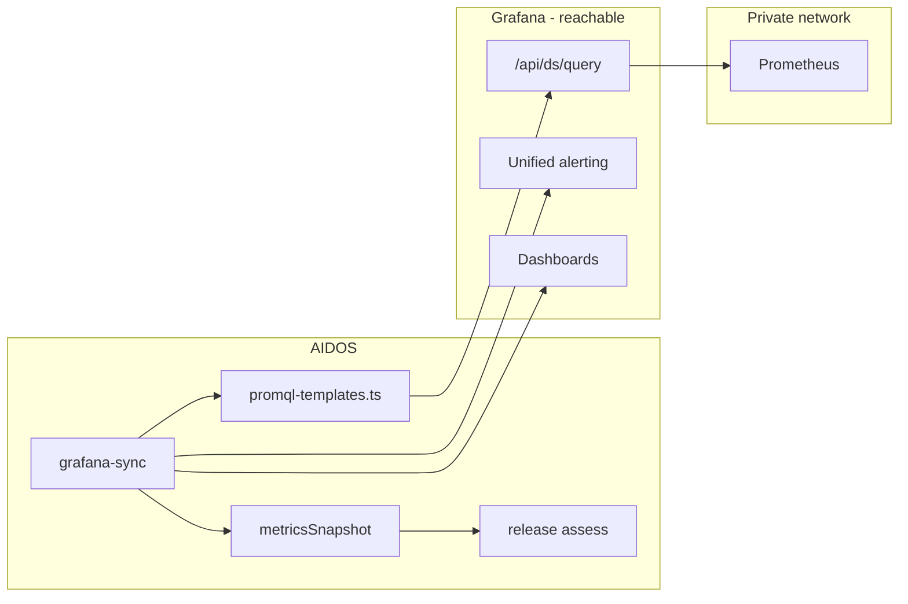

# Prometheus via Grafana — implementation plan

**Status:** Spec · not started  
**Last updated:** 2026-06-09  
**Owner agents:** `/backend` (API client, sync, assess wiring), `/frontend` (Integrations + Observability UI), `/architect` (review before merge)

**Related:**

- [`docs/grafana-integration.md`](docs/grafana-integration.md) — Grafana connect, scopes, sync (G1–G3 shipped)
- [`docs/prometheus-integration.md`](docs/prometheus-integration.md) — Direct Prometheus connect (P2a shipped; P2c sync planned)
- [`grafana-setup.md`](grafana-setup.md) — Grafana integration master plan
- [`prometheus-analysis.md`](prometheus-analysis.md) — Observability center KPIs and PromQL template catalog
- [`docs/AIDOS-USP.md`](docs/AIDOS-USP.md) — Governance + operational intelligence positioning

---

## 1. Executive summary

Many enterprises run **Prometheus on a private network** and expose **only Grafana** to SaaS or DMZ workloads. AIDOS today requires a **direct HTTP connection** to Prometheus for metric KPIs (PromQL). Grafana integration covers alerts, dashboards, and annotations — but not PromQL metrics.

This plan adds **Grafana-mediated Prometheus metrics**: AIDOS runs the same PromQL templates as direct Prometheus sync, but routes queries through Grafana’s datasource proxy API using the org’s existing Grafana service account token.

**Product decision (frozen):**

| Path | When to use |
|------|-------------|
| **Direct Prometheus integration** | Prometheus URL reachable from AIDOS (VPN, private link, public endpoint) |
| **Grafana datasource proxy** | Prometheus private; Grafana reachable; Prometheus configured as Grafana datasource |
| **Both connected** | Direct Prometheus preferred for metrics; Grafana for alerts/dashboards; clear attribution |

We **do not remove** the Prometheus integration. We **add** an optional metrics path on the Grafana integration.

---

## 2. Problem statement

### 2.1 Typical topology

```
                    ┌─────────────────┐
  AIDOS (SaaS) ────►│ Grafana (edge)  │────► Prometheus (private VPC)
                    │  public URL     │      not reachable from AIDOS
                    └─────────────────┘
```

### 2.2 Current behavior

| Capability | Direct Prometheus | Grafana only (today) |
|------------|-------------------|----------------------|
| Connect + probe | ✅ P2a | ✅ G1 |
| PromQL / metric KPIs | ⬜ P2c (requires direct URL) | ❌ Not available |
| Firing alerts | — | ✅ G3 |
| Dashboard coverage | — | ✅ G3 |
| Release assess P95 / error rate | ⬜ via Prometheus snapshot | ⚠️ Grafana `healthScore` fallback only |
| Production observability gap cleared | `hasLiveObservability().prometheus` | `hasLiveObservability().grafana` only |

### 2.3 Target behavior

After this work, an org with **Grafana only** can:

1. Select a Prometheus datasource in the Grafana integration panel
2. Sync metrics via Grafana proxy (same KPI shape as direct Prometheus)
3. See attributed copy: **“Metrics via Grafana → Prometheus (prod)”**
4. Pass release assess with real P95 / error-rate signals — no public Prometheus URL

---

## 3. Architecture

### 3.1 High-level flow



### 3.2 Metrics resolution priority (assess + Observability)

Single helper: `resolveMetricsAssessContext(integrations)` — replaces narrow Prometheus-only reads.

| Priority | Source | Condition |
|----------|--------|-----------|
| 1 | Direct Prometheus | `PROMETHEUS` connected + `operationalSnapshot.kpis` |
| 2 | Grafana proxy | `GRAFANA` connected + `metricsSnapshot.kpis` + `prometheusDatasource.uid` |
| 3 | Grafana native | `operationalSnapshot.kpis.healthScore` (alerts/dashboard coverage) |
| 4 | Warning | Connected but never synced |
| 5 | Disconnected | “Connect Grafana or Prometheus” |

**Attribution field** on every snapshot consumed by UI/assess:

```ts
type MetricsProvenance = {
  path: "prometheus-direct" | "grafana-datasource-proxy";
  grafanaUrl?: string;
  prometheusUrl?: string;        // direct only
  datasourceUid?: string;        // proxy only
  datasourceName?: string;
};
```

Direct Prometheus URL is **never invented** for proxy path — display `via Grafana → {datasourceName}`.

### 3.3 Shared PromQL engine

Do **not** duplicate template logic. One module executes queries through a transport interface:

```ts
// src/lib/observability-metrics/types.ts
export type MetricsQueryTransport = {
  kind: "prometheus-direct" | "grafana-datasource-proxy";
  queryInstant(promql: string): Promise<PrometheusQueryResult>;
  queryRange(promql: string, start: Date, end: Date, stepSec: number): Promise<PrometheusQueryResult>;
};

// src/lib/observability-metrics/run-promql-sync.ts
export async function runPromqlSync(input: {
  transport: MetricsQueryTransport;
  serviceScopes: PrometheusServiceScope[];
  promqlOverrides?: Record<string, string>;
  previousSnapshot?: ObservabilityAnalysisSnapshot | null;
}): Promise<ObservabilityAnalysisSnapshot>;
```

| Transport | Implementation |
|-----------|----------------|
| Direct | `src/lib/prometheus-api.ts` — existing fetch to `{prometheusUrl}/api/v1/query` |
| Proxy | `src/lib/grafana-prometheus-proxy.ts` — `POST {grafanaUrl}/api/ds/query` |

Both produce the same `ObservabilityAnalysisSnapshot` shape defined in `src/lib/observability-analysis/types.ts`.

### 3.4 Independence rule (updated)

Previous rule: *“Grafana must not call Prometheus APIs.”*

**Clarified rule:** AIDOS must not call Prometheus **directly** from Grafana integration code paths unless the org configured **direct Prometheus**. Calling Prometheus **through Grafana’s documented datasource API** is allowed and expected for private-network topologies.

Grafana and Prometheus integrations remain **separate rows** in `Integration` table. Proxy metrics are stored on **`GRAFANA` metadata**, not merged into `PROMETHEUS` integration.

---

## 4. Metadata schema

### 4.1 Grafana integration extensions

Add to `GrafanaIntegrationMeta` in `src/lib/grafana-meta.ts`:

| Field | Type | Notes |
|-------|------|-------|
| `prometheusDatasource` | `GrafanaPrometheusDatasource \| null` | Selected datasource for proxy metrics |
| `metricsServiceScopes` | `PrometheusServiceScope[]` | Max 10 — same type as direct Prometheus |
| `promqlOverrides` | `Record<string, string>` | Optional — shared template IDs |
| `metricsSnapshot` | `ObservabilityAnalysisSnapshot` | Latest PromQL rollup via proxy |
| `metricsProvenance` | `MetricsProvenance` | Always set when `metricsSnapshot` present |
| `metricsLastSyncSummary` | `string` | Human-readable metrics sync line |
| `metricsLastError` | `string` | Last proxy query failure |

```ts
export type GrafanaPrometheusDatasource = {
  uid: string;
  name: string;
  type: "prometheus";           // v1: prometheus only
  isDefault?: boolean;
  lastProbedAt?: string;        // ISO — test query timestamp
  lastProbeStatus?: "ok" | "error";
  lastProbeSummary?: string;    // e.g. "up=42 targets"
};
```

### 4.2 Direct Prometheus integration (optional extension)

Add to `PrometheusIntegrationMeta` in `src/lib/prometheus-meta.ts`:

| Field | Type | Notes |
|-------|------|-------|
| `connectionMode` | `"direct"` | Default; v1 only direct on this integration |
| `metricsProvenance` | `MetricsProvenance` | `path: "prometheus-direct"` |

**Do not** add `connectionMode: "grafana-proxy"` on Prometheus integration — proxy config lives on Grafana only to avoid duplicate sources of truth.

### 4.3 ObservabilityAnalysisSnapshot extension

Add optional provenance on snapshot (backward compatible):

```ts
export type ObservabilityAnalysisSnapshot = {
  // ... existing fields ...
  provenance?: MetricsProvenance;
  // prometheusUrl: keep for direct; for proxy set to synthetic label or omit and use provenance.datasourceName
};
```

For proxy snapshots, set:

```ts
prometheusUrl: `grafana-proxy://${datasourceUid}`; // internal discriminator — UI never shows raw
```

UI always renders from `provenance` + `formatMetricsSourceLabel()`.

---

## 5. Grafana HTTP API — datasource proxy

Extend `src/lib/grafana-api.ts`.

### 5.1 Datasource discovery

| Method | Endpoint | Purpose |
|--------|----------|---------|
| GET | `/api/datasources` | List datasources; filter `type === "prometheus"` |
| GET | `/api/datasources/uid/{uid}` | Validate selected datasource still exists |

**Response mapping:**

```ts
export type GrafanaDatasourceSummary = {
  uid: string;
  name: string;
  type: string;
  isDefault: boolean;
};
```

### 5.2 PromQL execution (preferred — Grafana 8+)

`POST /api/ds/query`

```json
{
  "queries": [{
    "refId": "A",
    "datasource": { "type": "prometheus", "uid": "<uid>" },
    "expr": "up",
    "instant": true,
    "range": false
  }],
  "from": "now-5m",
  "to": "now"
}
```

Map Grafana frames → same `PrometheusQueryResult` parser used by direct API.

### 5.3 Legacy fallback (older Grafana / edge cases)

`GET /api/datasources/proxy/uid/{uid}/api/v1/query?query={encodedPromql}`

Use when `POST /api/ds/query` returns 404 or 400 with unsupported body. Log which path was used in sync summary for support.

### 5.4 Probe query

On datasource save or **Test query** button:

1. Run `up` or `prometheus_build_info` instant query via proxy
2. Set `prometheusDatasource.lastProbeStatus` + summary
3. Fail with actionable message if 403 (missing `datasources:query` permission)

### 5.5 Timeouts and limits

| Setting | Value |
|---------|-------|
| Query timeout | 15s per request (match existing probe timeout) |
| Max concurrent PromQL templates per sync | 8 (same as planned P2c direct sync) |
| Partial failure | Continue sync; yellow banner + gaps in snapshot |

### 5.6 Service account permissions (Grafana)

Document in Integrations UI copy. Token must include:

| Permission | Required for |
|------------|--------------|
| `datasources:read` | List + validate datasource |
| `datasources:query` | Proxy PromQL |
| Existing dashboard/alert scopes | Unchanged G2–G3 behavior |

If using Grafana Cloud or RBAC roles: **Viewer + datasource query** or custom role with above scopes.

---

## 6. API routes

All routes: session scoped by `organizationId`; mutating routes require `integrations.manage_integrations`.

### 6.1 List Prometheus datasources

`GET /api/integrations/grafana/datasources`

**Response:**

```ts
{
  ok: true;
  datasources: GrafanaDatasourceSummary[];  // prometheus type only
  selected: GrafanaPrometheusDatasource | null;
}
```

**Errors:** `401` · `403` · `502` Grafana unreachable

### 6.2 Save metrics config

`PUT /api/integrations/grafana/metrics-config`

**Body (Zod):**

```ts
{
  prometheusDatasource: { uid: string; name: string; type: "prometheus" };
  metricsServiceScopes?: PrometheusServiceScope[];  // max 10
  promqlOverrides?: Record<string, string>;
}
```

**Flow:**

1. Validate Grafana truly connected
2. Re-fetch datasource by UID — must still exist and be type prometheus
3. Run probe query via proxy
4. Merge into `metadataJson`; preserve existing `operationalSnapshot`
5. AuditLog + ActivityEvent

**Response:** `{ ok: true, probe: { status, summary } }`

### 6.3 Test metrics probe (optional standalone)

`POST /api/integrations/grafana/metrics-config/probe`

**Body:** `{ datasourceUid: string }` or use saved config

**Response:** `{ ok: true, summary: "up=42 targets" }` or `{ error }`

Used by **Test query** button without full save.

### 6.4 Extend Grafana sync

`POST /api/integrations/grafana/sync` — **extend existing route**, do not add separate metrics sync URL for v1.

**Updated flow:**

1. Existing: alerts, annotations, dashboard health → `operationalSnapshot`
2. **New (conditional):** if `prometheusDatasource.uid` set → `runPromqlSync` with grafana transport → `metricsSnapshot`
3. Write `TelemetryMetric` rows for both Grafana-native and proxied metrics (label proxied rows with `labelsJson.path = grafana-datasource-proxy`)
4. `lastSyncSummary` combines both lines:

   ```
   Synced 3 dashboards · 2 alerts · metrics via Grafana→Prometheus (prod): health 82/100, P95 142ms
   ```

**400 cases:**

| Condition | Message |
|-----------|---------|
| No dashboard scopes | Existing behavior |
| Datasource configured but probe fails | 502 with probe error |
| Datasource UID stale | 400 “Prometheus datasource not found — re-select on Integrations” |

### 6.5 Direct Prometheus sync (unchanged contract)

`POST /api/integrations/prometheus/sync` — P2c; uses same `runPromqlSync` with direct transport.

When both direct Prometheus and Grafana proxy configured:

- Direct Prometheus sync writes to `PROMETHEUS.metadataJson.operationalSnapshot`
- Grafana sync writes proxy to `GRAFANA.metadataJson.metricsSnapshot`
- Assess prefers direct (priority 1)

---

## 7. PromQL template catalog

**Single source:** `src/lib/prometheus/promql-templates.ts` (create in P2c if not exists; proxy work can ship templates in this feature).

| Template ID | KPI field | Default query (scoped) |
|-------------|-----------|------------------------|
| `up` | probe / health mix | `count(up == 1)` |
| `error_rate` | `errorRate` | `sum(rate(http_requests_total{status=~"5.."}[5m])) / sum(rate(http_requests_total[5m]))` |
| `p95_latency` | `p95LatencyMs` | `histogram_quantile(0.95, sum(rate(http_request_duration_seconds_bucket[5m])) by (le))` |
| `cpu_util` | `cpuUtilizationPct` | `avg(rate(process_cpu_seconds_total[5m]))` |
| `memory_util` | `memoryUtilizationPct` | `avg(process_resident_memory_bytes)` |

Templates accept scope labels from `metricsServiceScopes` / `serviceScopes` — same filter builder for direct and proxy transports.

**v1 scope:** Ship 3 templates (`up`, `error_rate`, `p95_latency`); add resource/SLO templates in P2c parity.

---

## 8. Downstream wiring

### 8.1 `src/lib/observability-connectivity.ts`

Add:

```ts
export type MetricsAssessContext = {
  provenance: MetricsProvenance | null;
  synced: boolean;
  snapshot: ObservabilityAnalysisSnapshot | null;
};

export function resolveMetricsAssessContext(input: {
  integrations: Integration[];
}): MetricsAssessContext;
```

Update `resolvePrometheusAssessContext` to delegate to `resolveMetricsAssessContext` or wrap it for backward compatibility.

Update `hasLiveObservability`:

```ts
any: grafana || prometheus || hasGrafanaMetricsProxy(integrations);
```

`hasGrafanaMetricsProxy` = Grafana truly connected + `metricsSnapshot?.kpis` present.

Update `formatObservabilityCoverage` to include proxy line:

```
Grafana synced (2 alerts); Metrics via Grafana→Prometheus (prod) health 82/100
```

Update `formatErrorRateDelta` to read from `resolveMetricsAssessContext`.

### 8.2 `src/lib/qa-intelligence.ts`

Update `formatPerformanceSignal`:

1. Direct Prometheus snapshot (existing)
2. **Grafana `metricsSnapshot`** (new — same KPI fields)
3. Grafana operational health score (existing fallback)
4. Warning / disconnected

Add stability signal from proxy metrics when error budget / error rate available.

Merge `metricsSnapshot.gaps` (when implemented in template runner) into `testGaps` with `area: "Observability"`.

### 8.3 `src/lib/release-governance.ts`

- `resolveOpenIncidents` — unchanged (Grafana alerts preferred)
- `resolveDeployments24h` — unchanged (Grafana annotations)
- Add recommendation when `metricsSnapshot` shows critical degradation OR Grafana `firingCritical > 0`:

  ```ts
  title: "Resolve firing alerts before production release"
  requiredRole: DEVOPS_LEAD
  ```

### 8.4 `src/lib/operational-intelligence.ts`

Post-deploy collect priority:

1. Direct Prometheus snapshot
2. Grafana metricsSnapshot
3. Grafana operationalSnapshot
4. Synthetic fallback

### 8.5 Observability center (`/observability`)

| Tab / state | Behavior |
|-------------|----------|
| Prometheus direct synced | Existing Prometheus dashboard (metrics tab) |
| Grafana proxy synced only | Show metrics KPI strip with banner: **“Metrics via Grafana → {datasourceName}”** |
| Both | Source toggle: **Metrics (Prometheus direct)** \| **Alerts (Grafana)**; combined summary card |
| Grafana connected, no datasource | CTA in metrics area: “Select Prometheus datasource on Integrations” |

Do not show mock preview when proxy snapshot exists.

### 8.6 Release assess route

`src/app/api/releases/[id]/assess/route.ts` — pass `resolveMetricsAssessContext` into governance (or extend existing prometheus/grafana contexts).

---

## 9. Integrations UI

Full UX spec: see conversation mockups in product review. Summary:

### 9.1 Page-level banner

Component: `src/components/integrations/observability-pairing-banner.tsx`

| State | Copy |
|-------|------|
| Grafana only, no metrics config | “Prometheus on a private network? Query metrics through Grafana.” |
| Grafana + proxy configured | “Metrics via Grafana → {datasourceName}” |
| Direct Prometheus connected | “Dual source: Prometheus metrics · Grafana alerts” |
| Both, proxy unused | Direct metrics preferred; note on Grafana card |

### 9.2 Grafana panel — new section

Insert after **Dashboards to analyze**, before **Alert webhook**:

**Section title:** `Metrics via Grafana`

- Helper text: private Prometheus / no public URL
- Datasource `<select>` populated from `GET .../grafana/datasources`
- **Test query** → `POST .../metrics-config/probe`
- Service scope chips (reuse Prometheus scope UX patterns)
- **Save metrics config** → `PUT .../grafana/metrics-config`
- Preview: last metrics sync summary + health / P95 / error rate

Extend **Sync Grafana** summary line to include metrics when configured.

### 9.3 Prometheus panel — connection mode hint

At top of disconnected state:

```
Connection mode
◉ Direct to Prometheus
○ Through Grafana — configure on Grafana card (private network)
```

When Grafana proxy active for same org, show info callout:

```
Metrics are provided via Grafana → Prometheus (prod).
Direct connection is optional.
```

No duplicate URL entry for proxy path.

---

## 10. Phased delivery

### GP0 — Spec & types (0.5 day)

- [ ] This document reviewed and frozen
- [ ] Add types to `grafana-meta.ts`, `observability-metrics/types.ts`
- [ ] Add `formatMetricsSourceLabel()` helper

**Exit:** Types compile; no runtime behavior change.

### GP1 — Grafana datasource API (1–2 days)

- [ ] `listGrafanaPrometheusDatasources()` in `grafana-api.ts`
- [ ] `queryPrometheusViaGrafana()` — ds/query + legacy fallback
- [ ] `grafana-prometheus-proxy.ts` transport adapter
- [ ] `GET /api/integrations/grafana/datasources`
- [ ] `POST /api/integrations/grafana/metrics-config/probe`
- [ ] Unit tests with mocked Grafana responses

**Exit:** Probe `up` against real Grafana in dev.

### GP2 — Metrics config save + UI (1–2 days)

- [ ] `PUT /api/integrations/grafana/metrics-config`
- [ ] Grafana panel: datasource picker + test + save
- [ ] `observability-pairing-banner.tsx`
- [ ] Update `docs/grafana-integration.md` §1 metadata

**Exit:** Admin can select datasource and see probe OK in UI.

### GP3 — PromQL sync via proxy (2–3 days)

- [ ] `src/lib/prometheus/promql-templates.ts` (minimal 3 templates)
- [ ] `run-promql-sync.ts` shared runner
- [ ] Extend `grafana-sync.ts` to populate `metricsSnapshot`
- [ ] TelemetryMetric ingest with provenance labels
- [ ] Partial failure handling + gaps

**Exit:** Sync produces `metricsSnapshot` on Grafana metadata; summary mentions proxy.

### GP4 — Assess + Observability wiring (1–2 days)

- [ ] `resolveMetricsAssessContext`
- [ ] Update `qa-intelligence.ts`, `release-governance.ts`, `operational-intelligence.ts`
- [ ] Observability page: metrics strip for proxy-only orgs
- [ ] Update `hasLiveObservability`

**Exit:** Release assess shows real P95/error rate for Grafana-only + datasource config.

### GP5 — Direct Prometheus parity (parallel / follows P2c)

- [ ] `prometheus-sync.ts` uses same `runPromqlSync` + direct transport
- [ ] Assess priority: direct > proxy > grafana health
- [ ] Dual-source Observability tabs

**Exit:** Orgs with direct URL unaffected; shared template catalog.

### GP6 — Hardening (1 day)

- [ ] Scheduled worker: extend `grafana-scheduled-sync.ts` to include metrics when datasource set
- [ ] Stale datasource UID detection on sync
- [ ] AuditLog events: `grafana.metrics_config.saved`, `grafana.metrics_sync.completed`
- [ ] Architect review

**Exit:** `npm run build` clean; manual test matrix below passes.

---

## 11. Files to create or modify

### New files

| Path | Purpose |
|------|---------|
| `src/lib/grafana-prometheus-proxy.ts` | Transport: PromQL via Grafana datasource |
| `src/lib/observability-metrics/types.ts` | Transport interface, provenance |
| `src/lib/observability-metrics/run-promql-sync.ts` | Shared sync runner |
| `src/lib/observability-metrics/format-source-label.ts` | UI/assess attribution strings |
| `src/lib/prometheus/promql-templates.ts` | Template catalog (shared) |
| `src/app/api/integrations/grafana/datasources/route.ts` | GET datasources |
| `src/app/api/integrations/grafana/metrics-config/route.ts` | PUT save config |
| `src/app/api/integrations/grafana/metrics-config/probe/route.ts` | POST test query |
| `src/components/integrations/observability-pairing-banner.tsx` | Page banner |
| `src/components/integrations/grafana-metrics-config-section.tsx` | Panel section |

### Modified files

| Path | Change |
|------|--------|
| `src/lib/grafana-meta.ts` | New metadata fields |
| `src/lib/grafana-api.ts` | Datasource list + ds/query |
| `src/lib/grafana-sync.ts` | Conditional metrics sync |
| `src/lib/observability-connectivity.ts` | `resolveMetricsAssessContext` |
| `src/lib/qa-intelligence.ts` | Performance signal from proxy snapshot |
| `src/lib/release-governance.ts` | Coverage string, alert rec |
| `src/lib/operational-intelligence.ts` | Post-deploy priority |
| `src/components/integrations/grafana-integration-panel.tsx` | Metrics section |
| `src/components/integrations/prometheus-integration-panel.tsx` | Direct vs via-Grafana hint |
| `src/app/(platform)/integrations/page.tsx` | Banner + pass new props |
| `src/app/(platform)/observability/page.tsx` | Proxy metrics display |
| `docs/grafana-integration.md` | Metadata + routes § |

### Documentation cross-updates

| Doc | Update |
|-----|--------|
| `prometheus-analysis.md` §2 | Add footnote: private Prometheus → see `prometheus-proxy-grafana.md` |
| `grafana-setup.md` | Reference GP phases; note stub status outdated where shipped |
| `docs/prometheus-integration.md` | Clarify direct vs proxy paths |

---

## 12. Error handling & edge cases

| Scenario | Behavior |
|----------|----------|
| Datasource deleted in Grafana | Sync fails with 400; panel shows “Re-select datasource” |
| Prometheus down behind Grafana | Probe fails 502; last good `metricsSnapshot` retained; stale banner if >24h |
| 403 on ds/query | UI: “Service account needs datasources:query permission” |
| Multiple Prometheus datasources | User picks one; v1 no multi-datasource merge |
| Mimir / Cortex / Thanos as `type: prometheus` | Supported — same proxy path |
| Grafana Cloud | Supported — same API |
| Direct + proxy both configured | Direct wins for metrics; Grafana still owns alerts |
| Org disconnects Grafana | Clear `metricsSnapshot` on disconnect or mark stale |

---

## 13. Security

- Never return decrypted Grafana token or raw datasource credentials
- PromQL templates are **read-only** — no user-supplied PromQL in v1 (only template overrides from org admin, validated length ≤ 500 chars)
- All proxy queries server-side only — browser never talks to Grafana directly except through existing connect flows
- Rate limit probe endpoint: 10 req/min/org (match introspect throttle pattern)
- Log sync errors without query secrets

---

## 14. Testing plan

### Manual matrix

| # | Setup | Action | Expected |
|---|-------|--------|----------|
| 1 | Grafana only, private Prom | Select datasource, test, sync | `metricsSnapshot.kpis` populated |
| 2 | Same | Release assess | P95/error signal from proxy, attributed |
| 3 | Direct Prometheus + Grafana | Both sync | Assess uses direct metrics |
| 4 | Grafana, no datasource | Sync | Alerts only; no metrics snapshot |
| 5 | Invalid datasource UID | Sync | Clear 400 error |
| 6 | Token without datasources:query | Probe | 403 with permission hint |

### Automated

- Unit: frame parser for `/api/ds/query` response → `PrometheusQueryResult`
- Unit: `resolveMetricsAssessContext` priority order
- Unit: `formatMetricsSourceLabel` strings
- Integration (optional): mocked fetch for sync pipeline

---

## 15. Explicit non-goals (v1)

- Loki / Tempo / CloudWatch datasource metrics (Prometheus type only)
- User-written arbitrary PromQL in UI (template overrides only)
- Writing to Grafana or Prometheus
- Replacing direct Prometheus integration
- Auto-discovering which datasource “belongs” to AIDOS without user selection
- Merging Grafana and Prometheus into a single Integration row
- VPN tunnel / agent sidecar for direct Prometheus (enterprise infra out of scope)

---

## 16. Exit criteria (feature complete)

1. Org with **Grafana only** can select Prometheus datasource, sync metrics, and see KPIs on Observability
2. Release assess uses proxy metrics for performance signals with correct attribution
3. Org with **direct Prometheus** unchanged; priority documented and tested
4. Integrations page shows pairing banner + Grafana metrics section
5. All snapshots label source (`prometheus-direct` vs `grafana-datasource-proxy`)
6. `npm run build` passes
7. `docs/grafana-integration.md` updated; architect sign-off

---

## 17. Open questions (resolve in GP0)

| # | Question | Default if unresolved |
|---|----------|----------------------|
| 1 | Store history snapshots for proxy metrics (`ObservabilityAnalysisSnapshot` table)? | v1: metadata only; history in GP+1 |
| 2 | Reuse Prometheus `serviceScopes` picker UI component? | Yes — extract shared `ServiceScopePicker` |
| 3 | Single sync button vs separate “Sync metrics”? | Single **Sync Grafana** button (simpler UX) |
| 4 | Default auto-select when exactly one Prometheus datasource? | Yes — preselect in UI, user must save |

---

## 18. Implementation order (recommended PR sequence)

```
PR1  GP0 + GP1   Types, grafana-api proxy client, datasources + probe routes
PR2  GP2         Grafana panel metrics section + banner
PR3  GP3         promql-templates + run-promql-sync + extend grafana-sync
PR4  GP4         assess + observability wiring
PR5  GP5/GP6     Direct prometheus-sync parity (can overlap P2c) + worker + docs
```

**Suggested first vertical slice:** PR1 + PR2 — admin can probe datasource from Integrations; proves private-network topology before full KPI sync.
